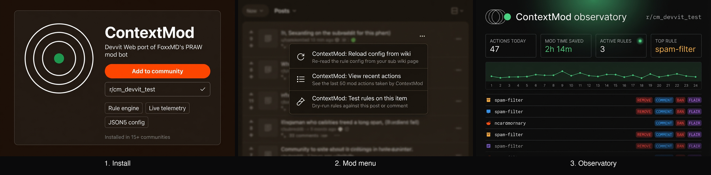
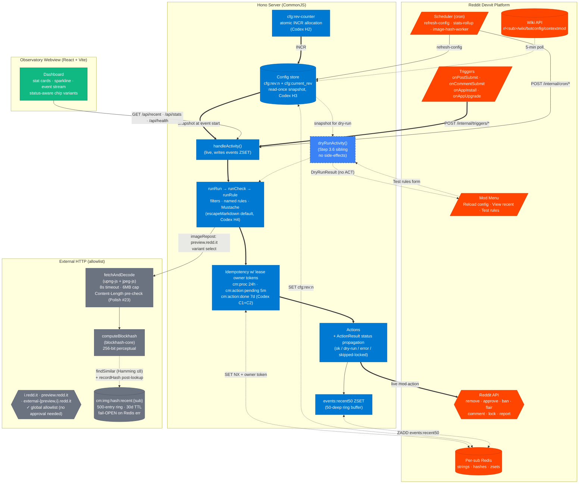
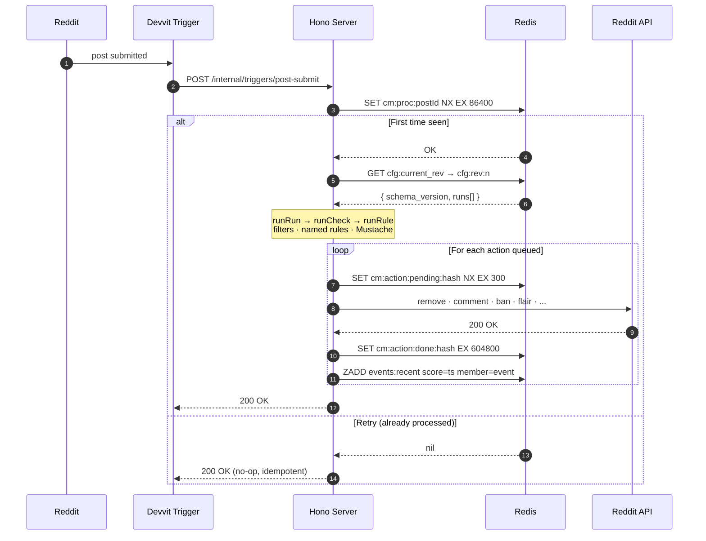
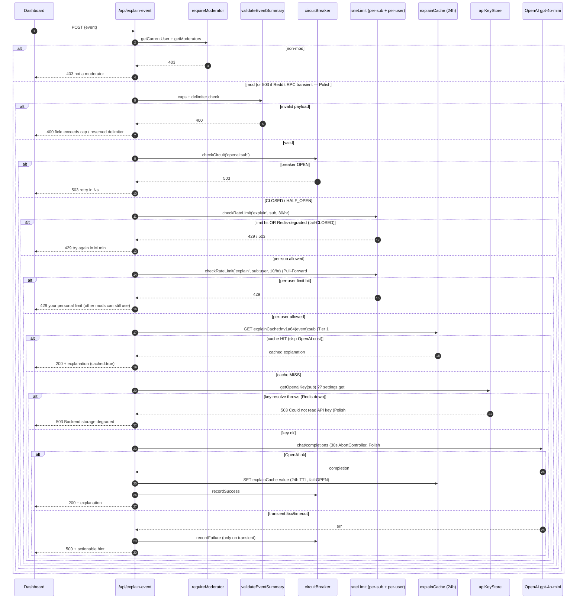

# context-mod-devvit

> **A rule-engine moderation co-pilot for Reddit subreddits, running natively on Devvit.**
> Write your moderation rules once in JSON5. The rule engine (8 rule kinds incl. Phase 4.7 perceptual-blockhash image-repost), 8 action handlers (remove · approve · lock · comment · report · ban · userFlair · distinguish), atomic config publish, dry-run rule tester, AI rule explainer, AI event summary w/ 24h response cache, mod activity feed, config-diff viewer, mute/unmute, full mod-auth gating + per-sub + per-user rate-limiting + circuit-breaker on AI calls, per-event run isolation + wall-clock timeouts, light-mode toggle, and Observatory dashboard all ship live in v0.6.6. Mods install ContextMod once, define what counts as spam / what to remove / what to comment / what users to ban, and the bot handles the rest.

[](https://github.com/StephenSook/context-mod-devvit/actions/workflows/ci.yml)
[](./tests)
[](./tsconfig.json)
[](./LICENSE)
[](https://developers.reddit.com/docs)
[](https://mod-tools-migration.devpost.com/)

---

**Devvit Web port of [ContextMod](https://github.com/FoxxMD/context-mod)** — FoxxMD's flagship moderation bot, originally built on PRAW and now ported to Reddit's first-party developer platform.

Built for the [Reddit Mod Tools and Migrated Apps Hackathon](https://mod-tools-migration.devpost.com/) (Apr 29 – May 27, 2026). Ported with explicit written permission from FoxxMD via [github.com/FoxxMD/context-mod#152](https://github.com/FoxxMD/context-mod/issues/152).

**Why a port?** The original ContextMod requires you to host a server, manage API tokens, and trust a centralized instance. Devvit's per-subreddit install model removes all three. Every mod team installs their own instance with one click — no infrastructure, no shared rate limits, no central bottleneck.

## What it does

ContextMod evaluates new posts and comments against a flexible, mod-defined rule engine and takes moderation actions when checks trigger. Each rule + action set is defined in a JSON5 config (loaded from your sub's wiki), composable with named rules, filters, and Mustache-templated action messages.

The Devvit port preserves the rule/check/action concept model that mods of [r/mealtimevideos](https://reddit.com/r/mealtimevideos) (60K weekly visitors), [r/piercing](https://reddit.com/r/piercing) (600K visitors, 12K contributors), and 15+ other communities already know — while solving the central-server bottleneck that capped CM's adoption on the original PRAW infrastructure. With Devvit's per-subreddit install model, every mod team can install their own instance.

## Quick start (for moderators)



1. **Install** — Visit [developers.reddit.com/apps/cm-devvit](https://developers.reddit.com/apps/cm-devvit) and click **Add to community**, then pick your subreddit (you must be a mod with `posts` + `wiki` permissions).
2. **Pin the dashboard** — In your sub's mod overflow menu, click **ContextMod: View recent actions**. A custom post appears that shows mod-action telemetry — live data from the `events:recent50` ZSET (Phase 3 shipped). Stickying it is optional but recommended.
3. **Write your rules** — Create `r/<your-sub>/wiki/botconfig/contextmod` with JSON5 config. A starter config is seeded on install; the [`examples/`](./examples) directory carries 12 working configs (starter + spam-fresh + approve-trusted + comment-mod-banned + repost-watch + low-karma-banned + named-rules-flair + nsfw-strict + Phase 4 history/attribution/recentActivity + Phase 4.7 image-repost) you can paste and edit. See [Config schema](#config-schema) for the full surface.
4. **Reload** — In the subreddit mod overflow, click **ContextMod: Reload config from wiki** (or wait 5 minutes — the app polls automatically). Toast shows the rule count; the Observatory dashboard refreshes with the next rule firing.
5. **Test a rule** — Right-click any post or comment, choose **ContextMod: Test rules on this item**. A dry-run shows which rules would fire without taking action.

> **No hosting. No tokens. No central bottleneck.** Everything lives inside your subreddit's Devvit installation.

## Try locally in 3 commands (for judges + devs)

See the Observatory dashboard render without installing the app, no Devvit credentials needed:

```bash
git clone https://github.com/StephenSook/context-mod-devvit.git
cd context-mod-devvit
npm ci && npm run dev:web
```

Then open [`http://localhost:5173/?demo=1`](http://localhost:5173/?demo=1). The `?demo=1` query parameter seeds the dashboard with synthetic events (per the production-safety pattern — fabricated data never auto-shows). Remove the flag to see the empty-state with a copy-to-clipboard starter config.

The `dev:web` script chains `vite build` → `node scripts/dev/mock-server.cjs`. The mock server is pure Node stdlib (no Express, no extra deps) and binds 127.0.0.1 only — local loopback, no LAN exposure.

To stop: `Ctrl-C` in the terminal running `npm run dev:web`.

## Status at a glance

| Phase | State | Notes |
|-------|-------|-------|
| **Phase 0** — Scaffold | ✅ Shipped | `devvit.json` + routes + idempotency primitives + Observatory dashboard chrome |
| **Phase 1** — Rule engine | ✅ Shipped | regex + author + ruleSet + named rules + Mustache + filters + run state machine |
| **Phase 2** — Actions + handleActivity | ✅ Shipped | 7 MVP actions + handleActivity orchestrator + URL-dedupe repost rule (promoted from Phase 4) |
| **Phase 3** — Config UX + live dashboard | ✅ Shipped | wiki loader cron + reload-config menu + onAppInstall seed + onAppUpgrade migrations + live `/api/recent` ZRANGE |
| **Step 3.6** — Dry-run rule tester | ✅ Shipped | mod menu → form → toast bullets; non-contract `dryRunActivity` sibling preserves read-once config invariant |
| **Codex hardening** (initial) | ✅ Shipped | 2 CRITICAL + 10 HIGH safety findings closed (idempotency double-action, dry-run authority, repost `SET NX`, atomic INCR config publish, read-once invariant, Mustache markdown injection, filter regex try/catch, parsed-config invariant) |
| **Wave S + T mod UX** | ✅ Shipped (v0.3.0) | filter chips · mobile responsive · keyboard shortcuts (`?`/`r`/`h`/`a`/`esc`) · per-event drill-down click-to-expand · onboarding tour · per-rule stats table · mod activity attribution feed · config rev diff viewer modal |
| **S1 Rule simulation against history** | ✅ Shipped (v0.3.0) | **demo money shot** — mod pastes rule JSON5 → fires "would have fired N/25 (X%)" against last 25 posts. Demo gold. |
| **S5 AI rule explainer** | ✅ Shipped (v0.3.0) | OpenAI gpt-4o-mini via Devvit HTTP allowlist (PR #96 AI-provider scope). Mod pastes JSON5 → plain-English explanation. |
| **S10 Mute/unmute rule MVP** | ✅ Shipped (v0.3.0) | Redis hash store + 3 API endpoints w/ mod-auth gate. v0 soft-mute; Vinh wires hard-mute against this storage shape in Phase 4. |
| **V7 AI summary per event** | ✅ Shipped (v0.3.0) | drill-down panel "Explain with AI" button — OpenAI summarizes why this event fired in 2 sentences. |
| **S12 E2E Playwright CI** | ✅ Shipped (v0.3.0) | 7 dashboard scenarios in headless chromium via GitHub Actions. Trace + artifact upload on failure. |
| **Wave U code review hardening** | ✅ Shipped (v0.3.0) | 5 BLOCKERs + 1 CRITICAL + 11 WARNs closed from parallel adversarial review by 5 agents (Codex + Explore + silent-failure-hunter + test-coverage-analyzer + comment-analyzer). |
| **Wave W + X — deep review + production hardening** | ✅ Shipped (v0.3.1) | 30+ atomic commits. requireModerator on every mutation/cost endpoint; rate-limit + circuit-breaker on OpenAI calls; configStore parse-fail surfacing; wiki not-found/unreachable split; structured JSON logger; deep-health probe; THREAT-MODEL.md + API.md + PRIVACY.md + data-retention.md; ErrorBoundary; CodeQL workflow; FUNDING + Discussions; .devcontainer + VSCode workspace. |
| **v0.3.1** | ✅ Tagged + released | GitHub release auto-generated from CHANGELOG via X72 workflow. |
| **Phase 4** — `history` / `attribution` / `recentActivity` rules | ✅ Shipped (2026-05-18) | Vinh's author-history cache + 3 stretch rules. 179 tests. Authorized 2026-05-17 Wave S16; shipped ahead of 2026-05-25 target. |
| **Phase 4.7** — Image-mode `repost` (perceptual blockhash) | ⏸ Deferred | Day-0 GO/NO-GO spike not run pre-hackathon; revisit post-submission |
| **MHS** (ModerateHateSpeech HTTP fetch) | ✂️ Cut | Reddit PR #96 (2026-05-08) — HTTP fetch policy AI-provider allowlist excludes ModerateHateSpeech |

For per-component detail see the Status table further down + [`PLAN.md`](./PLAN.md) + [`CHANGELOG.md`](./CHANGELOG.md).

## Status — what's production vs scaffolded vs Phase-N pending

**Hackathon-era MVP.** Active development; expect rough edges. Architecture diagram below shows the *complete request lifecycle*; the Status table below shows the per-component ship state. Phase 1+2+3 complete; Phase 4 stretch rules in progress.

| Component | State today | Notes |
|-----------|-------------|-------|
| Observatory dashboard (React + Vite + Tailwind, 24h sparkline + event stream + dry-run mod menu) | **Production** | Renders against live `/api/recent` ZSET + falls back to `?demo=1` synthetic for screenshots. Wave A–F shipped. |
| Rule engine — `handleActivity` → `runRun` → `runCheck` → `runRule` (regex / author / ruleSet) | **Production** | Vinh's Phase 1 — 11 steps, 93 tests. Filters (authorIs + itemIs), Mustache templates, named-rule expansion, AND/OR combinators, postBehavior state machine w/ 100-iter safety. |
| Action handlers (`remove` / `approve` / `lock` / `comment` / `report` / `ban` / `userFlair`) | **Production** | Vinh's Phase 2 — 7 MVP actions, Reddit-API signatures verified live. Markdown sanitizer (u/r-ping defang + link-injection guard) for `comment` action. |
| `handleActivity` orchestrator + `runAction` w/ idempotency wrap | **Production** | Vinh's Phase 2.3 — reads config rev once at event start (D5), aggregates ActionResult into events:recent ZSET. Codex-hardened (CRITICAL+HIGH fixes shipped 2026-05-16). |
| Idempotency primitives (`src/lib/idem.ts` — FNV-1a + BigInt + lease owner tokens + 3-stage Redis keys + 60s cron lock) | **Production** | 13 unit tests. Codex-hardened: commitAction retries done-write 3x and never releases pending on failure (prevents double-action); lease owner-token compare-and-delete (prevents third-execution race on slow worker). |
| Dry-run rule tester (mod menu "Test rules on this item" → form → toast) | **Production** | Stephen's Step 3.6 — non-contract `dryRunActivity` sibling. Mod right-clicks any post/comment, gets eval trace + would-have-called list, zero Reddit side-effects. |
| URL-dedupe repost rule (`cm:{sub}:repost:url:{hash}`, 30d TTL) | **Production** | Vinh's Phase 2.5.1 (promoted from Phase 4). FNV-1a hash, race-safe `SET NX` (Codex hardened), fail-OPEN on Redis outage. |
| Config UX — wiki loader cron + reload-config menu + onAppInstall default-config seed + onAppUpgrade migrations | **Production** | Vinh's Phase 3 — `loadFromWiki()` cron polls every 5 min, no-op on unchanged wiki revisionId, atomic config publish via rev pointer. |
| `routes/api.ts` `/api/recent` + `/api/stats` | **Production for `/api/recent`** (live ZRANGE wired Phase 3.4) · **Scaffolded for `/api/stats`** (Phase 4 stretch) | Versioned events drop corrupt/future members loudly. |
| `routes/scheduler.ts` cron (`refresh-config`, `stats-rollup`, `image-hash-worker`) | **Production for `refresh-config`** · **Scaffolded** for `stats-rollup` + `image-hash-worker` | Stats rollup Phase 4; image-hash-worker gated on 0.10 spike (not run yet — likely NO-GO). |
| Devvit configuration (`devvit.json`, fetch allowlist, post entry, scheduler tasks, menu items, forms) | **Production** | All 3 menu items + dry-run form declared. |
| Hono server routing (`src/index.ts`, `/api/*`, `/internal/*`) | **Production** | |
| Phase 4 stretch rules (`history`, `attribution`, `recentActivity`) | **Pending** | Vinh's queue. May ship pre-deadline or defer post-hackathon depending on capacity. |
| Phase 4 image-hash + LSH | **Deferred** | 0.10 spike gate not run; effectively NO-GO for hackathon. Post-hackathon. |
| MHSRule (toxicity HTTP fetch) | **Cut** | Reddit PR #96 (2026-05-08) — HTTP fetch policy AI-provider allowlist excludes ModerateHateSpeech. |

**749 tests passing** (Phase 1+2+3 + Step 3.6 + Codex regression suite + Wave S+T 15 features + Wave U code-review + V7 AI event summary + Waves W/X/Y/Z/AA/AB/AC/AD/AD-review/AE hardening + Vinh Phase 4: history/attribution/recentActivity + author cache + Phase 4.7 image-repost via blockhash + 8th action (distinguish) + NOT combinator + migration tool + AE 54/54 audit findings closed — Polish #1-#54 incl. 3 adversarial-review rounds: silent-failure-hunter, code-reviewer, gemini-agent). Production npm-audit: 0 vulns. `tsc --build` clean. `npm run lint` clean. CI all-green across 8 jobs (validate Node 20/22/24 + ai-tone + e2e Playwright (chromium+firefox+webkit) + CodeQL + Semgrep + axe-core + dependency-cruiser + release-drafter).

See [implementation plan](./docs/superpowers/plans/2026-05-12-contextmod-devvit-port.md) + [`PLAN.md`](./PLAN.md) team-coordination doc for full per-phase scope.

### Observatory dashboard preview


> Captured 2026-05-14 via Playwright against the mock-server-backed `?demo=1` build. Production now renders the same chrome over real `events:recent50` ZSET data (Phase 1+2+3 shipped 2026-05-16) — `?demo=1` remains for screenshots + demo capture without depending on a live test sub.

## Architecture



**Storage:** Redis only (Devvit-native, per-install isolation, 500MB cap). No external DB. Strings + hashes + sorted sets only — no Lists, no Sets, per Devvit constraints.

**Atomic config publish (D5, shipped Phase 1+3):** mod edits wiki → `refresh-config` cron parses + validates → writes immutable `cfg:rev:{n}` → atomically bumps `cfg:current_rev` pointer. Every `handleActivity` reads the snapshot once at event start (Codex H3 hardened — triggers pass the snapshot to handleActivity to prevent split-rev events) and threads it through the rule pipeline. Codex H2 hardened: rev allocation uses atomic `INCR` on `cfg:rev-counter` so concurrent publishers get distinct rev numbers rather than racing for N+1.

### Request lifecycle

How a single Reddit trigger flows through the engine end-to-end, including the three-stage idempotency that makes Devvit's at-least-once trigger delivery safe:



### AI explain-event security chain (Wave X + post-AE)

Defense-in-depth on the `/api/explain-event` cost-bearing endpoint. **Seven gates** in sequence before any byte touches OpenAI (added per-user rate limit + 24h response cache after AE wave):



## Config schema

Mod config is JSON5 stored at `r/<your-sub>/wiki/botconfig/contextmod`. Minimum viable example:

```json5
{
  runs: [
    {
      name: "main",
      checks: [
        {
          name: "spam-filter",
          combinator: "AND",
          rules: [
            { kind: "regex", name: "spam-words", pattern: "free.{0,5}money|crypto.+(giveaway|drop)", target: "title" },
            { kind: "author", name: "fresh-account", filter: { ageMaxSec: 86400 } }
          ],
          actions: [
            { kind: "remove", isSpam: true },
            { kind: "comment", template: "Removed: looks like spam from a fresh account. u/{{author.name}}, modmail us if this was a mistake." }
          ]
        }
      ]
    }
  ]
}
```

**Concept model** (ported faithfully from the original ContextMod):

- **Run** — ordered list of Checks. Supports `postBehavior` (`next` / `nextRun` / `stop` / `goto:<run>.<check>`) for branching workflows.
- **Check** — a group of Rules combined with `AND` or `OR`. When triggered, executes its Actions.
- **Rule** — a single boolean predicate (`regex`, `author`, `history`, `attribution`, `recentActivity`, `repost`, plus composite `ruleSet`). Upstream `mhs` rule cut from Devvit port per PR #96 — see Phase FAQ.
- **Filter** — `authorIs` / `itemIs` clauses that gate Rule/Check/Action execution by author + item attributes.
- **Action** — side-effect (`remove`, `approve`, `lock`, `comment`, `report`, `ban`, `userFlair`). Action content supports [Mustache](https://mustache.github.io/) templating with `{{item.*}}`, `{{author.*}}`, `{{rules.<name>.data.*}}` context.
- **Named rules** — declare a rule once with `name:`, reference by string elsewhere — DRY composition.

The canonical AJV schema lives at `src/schema/app.schema.json` (shipped Phase 1, 2026-05-16). See also the original [context-mod docs](https://github.com/FoxxMD/context-mod/tree/master/docs/subreddit-configuration) for concept-level reference — concepts identical, surface trimmed per [migration guide](#migration-guide-for-existing-contextmod-operators).

### Validation behavior + safety story

**Shipped behavior (Phase 1+3 — `src/schema/app.schema.json` + `src/routes/scheduler.ts:refresh-config`):** every config load runs the JSON5 source through AJV against the schema. Three outcomes:

| Outcome | Behavior | What mods see |
|---------|----------|---------------|
| **Valid JSON5 + schema match** | New revision (`cfg:rev:{n+1}`) is written immutably, then the `cfg:current_rev` pointer is atomically bumped. Every subsequent `handleActivity` reads the new revision. | Observatory event chip: `config loaded · revision N+1`. Mod-menu **Reload config** toast: *"Loaded N+1, X rules active."* |
| **Invalid JSON5 (parser error)** | New revision **NOT** written. `cfg:current_rev` stays pointed at the prior known-good revision. The sub keeps moderating against the prior config. | Observatory event chip: `config rejected · JSON5 parse error at line L col C`. Mod-menu **Reload config** toast: *"Parse failed at L:C — last revision N still active."* |
| **Valid JSON5 + schema violation** | New revision **NOT** written. Same fallback to prior revision. | Observatory event chip: `config rejected · schema: <AJV instance path>: <human reason>` (e.g., `/runs/0/checks/1/rules/0/threshold must be integer, got "1"`). Mod-menu **Reload config** toast carries the same. |

**Safety property:** the sub *never* runs against a broken config. A typo or syntax error in the wiki halts the swap, not moderation — the last known-good revision keeps firing rules until you fix the wiki. No "broken window" between bad save + fix.

This is one of the two reasons the port uses an immutable-revision + atomic-pointer pattern (the other reason is mid-event consistency — `handleActivity` reads the pointer once at event start so the whole pipeline runs against a single revision snapshot, even if a concurrent reload fires).

## Comparison — AutoMod vs original CM vs CM-Devvit

Why does Reddit need a port of CM when AutoMod already exists? Because AutoMod handles a different problem.

| Dimension | AutoModerator | Original CM (PRAW) | **ContextMod-Devvit (this port)** |
|-----------|---------------|--------------------|------------------------------------|
| Hosting | Built into Reddit — no setup | Self-hosted server + Snoowrap + API tokens | Per-subreddit Devvit install, one click |
| Rule composition | YAML rules with regex + simple filters + `priority` ordering; no named-rule or ruleSet composition | Composable named rules + ruleSets (AND/OR) + `postBehavior` flow control | Composable named rules + ruleSets (AND/OR) + `postBehavior` flow control |
| Author-history rules | Limited author/account checks (age, karma, flair, post/comment counters); no history-window queries across other subs | Full `author` rule: age, karma, flair, verified, contributor, mod, shadowban, history-window | Full `author` rule + filter system (`authorIs`/`itemIs`) at check level |
| Image-hash repost detection | ❌ | ✅ (perceptual hash via Python image libs) | 🚧 Phase 4 stretch (pure-JS blockhash in Devvit's 30s window — feasibility spike pending) |
| Per-sub data isolation | Shared infrastructure | Operator runs their own instance, isolation depends on hosting | Hard-isolated: each install gets its own Redis namespace, no cross-sub leak |
| Mobile dashboard | ❌ (modmail only) | ❌ (terminal logs / Discord webhooks) | ✅ Observatory custom post — stat cards + sparkline + event stream, renders on mobile webview |
| Config surface | YAML in wiki, single source | JSON5 in wiki + named-rule reuse + Mustache action templating | JSON5 in wiki + named-rule reuse + Mustache action templating |
| Install model | Auto-on for every sub | Operator-managed central server serving N subs | Per-mod-team install — no shared rate limits, no central bottleneck |
| Pricing | Free | Heroku/VPS hosting + dev time | Free (Devvit hosts) — eligible for Reddit's Developer Funds program |
| When to use | High-volume regex spam catches | Context-aware rules requiring history + composition | Same as original CM, without the central-server tax |
| AI rule explainer | ❌ | ❌ | ✅ Paste a rule → plain-English explanation via OpenAI (rate-limited + circuit-breakered per sub) |
| Per-event AI summary | ❌ | ❌ | ✅ Click "Explain with AI" on any drill-down — gpt-4o-mini summarizes why the rule fired |
| Dry-run rule tester | ❌ | ❌ | ✅ Right-click any post → "Test rules on this item" → see which rules would fire w/ zero Reddit side-effects |
| Rule simulation against history | ❌ | ❌ | ✅ Paste a proposed rule → "Would fire on N/25 (X%) recent items" against last 25 posts |
| Auth gating | Subreddit-level | Self-hosted (operator's responsibility) | Per-endpoint `requireModerator`: mutation + cost-bearing endpoints all gate against Reddit's mod-list — defense-in-depth beyond menu `forUserType:moderator` |
| Documented threat model | ❌ | ❌ | ✅ STRIDE inventory: 15 cataloged threats + mitigations + 4 residual risks ([`THREAT-MODEL.md`](./THREAT-MODEL.md)) |
| Rate-limited AI calls | N/A | N/A | ✅ Redis fixed-window 30/hour/sub + 3-state circuit breaker w/ smart-failure classification — prevents quota burn on bad keys or transient outages |

**Best-of-both posture:** ContextMod-Devvit doesn't replace AutoMod — both coexist on the same sub. AutoMod handles the fast regex pass; ContextMod handles the *context* part (history, composition, audit trail). Mods of [r/mealtimevideos](https://reddit.com/r/mealtimevideos) (60K weekly visitors) and [r/piercing](https://reddit.com/r/piercing) (600K visitors) already run upstream CM alongside AutoMod for exactly this reason.

## Credits

- **Original bot:** FoxxMD ([github.com/FoxxMD/context-mod](https://github.com/FoxxMD/context-mod)) — MIT License. Used with written permission.
- **Devvit Web template:** Reddit Inc — BSD-3-Clause, see `NOTICES.md`.
- **Devvit port:** Stephen Sookra ([github.com/StephenSook](https://github.com/StephenSook)) — MIT License.

## Fetch Domains

Per [Devvit Rules](https://developers.reddit.com/docs/policies/devvit-rules), every external domain this app contacts is declared in `devvit.json` and listed here with justification + data flow.

| Domain | Status | Why we need it | What data we send | What data we store |
|---|---|---|---|---|
| `i.redd.it` | global allowlist (no approval needed) | Fetch Reddit-hosted image to compute perceptual hash for repost detection. | None (anonymous GET). | 64-bit blockhash + post ID. Never the image bytes. |
| `preview.redd.it` | global allowlist | Same as above for preview-sized Reddit images. | None. | Same. |
| `external-preview.redd.it` | global allowlist | Same for cross-posted previews. | None. | Same. |
| `external-i.redd.it` | global allowlist | Same for cross-posted full-size images. | None. | Same. |

**Privacy commitments:**
- No PII ever transmitted. No usernames, no IPs, no profile data.
- No data sold, shared, or used for training (per our [Privacy Policy](./policies/privacy.md)).
- Image bytes are decoded → hashed → discarded in-process. Only the 64-bit hash is persisted.
- All cached data is per-installation isolated (Devvit Redis) and TTL'd: hashes auto-expire after 30 days, author profile cache 1h, idempotency keys 24h.

## Migration guide for existing ContextMod operators

If you're already running [FoxxMD/context-mod](https://github.com/FoxxMD/context-mod) (Docker/Heroku) you can keep your existing config and migrate progressively.

> **Full schema-compatibility matrix:** [`docs/migration-compatibility.md`](./docs/migration-compatibility.md) — every upstream rule / action / filter / config key mapped to ✅ ported / 🚧 deferred / ✂️ cut with rationale.

**Config compatibility:** YAML/JSON5 → JSON5 only. Convert with [`yaml-to-json`](https://www.npmjs.com/package/yaml-to-json) or any online converter. The schema is a strict subset of upstream — see `What's ported vs deferred` below.

**What's ported (rule engine + dashboard ship in v0.1.0):**

The concept model, schema validation, config publish pipeline, idempotency primitives, and Observatory dashboard all ship. Live trigger wiring (`handleActivity` → rule pipeline → mod action) is the Phase 1+2 integration step Vinh is finishing through Day 5-8.

- ✅ `Run` / `Check` / `Rule` / `Action` concept model + `postBehavior` flow control (`next` / `nextRun` / `stop` / `goto:`) — typed + scaffolded
- ✅ Filters: `authorIs` / `itemIs` with the canonical criteria set (name, age, karma, flair, isMod, isContributor, verified, shadowBanned, removed, approved, locked, score, age, title, isSelf, over18, depth, op) — typed + scaffolded
- ✅ Rules: `regex` (multi-field target), `author`, `ruleSet` (AND/OR composition) — live evaluation shipped Phase 1
- ✅ Actions: `remove`, `approve`, `lock`, `comment`, `report`, `ban`, `userFlair` — handlers shipped Phase 2 with Reddit-API signatures verified live + Mustache markdown sanitizer (escapeMarkdown default per Codex H4)
- ✅ Named rules + composition by name reference — resolver shipped Phase 1
- ✅ Wiki-based config + 5-min refresh cron + manual `Reload config` menu action — shipped Phase 3 (`loadFromWiki()` short-circuits on unchanged wiki revisionId)
- ✅ Per-action idempotency primitives (`cm:proc` 24h + `cm:action:pending` 5m owner-token + `cm:action:done` 7d) — shipped Phase 0.6 + Codex CRITICAL hardened (commitAction retries done-write 3x + lease compare-and-delete)
- ✅ Observatory dashboard — renders live data via `/api/recent` ZRANGE (Phase 3.4) + `?demo=1` synthetic-fixture path retained for screenshots
- ✅ URL-dedupe repost rule — shipped Phase 2.5.1 (promoted from Phase 4) with race-safe SET NX

**What's deferred (Phase 4 stretch, not yet shipped):**
- `history`, `attribution`, `recentActivity`, `repost` (URL + image-hash variants) rules — landing in Phase 4. `mhs` rule cut per Phase FAQ.
- `RepeatActivityRule`, `SentimentRule`, full `RepostRule` w/ YouTube — explicitly **cut** (NLP libs don't bundle in Devvit; YouTube API exceeds scope)
- `DispatchAction` — explicitly **cut** (defer-and-replay isn't load-bearing for MVP; defer to v2 if operators ask)

**What's different from upstream:**
- **No central server.** Every mod team installs their own instance — no shared rate limits, no central API token to manage.
- **Per-subreddit Redis isolation.** Your data never leaves your sub. Mod-action history, image hashes, author cache — all scoped per-install by Devvit.
- **Observatory dashboard.** Inline custom post showing mod-action telemetry (last 50 events + 24h sparkline + stat cards). Renders live data via `/api/recent` (Phase 3.4 shipped); `?demo=1` retained for capture-without-test-sub.
- **No `wikiLocation` config fragment hydration.** v1 reads one wiki page; `wiki:` + `url:` includes were dropped to simplify the threat model.

**The grandfather case:** if you're FoxxMD or running CM in production with subscribers depending on it, [open an issue](https://github.com/StephenSook/context-mod-devvit/issues) — we'd love to talk about a graceful cutover.

## FAQ

**Do I need to host anything?**
No. Devvit runs the server. You install via the Reddit App Directory, write your rules in your sub's wiki, and that's it.

**Can other mods edit the config?**
Yes — anyone with `wiki` permissions in your sub can edit `/wiki/botconfig/contextmod`. Standard Reddit wiki access control applies.

**What happens if I edit the wiki and break the config?**
The 5-minute refresh cron validates new config against an AJV JSON Schema. If it fails to parse or validate, the previous `cfg:current_rev` stays active and the error is logged. Your sub stays moderated by the last good config until you fix the wiki page.

**How do I see what ContextMod actually did?**
Open the Observatory dashboard. From the sub overflow menu: **ContextMod: View recent actions**. Shows last 50 events with action chips (REMOVE / APPROVE / COMMENT etc), color-coded by status, with a 24h sparkline of action volume.

**How do I test a config rule without it firing for real?**
Use the **ContextMod: Test rules on this item** mod menu entry on any post or comment. The dry-run pipeline evaluates every rule against the selected thing + shows you which rules matched, which filter clauses passed/failed, which actions *would* fire — without any real Reddit-API side-effects.


Dry-run results live in `src/routes/forms.ts` — shipped Step 3.6 via the non-contract `src/core/dryRunActivity.ts` sibling of `handleActivity`.

**Does it work on iOS / Android?**
The dashboard is mobile-responsive. Devvit custom posts render natively in the Reddit app's webview. Mod menu actions work on web only (per Devvit platform limits today).

**Is this safe to install on my big sub?**
This is hackathon-era MVP code. Phase 1+2+3 shipped with Codex adversarial review applied (CRITICAL idempotency + HIGH safety-gate fixes baked in). Stable for a private test sub and small subs; not yet pressure-tested on high-volume production. Watch the [App Versions page](https://developers.reddit.com/apps/cm-devvit/app-versions) for the v1.0 release.

**Why a separate slug, not `context-mod`?**
Reddit's Devvit App Directory has a 16-character app-name limit. `cm-devvit` is the working slug — leaving `context-mod` open if FoxxMD eventually publishes his own official port.

**Which Phase is this work in?**
Active scope tracked on the [FoxxMD/ContextMod Devvit project board](https://github.com/users/FoxxMD/projects/6). Cards tagged `[P1]`-`[P6]`:
- **P1** — Core engine (`handleActivity`, `runRule`, etc.) — Vinh, Day 5-8
- **P2** — Action handlers + trigger routes — Vinh, Day 5-8
- **P3** — Dashboard wire-up to live data — Stephen, Day 9-11
- **P4** — Stretch rules (`history` / `attribution` / `recentActivity` / `repost`) — Phase 4 stretch
- **P5** — Demo + Devpost submission — Stephen, Day 13-15
- **P6** — Post-hackathon ship + open to upstream operators

The `mhs` rule was cut after `reddit/devvit-docs` PR #96 (2026-05-08) locked the HTTP fetch policy's AI-provider list to OpenAI + Gemini only.

## Install troubleshooting

**The custom post shows a blank white screen.**
Vite's `base` must be `'./'` for the Devvit webview iframe. Verify in `vite.config.ts`. Also confirm `post.dir` in `devvit.json` points at `dist/client` (build output), not `src/client` (source).

**`devvit playtest` says "Unable to authenticate."**
Run `devvit login` and complete the browser flow. Token's cached in your home dir.

**Wiki config fails to validate after editing.**
The AJV schema (lives at `src/schema/app.schema.json`, shipped Phase 1) is strict. If the cron's `refresh-config` rejects your JSON5, the previous `cfg:current_rev` stays active and the error is logged. Common gotchas: trailing commas (OK in JSON5), unquoted keys (OK in JSON5), but type mismatches (e.g., `age: "1d"` instead of `age: 86400`) get rejected.

**Devvit upload fails with "name does not meet maximum length of 16".**
`devvit.json:name` must be ≤16 chars. Our slug is `cm-devvit`.

**App icon upload rejected on the Developer Portal.**
The file must be a real PNG, not JPEG bytes inside a `.png` filename. Verify with `file assets/icon.png` — it must report `PNG image data`. If JPEG, re-encode via PIL (see `DESIGN.md` "Assets" section).

**`devvit publish --public` says my domain isn't approved.**
The 4 Reddit hosts (`i.redd.it`, `preview.redd.it`, `external-preview.redd.it`, `external-i.redd.it`) are in the global allowlist. Only third-party domains need explicit approval, which takes up to 4 business days per [Devvit FAQ](https://developers.reddit.com/docs/faq).

## Changelog

### v0.1.0 — Hackathon Day 1-2 (2026-05-12 – 2026-05-13)
- Initial Devvit Web scaffold + custom-post Observatory dashboard
- Per-effect idempotency (5min pending / 7d done) + atomic config publish (`cfg:rev:{n}` + `cfg:current_rev`)
- BigInt FNV-1a for action keys (canonical test vectors verified)
- Liquid-glass UI (Geist + Geist Mono + Instrument Serif italic accents)
- Mod menu wired: View recent actions, Reload config, Test rules
- Privacy Policy + Terms of Service + Fetch Domains table
- CI on every push (type-check + lint + test + build)
- 60+ atomic commits

## License

MIT. See [`LICENSE`](./LICENSE). Citations + third-party attribution in [`NOTICES.md`](./NOTICES.md).
