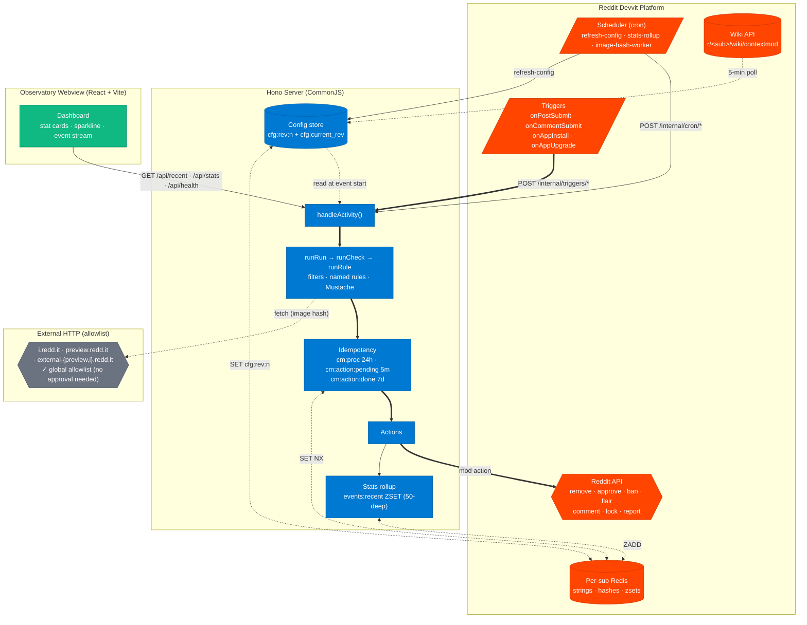
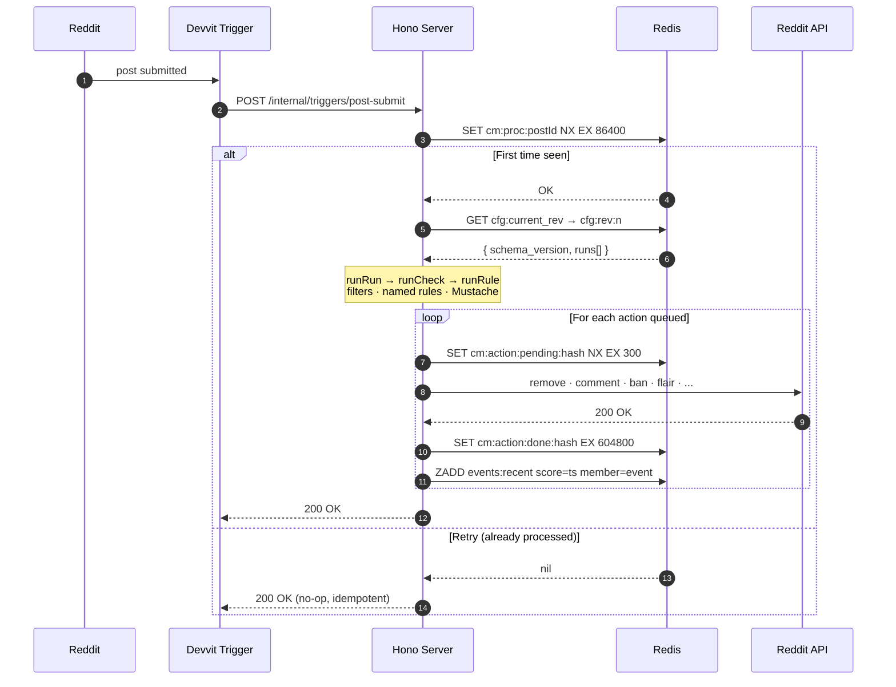

Reading additional input from stdin...
OpenAI Codex v0.128.0 (research preview)
--------
workdir: /Users/stephensookra/Reddiit Hacks/context-mod-devvit
model: gpt-5.5
provider: openai
approval: never
sandbox: workspace-write [workdir, /tmp, $TMPDIR, /Users/stephensookra/.codex/memories]
reasoning effort: none
reasoning summaries: none
session id: 019e345f-b1af-7910-b935-9bcc703acd9e
--------
user
Strategic enhancement audit. Repo at /Users/stephensookra/Reddiit\ Hacks/context-mod-devvit. Production state: Phase 1+2+3 backend SHIPPED (Vinh, commits 6694109/9532cf4/983c949). Step 3.6 dry-run tester SHIPPED (Stephen). Codex hotfixes shipped (2 CRITICAL + 7 HIGH original + 3 HIGH session-review). v0.2.0 in Reddit App Directory review. 173 tests green; tsc clean. Hackathon deadline 2026-05-27 18:00 PT (T-10 days). Two-person team: Vinh on backend (Phase 4 stretch in progress: history/attribution/recentActivity rules; image-hash NO-GO), Stephen on frontend + scaffolding + submission.

What would MEANINGFULLY improve this project pre-deadline that Stephen can do SOLO without interfering with Vinh-territory (src/core/, src/state/, src/actions/, src/rules/, src/lib/idem.ts, src/routes/triggers.ts, src/routes/scheduler.ts, src/shared/types.ts, src/shared/normalize.ts, src/schema/app.schema.json)?

Read the repo state directly. Consider:
1. Dashboard UX improvements (src/client/* is Stephen territory)
2. README + CHANGELOG + docs polish
3. Devpost submission strength (docs/submission/* and how it ties to actual repo state)
4. CI/test coverage for Stephen-owned surfaces
5. Examples library expansion (examples/*)
6. Performance / a11y / Lighthouse audits
7. Repo-meta polish (GitHub Topics, social preview, etc.)
8. Demo video readiness
9. Outreach + marketing surfaces
10. Hackathon-specific judge-impressing additions

Output STRICT MARKDOWN ranked into 3 tiers:
- **TIER 1 — high impact, low effort (<30 min each)**: 5-8 items
- **TIER 2 — high impact, medium effort (30-90 min each)**: 5-8 items
- **TIER 3 — nice-to-have / lower priority**: 3-5 items

Per item: 1-line description + estimated effort + which files touched + why it matters for hackathon judging or production-readiness. Skip ideas that overlap Vinh-territory. Skip vague suggestions; concrete deliverables only.

End with a SUMMARY: top 3 picks if Stephen has 2 hours to spend, top 1 pick if Stephen has 30 min.
codex
I’ll audit the repo directly and keep the recommendations constrained to Stephen-owned surfaces. I’m going to inspect structure, docs/submission assets, client code, examples, and CI/tests before ranking anything.
exec
/bin/zsh -lc 'ls -la' in /Users/stephensookra/Reddiit Hacks/context-mod-devvit
 succeeded in 0ms:
total 1056
drwxr-xr-x@  35 stephensookra  staff    1120 May 16 23:10 .
drwxr-xr-x    8 stephensookra  staff     256 May 13 19:19 ..
-rw-r--r--@   1 stephensookra  staff      29 May 16 21:43 .env
drwxr-xr-x@  15 stephensookra  staff     480 May 17 01:14 .git
drwxr-xr-x@   6 stephensookra  staff     192 May 13 19:28 .github
-rw-r--r--@   1 stephensookra  staff     116 May 14 01:03 .gitignore
-rw-r--r--@   1 stephensookra  staff      97 May 12 15:38 .prettierrc
drwxr-xr-x@   3 stephensookra  staff      96 May 12 15:38 .vscode
-rw-r--r--@   1 stephensookra  staff   14877 May 14 01:21 CHANGELOG.md
-rw-r--r--@   1 stephensookra  staff    5729 May 13 19:37 CODE_OF_CONDUCT.md
-rw-r--r--@   1 stephensookra  staff    5149 May 13 19:28 CONTRIBUTING.md
-rw-r--r--@   1 stephensookra  staff   10665 May 13 20:21 DESIGN.md
-rw-r--r--@   1 stephensookra  staff    1425 May 12 15:39 LICENSE
-rw-r--r--@   1 stephensookra  staff    4039 May 13 14:53 NOTICES.md
-rw-r--r--@   1 stephensookra  staff   24665 May 16 21:44 PLAN.md
-rw-r--r--@   1 stephensookra  staff   31922 May 16 21:15 README.md
-rw-r--r--@   1 stephensookra  staff    1954 May 13 19:17 SECURITY.md
drwxr-xr-x@  12 stephensookra  staff     384 May 14 01:33 assets
-rw-r--r--@   1 stephensookra  staff    2296 May 16 21:25 devvit.json
drwxr-xr-x@   5 stephensookra  staff     160 May 12 18:42 dist
drwxr-xr-x@   6 stephensookra  staff     192 May 14 03:19 docs
-rw-r--r--@   1 stephensookra  staff    2155 May 16 19:34 eslint.config.js
drwxr-xr-x@   6 stephensookra  staff     192 May 14 01:27 examples
drwxr-xr-x@ 461 stephensookra  staff   14752 May 12 18:39 node_modules
-rw-r--r--@   1 stephensookra  staff  372940 May 16 13:45 package-lock.json
-rw-r--r--@   1 stephensookra  staff    1611 May 16 21:25 package.json
drwxr-xr-x@   6 stephensookra  staff     192 May 14 01:16 policies
-rw-r--r--@   1 stephensookra  staff      81 May 12 18:01 postcss.config.js
drwxr-xr-x@   6 stephensookra  staff     192 May 14 02:39 scripts
drwxr-xr-x@  13 stephensookra  staff     416 May 16 19:34 src
-rw-r--r--@   1 stephensookra  staff    1787 May 13 19:36 tailwind.config.ts
drwxr-xr-x@  10 stephensookra  staff     320 May 16 19:50 tests
-rw-r--r--@   1 stephensookra  staff     969 May 16 13:45 tsconfig.json
-rw-r--r--@   1 stephensookra  staff     205 May 12 18:12 vite.config.ts
-rw-r--r--@   1 stephensookra  staff     427 May 12 18:39 vitest.config.ts

exec
/bin/zsh -lc 'pwd && rg --files' in /Users/stephensookra/Reddiit Hacks/context-mod-devvit
 succeeded in 0ms:
/Users/stephensookra/Reddiit Hacks/context-mod-devvit
src/routes/triggers.ts
src/routes/forms.ts
src/routes/api.ts
src/routes/menu.ts
src/routes/scheduler.ts
src/client/styles.d.ts
src/client/lib/design-tokens.ts
src/client/lib/types.ts
src/client/lib/starter-snippet.ts
src/client/lib/api.ts
src/client/components/ErrorBanner.tsx
src/client/components/EmptyState.tsx
src/client/components/Header.tsx
src/client/components/Sparkline.tsx
src/client/components/StatsRow.tsx
src/client/components/ActionBar.tsx
src/client/components/EventRow.tsx
src/client/components/RuleCountChips.tsx
src/client/styles.css
src/client/index.html
src/client/main.tsx
src/client/App.tsx
src/index.ts
src/lib/demo-fixtures.ts
src/lib/idem.ts
src/rules/ruleset.ts
src/rules/author.ts
src/rules/repost.ts
src/rules/regex.ts
src/actions/userFlair.ts
src/actions/approve.ts
src/actions/comment.ts
src/actions/remove.ts
src/actions/lock.ts
src/actions/ban.ts
src/actions/report.ts
src/schema/app.schema.json
src/state/recentEvents.ts
src/state/keys.ts
src/state/configStore.ts
src/state/migrations.ts
src/shared/normalize.ts
src/shared/types.ts
src/config/default-config.ts
src/core/runCheck.ts
src/core/config.ts
src/core/dryRunActivity.ts
src/core/handleActivity.ts
src/core/runRun.ts
src/core/template.ts
src/core/runRule.ts
src/core/namedRules.ts
src/core/runAction.ts
src/core/filters.ts
src/core/configSource.ts
SECURITY.md
package.json
package-lock.json
tailwind.config.ts
README.md
DESIGN.md
tsconfig.json
PLAN.md
vite.config.ts
devvit.json
eslint.config.js
vitest.config.ts
postcss.config.js
CONTRIBUTING.md
LICENSE
NOTICES.md
CODE_OF_CONDUCT.md
CHANGELOG.md
assets/gallery-dashboard.png
assets/thumbnail.png
assets/gallery-dryrun.png
assets/gallery-install.png
assets/gallery-wiki.png
assets/social-preview.png
assets/install-flow.png
assets/gallery-modmenu.png
assets/gallery-trigger.png
assets/icon.png
policies/terms.md
policies/_config.yml
policies/index.md
policies/privacy.md
scripts/plan
scripts/check-ai-tone.sh
examples/spam-fresh-account.json5
examples/README.md
examples/approve-trusted-mod.json5
examples/starter-config.json5
scripts/dev/mock-server.cjs
scripts/demo/stitch.sh
scripts/demo/captions-synthetic-fallback.srt
scripts/demo/captions-live-data.srt
scripts/demo/captions.notes.md
docs/submission/domain-approval-runbook.md
tests/routes/forms-test-rules.test.ts
docs/submission/devpost-form-cheat-sheet.md
docs/submission/e2e-scenarios.md
docs/submission/devvit-app-settings.md
docs/submission/writeup-draft.md
docs/submission/demo-video-runbook.md
docs/submission/outreach-drafts.md
docs/submission/pillar-5-numbers.md
docs/submission/demo-video-script.md
docs/submission/stephen-action-list.md
tests/routes/menu-test-rules.test.ts
docs/submission/submission-day-runbook.md
docs/migration-compatibility.md
tests/lib/idem.test.ts
tests/lib/idem-commit.test.ts
docs/superpowers/foxxmd-kanban-seed.md
docs/superpowers/2026-05-13-research-deltas.md
docs/superpowers/phase-3-ui-polish.md
tests/rules/repost.test.ts
tests/rules/ruleset.test.ts
tests/rules/regex.test.ts
tests/rules/author.test.ts
docs/superpowers/plans/2026-05-14-dev-web.md
docs/superpowers/plans/2026-05-14-solo-artifacts.md
docs/superpowers/plans/2026-05-13-day2-followups.md
docs/superpowers/plans/2026-05-14-three-ui-adds.md
docs/superpowers/plans/2026-05-12-contextmod-devvit-port.md
docs/superpowers/plans/2026-05-14-c-h-e-audit.md
docs/superpowers/plans/2026-05-13-tier-1-2-3-final.md
docs/superpowers/plans/2026-05-12-day1-codex-review-fixes.md
docs/superpowers/plans/2026-05-16-stephen-burndown-after-vinh-ship.md
docs/superpowers/plans/2026-05-14-wave-f-audit.md
docs/superpowers/plans/2026-05-13-tier-1-2-3-polish.md
docs/superpowers/plans/2026-05-13-retroactive-tool-incorporation.md
docs/superpowers/plans/2026-05-14-wave-f-closeout.md
docs/superpowers/plans/2026-05-14-a11y-polish.md
docs/superpowers/plans/2026-05-13-day3-submission-prep.md
docs/superpowers/plans/2026-05-14-audit-4-integration.md
docs/superpowers/plans/2026-05-14-c-h-e-tier-ship.md
tests/actions/actions.test.ts
docs/superpowers/codex-reviews/2026-05-16-session-full-review.md
docs/superpowers/codex-reviews/2026-05-16-vinh-ping-contract-findings.md
docs/superpowers/codex-reviews/2026-05-16-vinh-phase-1-2.md
docs/superpowers/codex-reviews/2026-05-17-enhancement-audit.md
tests/state/recentEvents.test.ts
tests/state/keys.test.ts
tests/state/configStore.test.ts
tests/shared/normalize.test.ts
docs/screenshots/CAPTURE-CHECKLIST.md
docs/screenshots/scenario-g-reload-toast.png
docs/screenshots/scenario-f-dryrun-form.png
docs/screenshots/scenario-h-dashboard-empty.png
docs/screenshots/scenario-f-dryrun-toast.png
docs/screenshots/dashboard-desktop.png
tests/config/default-config.test.ts
tests/core/config.test.ts
tests/core/configSource.test.ts
tests/core/namedRules.test.ts
tests/core/handleActivity.test.ts
tests/core/runRun.test.ts
tests/core/dryRunActivity.test.ts
tests/core/runCheck.test.ts
tests/core/template.test.ts
tests/core/runAction.test.ts
tests/core/filters.test.ts

exec
/bin/zsh -lc 'git status --short && git log --oneline -12' in /Users/stephensookra/Reddiit Hacks/context-mod-devvit
 succeeded in 0ms:
?? docs/superpowers/codex-reviews/2026-05-17-enhancement-audit.md
1df1d3b docs(submission): Vinh Reddit username confirmed — u/Outside-Research-772
3aec7ab docs(submission): refresh Devpost cheat sheet — Phase 1+2+3 shipped + Codex-hardened + v0.2.0 in review
1db00e2 docs(screenshots): scenarios G + F + H captured live on r/cm_devvit_test
6974b18 fix(forms): Devvit form envelope is flat — primary parse path is body.thingId
d58d76d diag(forms): log raw body + try multi-shape thingId parse — live-playtest diagnosis
3757dd9 fix(menu): drop disabled:true on test-rules form thingId — live-playtest bug
0e27460 docs(codex-review): full-session review (0C/3H/4M/3L/3K) catch-up commit
82c995c status: 6.1 🟡 IN REVIEW — cm-devvit v0.2.0 submitted to Reddit App Directory
9b2ee92 status: 6.1 ⛔ blocked — Reddit pre-flight wants Terms+Privacy URLs registered
77f5ed0 ⚠️ CONTRACT: rename app slug back to cm-devvit for public publish
3fa4b0f docs(screenshots): capture checklist A–H for Stephen — mod-auth views Playwright can't reach
4f8df6d status: PLAN.md fix internal inconsistencies — 2.5.2 dry-run authority + 4.1 PROMOTED

codex
I found the repo is already in a polished state, with one untracked audit doc present. Next I’m reading the client surface, submission docs, examples, and workflow files to identify concrete solo-safe gaps rather than generic polish.
exec
/bin/zsh -lc "sed -n '1,260p' src/client/App.tsx" in /Users/stephensookra/Reddiit Hacks/context-mod-devvit
exec
/bin/zsh -lc "sed -n '1,220p' package.json" in /Users/stephensookra/Reddiit Hacks/context-mod-devvit
exec
/bin/zsh -lc "sed -n '1,260p' src/client/styles.css" in /Users/stephensookra/Reddiit Hacks/context-mod-devvit
 succeeded in 0ms:
{
  "private": true,
  "name": "cm-devvit",
  "version": "0.0.2",
  "description": "Devvit Web port of FoxxMD's ContextMod rule-engine moderation bot",
  "license": "MIT",
  "type": "module",
  "scripts": {
    "build": "vite build",
    "deploy": "npm run type-check && npm run lint && npm run test && devvit upload",
    "dev": "devvit playtest",
    "dev:web": "vite build && node scripts/dev/mock-server.cjs",
    "launch": "npm run deploy && devvit publish",
    "lint": "eslint 'src/**/*.{ts,tsx}'",
    "login": "devvit login",
    "prettier": "prettier --write .",
    "test": "vitest run --config vitest.config.ts",
    "test:watch": "vitest --config vitest.config.ts",
    "type-check": "tsc --build"
  },
  "engines": {
    "node": ">=22.2.0"
  },
  "dependencies": {
    "@hono/node-server": "^1.19.9",
    "ajv": "^8.17.1",
    "hono": "4.11.7",
    "json5": "^2.2.3",
    "lucide-react": "^1.14.0",
    "mustache": "^4.2.0",
    "react": "^18.3.1",
    "react-dom": "^18.3.1"
  },
  "devDependencies": {
    "@devvit/start": "0.12.23",
    "@devvit/web": "0.12.23",
    "@eslint/js": "9.39.2",
    "@types/mustache": "^4.2.5",
    "@types/node": "^22.19.7",
    "@types/react": "^19.2.14",
    "@types/react-dom": "^19.2.3",
    "@vitejs/plugin-react": "^5.2.0",
    "autoprefixer": "^10.5.0",
    "devvit": "0.12.23",
    "eslint": "9.39.2",
    "globals": "17.2.0",
    "postcss": "^8.5.14",
    "prettier": "3.8.1",
    "tailwindcss": "^3.4.19",
    "tailwindcss-animate": "^1.0.7",
    "typescript": "5.9.3",
    "typescript-eslint": "8.54.0",
    "vite": "7.3.1",
    "vitest": "^2.1.9"
  }
}
 succeeded in 0ms:
@tailwind base;
@tailwind components;
@tailwind utilities;

@layer base {
  :root {
    --grain: url("data:image/svg+xml,%3Csvg xmlns='http://www.w3.org/2000/svg' width='160' height='160'%3E%3Cfilter id='n'%3E%3CfeTurbulence type='fractalNoise' baseFrequency='0.9' numOctaves='2' stitchTiles='stitch'/%3E%3CfeColorMatrix type='matrix' values='0 0 0 0 1  0 0 0 0 1  0 0 0 0 1  0 0 0 0.08 0'/%3E%3C/filter%3E%3Crect width='100%25' height='100%25' filter='url(%23n)'/%3E%3C/svg%3E");
  }

  html, body, #root { height: 100%; }

  .cm-body {
    margin: 0;
    background: #0A0A0B;
    color: #F5F5F4;
    font-family: 'Geist', ui-sans-serif, system-ui, sans-serif;
    -webkit-font-smoothing: antialiased;
    -moz-osx-font-smoothing: grayscale;
    text-rendering: optimizeLegibility;
    overflow: hidden;
  }

  ::-webkit-scrollbar { width: 6px; height: 6px; }
  ::-webkit-scrollbar-track { background: transparent; }
  ::-webkit-scrollbar-thumb { background: rgba(255,255,255,0.08); border-radius: 999px; }
  ::-webkit-scrollbar-thumb:hover { background: rgba(255,255,255,0.14); }
}

@layer components {
  .glass {
    position: relative;
    background: rgba(255, 255, 255, 0.015);
    background-blend-mode: luminosity;
    backdrop-filter: blur(8px);
    -webkit-backdrop-filter: blur(8px);
    border-radius: inherit;
    overflow: hidden;
    box-shadow:
      inset 0 1px 1px rgba(255, 255, 255, 0.08),
      0 8px 24px -12px rgba(0, 0, 0, 0.6);
  }
  .glass::before {
    content: '';
    position: absolute;
    inset: 0;
    border-radius: inherit;
    padding: 1px;
    background: linear-gradient(
      180deg,
      rgba(255, 255, 255, 0.18) 0%,
      rgba(255, 255, 255, 0.05) 25%,
      rgba(255, 255, 255, 0) 50%,
      rgba(255, 255, 255, 0.05) 75%,
      rgba(255, 255, 255, 0.18) 100%
    );
    -webkit-mask:
      linear-gradient(#fff 0 0) content-box,
      linear-gradient(#fff 0 0);
    -webkit-mask-composite: xor;
    mask-composite: exclude;
    pointer-events: none;
  }

  .grain::after {
    content: '';
    position: absolute;
    inset: 0;
    background-image: var(--grain);
    opacity: 0.5;
    mix-blend-mode: overlay;
    pointer-events: none;
  }

  .live-dot {
    width: 6px;
    height: 6px;
    border-radius: 999px;
    background: #4ADE80;
    box-shadow: 0 0 0 0 rgba(74, 222, 128, 0.5);
    animation: live-pulse 2s ease-in-out infinite;
  }
  @keyframes live-pulse {
    0%, 100% { box-shadow: 0 0 0 0 rgba(74, 222, 128, 0.5); }
    50% { box-shadow: 0 0 0 5px rgba(74, 222, 128, 0); }
  }

  .telemetry {
    font-family: 'Geist Mono', ui-monospace, monospace;
    font-variant-numeric: tabular-nums;
    letter-spacing: -0.01em;
  }

  /* CSP-safe entrance animations (no framer-motion / no eval) */
  @keyframes cmFadeUp {
    from { opacity: 0; transform: translateY(8px); }
    to { opacity: 1; transform: translateY(0); }
  }
  @keyframes cmFadeLeft {
    from { opacity: 0; transform: translateX(-8px); }
    to { opacity: 1; transform: translateX(0); }
  }
  @keyframes cmEventArrive {
    0% {
      opacity: 0;
      transform: translateX(-8px);
      background-color: rgba(74, 222, 128, 0.10);
    }
    60% {
      opacity: 1;
      transform: translateX(0);
      background-color: rgba(74, 222, 128, 0.08);
    }
    100% {
      opacity: 1;
      transform: translateX(0);
      background-color: transparent;
    }
  }
  @keyframes cmFadeIn {
    from { opacity: 0; }
    to { opacity: 1; }
  }
  @keyframes cmDrawLine {
    from { stroke-dashoffset: var(--line-len, 1000); }
    to { stroke-dashoffset: 0; }
  }

  .cm-fade-up {
    opacity: 0;
    animation: cmFadeUp 0.55s cubic-bezier(0.16, 1, 0.3, 1) both;
  }
  .cm-fade-left {
    opacity: 0;
    animation: cmFadeLeft 0.4s cubic-bezier(0.16, 1, 0.3, 1) both;
  }
  .cm-event-arrive {
    opacity: 0;
    animation: cmEventArrive 1.1s cubic-bezier(0.16, 1, 0.3, 1) both;
  }
  .cm-fade-in {
    opacity: 0;
    animation: cmFadeIn 0.6s ease-out both;
  }
  .cm-draw {
    stroke-dasharray: var(--line-len, 1000);
    stroke-dashoffset: var(--line-len, 1000);
    animation: cmDrawLine 1.1s cubic-bezier(0.16, 1, 0.3, 1) 0.6s forwards;
  }
}

@layer utilities {
  .text-balance { text-wrap: balance; }
  .text-pretty { text-wrap: pretty; }
}

/* WCAG 2.3.3 — respect the OS-level reduced-motion preference. Collapse
   durations to ~0 (not zero — some animation libraries break on
   `animation: none`) so vestibular-sensitive users get a static UI. */
@media (prefers-reduced-motion: reduce) {
  *,
  *::before,
  *::after {
    animation-duration: 0.01ms !important;
    animation-iteration-count: 1 !important;
    transition-duration: 0.01ms !important;
    scroll-behavior: auto !important;
  }
}

exec
/bin/zsh -lc 'rg --files .github docs/submission examples tests/routes tests/client src/client assets | sort' in /Users/stephensookra/Reddiit Hacks/context-mod-devvit
 succeeded in 0ms:
rg: tests/client: No such file or directory (os error 2)
.github/ISSUE_TEMPLATE/bug_report.yml
.github/ISSUE_TEMPLATE/config.yml
.github/ISSUE_TEMPLATE/feature_request.yml
.github/PULL_REQUEST_TEMPLATE.md
.github/dependabot.yml
.github/workflows/ci.yml
.github/workflows/pages.yml
assets/gallery-dashboard.png
assets/gallery-dryrun.png
assets/gallery-install.png
assets/gallery-modmenu.png
assets/gallery-trigger.png
assets/gallery-wiki.png
assets/icon.png
assets/install-flow.png
assets/social-preview.png
assets/thumbnail.png
docs/submission/demo-video-runbook.md
docs/submission/demo-video-script.md
docs/submission/devpost-form-cheat-sheet.md
docs/submission/devvit-app-settings.md
docs/submission/domain-approval-runbook.md
docs/submission/e2e-scenarios.md
docs/submission/outreach-drafts.md
docs/submission/pillar-5-numbers.md
docs/submission/stephen-action-list.md
docs/submission/submission-day-runbook.md
docs/submission/writeup-draft.md
examples/README.md
examples/approve-trusted-mod.json5
examples/spam-fresh-account.json5
examples/starter-config.json5
src/client/App.tsx
src/client/components/ActionBar.tsx
src/client/components/EmptyState.tsx
src/client/components/ErrorBanner.tsx
src/client/components/EventRow.tsx
src/client/components/Header.tsx
src/client/components/RuleCountChips.tsx
src/client/components/Sparkline.tsx
src/client/components/StatsRow.tsx
src/client/index.html
src/client/lib/api.ts
src/client/lib/design-tokens.ts
src/client/lib/starter-snippet.ts
src/client/lib/types.ts
src/client/main.tsx
src/client/styles.css
src/client/styles.d.ts
tests/routes/forms-test-rules.test.ts
tests/routes/menu-test-rules.test.ts

 succeeded in 107ms:
import { useEffect, useState, useCallback } from 'react';
import { Header } from './components/Header';
import { StatsRow } from './components/StatsRow';
import { Sparkline } from './components/Sparkline';
import { EventRow } from './components/EventRow';
import { ActionBar } from './components/ActionBar';
import { ErrorBanner } from './components/ErrorBanner';
import { RuleCountChips } from './components/RuleCountChips';
import { EmptyState } from './components/EmptyState';
import {
  fetchRecentSafe,
  fetchStatsSafe,
  DEMO_EVENTS,
  DEMO_STATS,
  ZERO_STATS,
} from './lib/api';
import type { EventRecord, StatsRollup } from './lib/types';

const POLL_MS = 10_000;

// Demo data is OPT-IN only via ?demo=1 — production never shows fabricated mod
// actions (per Codex review M6: invented data risks Devvit app review rejection).
const DEMO_ENABLED =
  typeof window !== 'undefined' &&
  new URLSearchParams(window.location.search).get('demo') === '1';

export default function App() {
  const [events, setEvents] = useState<EventRecord[]>([]);
  const [stats, setStats] = useState<StatsRollup | null>(null);
  const [refreshedAt, setRefreshedAt] = useState<number>(Date.now());
  const [usingDemo, setUsingDemo] = useState(false);
  const [apiError, setApiError] = useState<string | null>(null);

  const refresh = useCallback(async () => {
    const [recent, statsData] = await Promise.all([fetchRecentSafe(), fetchStatsSafe()]);

    // If EITHER call errored, surface the error and keep the last-good state
    // so the dashboard doesn't lose its display while the API recovers.
    if (!recent.ok || !statsData.ok) {
      const errMsg = !recent.ok ? recent.error : !statsData.ok ? statsData.error : 'unknown';
      setApiError(errMsg);
      setRefreshedAt(Date.now());
      return;
    }

    setApiError(null);

    // Both calls succeeded. Three branches: real data, empty + demo, empty + zero-state.
    const recentEvents = recent.empty ? [] : recent.data;
    const statsValue = statsData.empty ? null : statsData.data;

    if (recentEvents.length === 0 && !statsValue) {
      if (DEMO_ENABLED) {
        setEvents(DEMO_EVENTS);
        setStats(DEMO_STATS);
        setUsingDemo(true);
      } else {
        setEvents([]);
        setStats(ZERO_STATS);
        setUsingDemo(false);
      }
    } else {
      setEvents(recentEvents);
      setStats(statsValue ?? ZERO_STATS);
      setUsingDemo(false);
    }
    setRefreshedAt(Date.now());
  }, []);

  useEffect(() => {
    void refresh();
    const id = setInterval(() => void refresh(), POLL_MS);
    return () => clearInterval(id);
  }, [refresh]);

  const subreddit =
    typeof window !== 'undefined'
      ? new URLSearchParams(window.location.search).get('subreddit') ?? 'cm_devvit_test'
      : 'cm_devvit_test';

  return (
    <div className="relative w-full h-full overflow-hidden flex flex-col bg-ink-950 grain">
      <div
        aria-hidden
        className="absolute inset-0 pointer-events-none"
        style={{
          background:
            'radial-gradient(80% 60% at 50% 0%, rgba(74,222,128,0.06), transparent 60%), radial-gradient(40% 40% at 90% 100%, rgba(96,165,250,0.05), transparent 60%)',
        }}
      />

      <div className="relative z-10 flex flex-col h-full">
        <Header subreddit={subreddit} refreshedAt={refreshedAt} />

        {apiError && (
          <ErrorBanner message={apiError} onDismiss={() => setApiError(null)} />
        )}

        {stats && <StatsRow stats={stats} />}

        <div
          className="cm-fade-up px-5 pt-3.5 pb-1"
          style={{ animationDelay: '0.35s' }}
        >
          <div className="flex items-baseline justify-between mb-1">
            <h2 className="text-[11px] tracking-[0.18em] uppercase text-bone-300 font-medium">
              hourly <span className="font-serif italic normal-case tracking-normal text-bone-200/80">actions</span> · 24h
            </h2>
            {usingDemo && (
              <span className="telemetry text-[9px] tracking-wider uppercase text-bone-300/80">
                demo · awaiting real events
              </span>
            )}
          </div>
          {stats &&
            (stats.hourlyActions24h.length >= 2 ? (
              <Sparkline data={stats.hourlyActions24h} />
            ) : (
              <div className="telemetry text-[10px] text-bone-300/60 px-5 pb-2">
                not enough data yet — the sparkline needs at least 2 hours of activity
              </div>
            ))}
        </div>

        <div className="flex-1 min-h-0 mt-2 flex flex-col">
          <div className="flex items-baseline justify-between px-5 pb-2">
            <h2 className="text-[11px] tracking-[0.18em] uppercase text-bone-300 font-medium">
              recent <span className="font-serif italic normal-case tracking-normal text-bone-200/80">actions</span>
            </h2>
            <span className="telemetry text-[10px] text-bone-300/70">{events.length} events</span>
          </div>
          <RuleCountChips events={events} />

          <div
            className="flex-1 min-h-0 overflow-y-auto border-t border-line"
            aria-live="polite"
            aria-atomic="false"
            aria-relevant="additions"
            aria-label="Recent moderation actions"
          >
            {events.length === 0 ? (
              <EmptyState subreddit={subreddit} />
            ) : (
              events.map((ev, i) => <EventRow key={`${ev.activityId}-${ev.ts}`} event={ev} idx={i} />)
            )}
          </div>
        </div>

        <ActionBar subreddit={subreddit} onReload={refresh} events={events} />
      </div>
    </div>
  );
}

exec
/bin/zsh -lc "sed -n '1,240p' src/client/components/StatsRow.tsx" in /Users/stephensookra/Reddiit Hacks/context-mod-devvit
exec
/bin/zsh -lc "sed -n '1,240p' src/client/components/EventRow.tsx" in /Users/stephensookra/Reddiit Hacks/context-mod-devvit
exec
/bin/zsh -lc "sed -n '1,260p' src/client/components/ActionBar.tsx" in /Users/stephensookra/Reddiit Hacks/context-mod-devvit
 succeeded in 0ms:
import type { StatsRollup } from '../lib/types';

// Accent token names map to tailwind.config.ts signal palette + bone primary.
type AccentToken = 'bone' | 'ok' | 'warn' | 'err' | 'info' | 'author';

const ACCENT_CLASS: Record<AccentToken, string> = {
  bone: 'text-bone-50',
  ok: 'text-signal-ok',
  warn: 'text-signal-warn',
  err: 'text-signal-err',
  info: 'text-signal-info',
  author: 'text-signal-author',
};

function Card({
  label,
  value,
  accent = 'bone',
  delay,
  live,
}: {
  label: string;
  value: string;
  accent?: AccentToken;
  delay: number;
  live?: boolean;
}) {
  return (
    <div
      className="cm-fade-up relative rounded-xl glass p-3.5 flex flex-col gap-1.5 min-w-0"
      style={{ animationDelay: `${delay}s` }}
    >
      <span className="text-[10px] tracking-[0.18em] uppercase text-bone-300 font-medium flex items-center gap-1.5">
        {label}
        {live && (
          <span
            className="inline-block w-1.5 h-1.5 rounded-full bg-signal-ok animate-pulse-dot"
            aria-hidden
          />
        )}
      </span>
      <span
        className={`telemetry text-[28px] leading-none truncate ${ACCENT_CLASS[accent]}`}
        title={value}
      >
        {value}
      </span>
    </div>
  );
}

export function StatsRow({ stats }: { stats: StatsRollup }) {
  const hours = Math.floor(stats.timeSavedMin / 60);
  const mins = stats.timeSavedMin % 60;
  const timeFmt = hours > 0 ? `${hours}h ${mins}m` : `${mins}m`;
  return (
    <div className="grid grid-cols-2 lg:grid-cols-4 gap-2.5 px-5 pt-4">
      <Card label="Actions today" value={String(stats.actionsToday)} accent="bone" delay={0.05} />
      <Card label="Mod time saved" value={timeFmt} accent="ok" delay={0.12} />
      <Card label="Active rules" value={String(stats.activeRules)} accent="bone" delay={0.19} live={stats.activeRules > 0} />
      <Card label="Top rule" value={stats.topRule} accent="warn" delay={0.26} />
    </div>
  );
}

 succeeded in 0ms:
import { Trash2, Check, Lock, MessageSquare, Flag, Ban, Tag, AlertTriangle, type LucideIcon } from 'lucide-react';
import type { ActionKind, EventRecord } from '../lib/types';
import { SIGNAL } from '../lib/design-tokens';

const KIND_ICON: Record<ActionKind, LucideIcon> = {
  remove: Trash2,
  approve: Check,
  lock: Lock,
  comment: MessageSquare,
  report: Flag,
  ban: Ban,
  userFlair: Tag,
};

// Source-of-truth: SIGNAL palette in src/client/lib/design-tokens.ts.
// Tailwind config + this map both import the same constants — change a
// value once, both update.
const KIND_COLOR: Record<ActionKind, string> = {
  remove: SIGNAL.err,
  approve: SIGNAL.ok,
  lock: SIGNAL.warn,
  comment: SIGNAL.info,
  report: SIGNAL.warn,
  ban: SIGNAL.err,
  userFlair: SIGNAL.author,
};

function relTime(ts: number): string {
  const s = Math.floor((Date.now() - ts) / 1000);
  if (s < 60) return `${s}s`;
  if (s < 3600) return `${Math.floor(s / 60)}m`;
  if (s < 86400) return `${Math.floor(s / 3600)}h`;
  return `${Math.floor(s / 86400)}d`;
}

export function EventRow({ event, idx }: { event: EventRecord; idx: number }) {
  const allOk = event.actions.every((a) => a.ok);
  const FirstIcon = event.actions[0] ? KIND_ICON[event.actions[0].kind] ?? AlertTriangle : AlertTriangle;
  const firstColor = event.actions[0] ? KIND_COLOR[event.actions[0].kind] ?? '#71717A' : '#71717A'; // bone.300 fallback
  return (
    <div
      className="cm-event-arrive group grid grid-cols-[44px_60px_1fr_auto] items-center gap-3 px-5 py-2.5 border-b border-line/60 hover:bg-white/[0.015] transition-colors"
      style={{ animationDelay: `${0.05 * idx + 0.4}s` }}
    >
      <div className="flex items-center gap-1.5">
        <span
          role="img"
          className="w-1.5 h-1.5 rounded-full shrink-0"
          style={{ background: allOk ? SIGNAL.ok : SIGNAL.err }}
          aria-label={allOk ? 'action succeeded' : 'action failed'}
        />
        {event.actions[0] && <FirstIcon size={13} strokeWidth={1.6} color={firstColor} />}
      </div>

      <span className="telemetry text-[11px] text-bone-300 tabular-nums">{relTime(event.ts)}</span>

      <div className="min-w-0 flex items-baseline gap-2">
        <span className="text-[12px] text-bone-50 truncate font-medium">{event.checkName ?? '—'}</span>
        <span className="telemetry text-[10.5px] text-bone-300 truncate">{event.activityId}</span>
      </div>

      <div className="flex items-center gap-1.5">
        {event.actions.map((a, i) => (
          <span
            key={`${a.kind}-${i}`}
            className="telemetry text-[10px] uppercase tracking-wider px-1.5 py-0.5 rounded-sm"
            style={{
              color: a.ok ? KIND_COLOR[a.kind] : SIGNAL.err,
              background: `${a.ok ? KIND_COLOR[a.kind] : SIGNAL.err}14`,
              border: `1px solid ${a.ok ? KIND_COLOR[a.kind] : SIGNAL.err}33`,
            }}
          >
            {a.kind}{!a.ok ? '✗' : ''}
          </span>
        ))}
      </div>
    </div>
  );
}

 succeeded in 0ms:
import { useState } from 'react';
import { RefreshCw, FileText, ExternalLink, Download } from 'lucide-react';
import type { EventRecord } from '../lib/types';

const REPO_URL = 'https://github.com/StephenSook/context-mod-devvit';

function eventsToCsv(events: EventRecord[]): string {
  const header = ['ts', 'activityId', 'runName', 'checkName', 'actions', 'allOk'];
  const rows = events.map((e) =>
    [
      new Date(e.ts).toISOString(),
      e.activityId,
      e.runName ?? '',
      e.checkName ?? '',
      e.actions.map((a) => `${a.kind}${a.ok ? '' : '✗'}`).join(';'),
      e.actions.every((a) => a.ok) ? 'true' : 'false',
    ]
      .map((v) => `"${String(v).replace(/"/g, '""')}"`)
      .join(','),
  );
  return [header.join(','), ...rows].join('\n');
}

function downloadCsv(events: EventRecord[], subreddit: string) {
  const csv = eventsToCsv(events);
  const blob = new Blob([csv], { type: 'text/csv;charset=utf-8' });
  const url = URL.createObjectURL(blob);
  const a = document.createElement('a');
  a.href = url;
  const stamp = new Date().toISOString().replace(/[:.]/g, '-').slice(0, 16);
  a.download = `contextmod-events-${subreddit}-${stamp}.csv`;
  document.body.appendChild(a);
  a.click();
  document.body.removeChild(a);
  URL.revokeObjectURL(url);
}

export function ActionBar({
  subreddit,
  onReload,
  events,
}: {
  subreddit: string;
  onReload: () => Promise<void> | void;
  events: EventRecord[];
}) {
  const [busy, setBusy] = useState(false);
  const [flash, setFlash] = useState<string | null>(null);

  const handleReload = async () => {
    if (busy) return;
    setBusy(true);
    setFlash(null);
    try {
      await onReload();
      setFlash('refreshed');
      setTimeout(() => setFlash(null), 1500);
    } finally {
      setBusy(false);
    }
  };

  const handleExport = () => {
    if (events.length === 0) return;
    downloadCsv(events, subreddit);
    setFlash('exported');
    setTimeout(() => setFlash(null), 1500);
  };

  const wikiUrl = `https://www.reddit.com/r/${subreddit}/wiki/contextmod`;
  const exportDisabled = events.length === 0;

  return (
    <div
      className="cm-fade-up flex items-center justify-between px-5 py-3 border-t border-line"
      style={{ animationDelay: '0.7s' }}
    >
      <div className="flex items-center gap-4">
        <button
          onClick={handleReload}
          disabled={busy}
          className="group inline-flex items-center gap-1.5 text-[11px] text-bone-200 hover:text-bone-50 transition-colors disabled:opacity-60"
        >
          <RefreshCw
            size={12}
            strokeWidth={1.8}
            className={busy ? 'animate-spin' : 'group-hover:rotate-180 transition-transform duration-500'}
          />
          <span className="tracking-wide">
            {flash === 'refreshed' ? <span className="text-signal-ok">refreshed</span> : 'Reload config'}
          </span>
        </button>

        <button
          onClick={handleExport}
          disabled={exportDisabled}
          title={exportDisabled ? 'No events to export yet' : `Download last ${events.length} as CSV`}
          className="group inline-flex items-center gap-1.5 text-[11px] text-bone-200 hover:text-bone-50 transition-colors disabled:opacity-40 disabled:cursor-not-allowed"
        >
          <Download size={12} strokeWidth={1.8} />
          <span className="tracking-wide">
            {flash === 'exported' ? <span className="text-signal-ok">downloaded</span> : 'Export CSV'}
          </span>
        </button>
      </div>

      <div className="flex items-center gap-4">
        <a
          href={wikiUrl}
          target="_top"
          rel="noreferrer"
          className="group inline-flex items-center gap-1.5 text-[11px] text-bone-300 hover:text-bone-50 transition-colors"
        >
          <FileText size={12} strokeWidth={1.8} />
          <span>Wiki</span>
        </a>
        <a
          href={REPO_URL}
          target="_top"
          rel="noreferrer"
          className="group inline-flex items-center gap-1.5 text-[11px] text-bone-300 hover:text-bone-50 transition-colors"
        >
          <ExternalLink size={12} strokeWidth={1.8} />
          <span>Docs</span>
        </a>
      </div>
    </div>
  );
}

exec
/bin/zsh -lc "sed -n '1,240p' src/client/lib/api.ts" in /Users/stephensookra/Reddiit Hacks/context-mod-devvit
 succeeded in 3ms:
import type { ApiResult, EventRecord, StatsRollup } from './types';

/**
 * fetchRecentSafe / fetchStatsSafe — return a discriminated ApiResult so the
 * dashboard can distinguish (success+data) vs (success+empty) vs (real error).
 *
 * Replaces the prior `return []` / `return null` swallow pattern that made an
 * API outage indistinguishable from "no events yet" (Codex review HIGH F5).
 *
 * ?demo=1 in window.location propagates to the fetch URL so the server returns
 * seeded fixtures from src/lib/demo-fixtures.ts. Read inside each call so
 * runtime URL changes (history.pushState) take effect on the next poll.
 */

function demoSuffix(): string {
  if (typeof window === 'undefined') return '';
  return new URLSearchParams(window.location.search).get('demo') === '1'
    ? '?demo=1'
    : '';
}

export async function fetchRecentSafe(): Promise<ApiResult<EventRecord[]>> {
  try {
    const res = await fetch(`/api/recent${demoSuffix()}`);
    if (!res.ok) return { ok: false, error: `HTTP ${res.status}` };
    const data = await res.json();
    const events = Array.isArray(data?.events) ? (data.events as EventRecord[]) : [];
    if (events.length === 0) return { ok: true, empty: true };
    return { ok: true, empty: false, data: events };
  } catch (err) {
    const msg = err instanceof Error ? err.message : String(err);
    return { ok: false, error: msg };
  }
}

export async function fetchStatsSafe(): Promise<ApiResult<StatsRollup>> {
  try {
    const res = await fetch(`/api/stats${demoSuffix()}`);
    if (!res.ok) return { ok: false, error: `HTTP ${res.status}` };
    const data = await res.json();
    const c = data?.counters;
    if (!c || typeof c !== 'object' || !Array.isArray(c.hourlyActions24h)) {
      return { ok: true, empty: true };
    }
    return { ok: true, empty: false, data: c as StatsRollup };
  } catch (err) {
    const msg = err instanceof Error ? err.message : String(err);
    return { ok: false, error: msg };
  }
}

/**
 * Genuine zero-state stats. Used when the API is reachable + empty (no demo flag).
 * Replaces the fabricated DEMO_STATS as the default empty-state shape so production
 * never shows invented mod-action counts (per Codex review M6).
 */
export const ZERO_STATS: StatsRollup = {
  actionsToday: 0,
  timeSavedMin: 0,
  activeRules: 0,
  topRule: '—',
  hourlyActions24h: new Array(24).fill(0),
};

/**
 * Demo fixtures live in src/lib/demo-fixtures.ts now (single source of truth
 * shared with src/routes/api.ts server-side branch). Re-export here so existing
 * client imports (App.tsx) keep working without a deeper import path change.
 */
import { demoEvents, DEMO_STATS as SHARED_DEMO_STATS } from '../../lib/demo-fixtures';
export const DEMO_EVENTS: EventRecord[] = demoEvents() as EventRecord[];
export const DEMO_STATS: StatsRollup = SHARED_DEMO_STATS as StatsRollup;

exec
/bin/zsh -lc "sed -n '1,260p' README.md" in /Users/stephensookra/Reddiit Hacks/context-mod-devvit
exec
/bin/zsh -lc "sed -n '1,240p' docs/submission/writeup-draft.md" in /Users/stephensookra/Reddiit Hacks/context-mod-devvit
exec
/bin/zsh -lc "sed -n '1,240p' docs/submission/devpost-form-cheat-sheet.md" in /Users/stephensookra/Reddiit Hacks/context-mod-devvit
 succeeded in 0ms:
# Devpost Submission Draft — context-mod-devvit

> **Voice rule (per Codex D10 + Watchful1 lesson):** write in first person, scrappy, sound like a real builder. No "sophisticated ecosystem" / "revolutionary platform" marketing prose. Mention specific bugs you hit, specific cuts you made, specific frustrations. Stephen rewrites every word before submission — this is structural scaffolding, not final copy. <!-- AITONE_IGNORE -->

---

## Section 1 — Tool Overview

> **What Devpost asks:** "Describe in detail the functionality of the bot. Include all capabilities and how moderators and users are intended to use the app."

**Suggested opener** (Stephen's voice — rewrite):

> ContextMod is a rule-engine moderation bot. Mods write JSON5 config in their sub's wiki — define what counts as spam, what flairs to require, what posts to remove, what comments to leave, what users to ban. Once Phase 1-3 wiring lands, the bot reads every new post and comment, runs the rules, takes the actions. No central server, no Heroku token, no shared rate limits — Devvit handles all of that. (v0.1.0 ships the rule engine + idempotency primitives + atomic config publish + Observatory dashboard demo mode; live trigger / action / dashboard wiring lands through Day 5-11 per the phase plan below.)

> **Why now:** Reddit's CEO said on the Q1 2026 earnings call that they're "porting good bots to the developer platform." Reddit's own r/Devvit team is deprecating the older Blocks framework. The $1,000 App Migration Bounty is explicitly scoped to PRAW→Devvit moves — ContextMod is exactly that. FoxxMD's last ContextMod release was November 2022, weeks before Reddit's paid Data API tier launched in July 2023. The bot has been frozen at the pre-blackout boundary ever since, with 15+ operators stuck running it on dying infrastructure. This port unblocks all of them on the platform Reddit is actively recommending.

> **What mods actually want:** The top-upvoted comment (94 upvotes, u/Aeroncastle) on the May 2026 r/modnews "Mod Monthly" thread is *"I want stronger tools to fight AI, not in person events"* (verified at [r/modnews/comments/1t6jggp](https://www.reddit.com/r/modnews/comments/1t6jggp/), top 6 sampled 2026-05-13). The next three top comments echo the same ask: u/critacle (34 upvotes) — *"Stop the AI bot spam. It's dominating /r/all. This is killing Reddit"*; u/GamingYouTube14 (21) — *"can you guys look into these new ai bots that adapt to the conversation? they're pretty much undetectable by any kind of algorithm"*; u/OMGWTFBBQUE (15) — *"If I have to remove another AI post I'm going to lose my shit. Fucking do something about it."* ContextMod is anti-AI-spam tooling by construction — `regex` catches the generic phrasings AI-generated spam reuses, `author` filters flag new-account / low-karma / no-verified-email patterns AI bot farms produce, `history` (Phase 4) detects cross-sub posting cadence that no human author would maintain. Plus the Observatory dashboard is the "reason-chain audit" r/TrustAndSafety asked for — every action chip surfaces the rule that fired, the activityId, and the context. ContextMod doesn't replace AutoMod (regex-only); it's the moderator's investigation workbench that runs alongside.

**Capabilities (bullet list):**

- **3 MVP rule kinds shipped** in v0.1.0: `regex` (multi-field threshold matching), `author` (basic criteria — age, karma, flair, isMod, isContributor, verified, shadowBanned), `ruleSet` (AND/OR composition).
- **7 MVP actions**: `remove`, `approve`, `lock`, `comment`, `report`, `ban`, `userFlair`. All support Mustache templates over `{{item}}`, `{{author}}`, `{{rules.<name>.data}}` context.
- **4 stretch rule kinds** in Phase 4: `history`, `attribution`, `recentActivity`, `repost` (URL + image-hash variants). Upstream `mhs` toxicity classifier was **cut** from the Devvit port after Reddit's `reddit/devvit-docs` PR #96 (2026-05-08) locked the HTTP fetch policy's AI-provider list to OpenAI + Gemini only — `api.moderatehatespeech.com` falls outside that carve-out.
- **Filters** (`authorIs` / `itemIs`) gate Rule/Check/Action execution by author + item attributes. Same criteria set as upstream ContextMod.
- **Flow control**: `postBehavior` per Check (`next` / `nextRun` / `stop` / `goto:<run>.<check>`).
- **Named rules** for DRY composition.
- **Observatory dashboard** (custom-post webview): action-telemetry surface with 24h sparkline, last 50 events with color-coded action chips, stat cards (actions today, mod time saved estimate, active rules, top rule). Ships in v0.1.0 against `?demo=1` synthetic data; live-data wiring lands at Phase 3 once Vinh's `events:recent` ZSET pipeline finishes.
- **Wiki-based config** with 5-min refresh cron + manual reload from mod menu. Atomic publish via revision pointer so handleActivity always reads a consistent snapshot mid-event.
- **Dry-run rule tester** mod menu action — point at any post/comment to see which rules would fire without taking action.
- **Per-effect idempotency**: every action has a 5-min `pending` reservation + 7d `done` marker, so Devvit's at-least-once trigger delivery never double-applies the same mod action.

**How mods use it:**

1. Install via the App Directory (`developers.reddit.com/apps/cm-devvit`) → click "Add to community."
2. Write JSON5 rules in `r/<sub>/wiki/contextmod`. Starter config seeded on install.
3. View action telemetry via the Observatory dashboard post (created via mod menu). Renders with `?demo=1` synthetic data until Phase 3 wires live `events:recent` ZSET data.
4. Dry-run rules on specific posts before letting them go live. Reload on every wiki edit (manual or 5-min auto).

---

## Section 2 — Project Impact

> **What Devpost asks:** "List 1-3 communities that you think would find this app useful and how you see moderators/communities benefiting. We're looking for community impact, time savings for moderators, etc."

### Communities served (real, not hypothetical)

1. **[r/mealtimevideos](https://reddit.com/r/mealtimevideos)** — 60K weekly visitors. FoxxMD's primary ContextMod instance. Currently running on his self-hosted PRAW infrastructure; this port lets him migrate to per-sub Devvit and stop paying for hosting.

2. **[r/piercing](https://reddit.com/r/piercing)** — 600K visitors, 12K contributors. Run by SampleOfNone who publicly flagged in r/Devvit Discord that "image parsing is the hard part on Devvit" — this port has perceptual-hash repost detection (Phase 4) specifically targeting that gap.

3. **The 15+ third-party operators** FoxxMD identified running ContextMod across their own subs (several in the 10K–1M subscriber range, ~150 NSFW subs). Each of them gets the same one-click install path the moment the app is published — no more central server, no more shared rate limits.

### Time savings — the defensible claim

> **Don't overclaim.** Per Codex review: "no published 'X hours saved per mod' study exists. Don't invent numbers."

What CAN be defended (every number citation-traceable in [`pillar-5-numbers.md`](./pillar-5-numbers.md)):

- **466 hours/day of moderation labor measured across 21,500 active mods in 126 subreddits** — Li, Hecht, Chancellor (ICWSM 2022). At $20/hr median that's $3.4M/yr unpaid in the measured population. Linear-scaled to Reddit's stated 60K active mods: **~$9.5M/yr in volunteer-labor-equivalent value** (flag this as scaling math).
- **73% of mod actions are already performed by bots** — same paper.
- ContextMod adds a **second axis** to the bot stack: AutoMod is regex-only; CM adds context-gathering (author history, sub-distribution, image-hash repost) that today only humans can do.
- **Per-action user-history checks take ~5-10 minutes manually**. If CM-class bots offload 1 incremental hour per mod per week beyond AutoMod's reach, the labor-equivalent value offloaded is **60K × 52 × $20 ≈ $62.4M/yr at full capture** — even 10% capture is $6M+/yr.

### Sookra Pillar alignment

- **Pillar 1 — Real problem, named person:** FoxxMD (creator, ContextMod) + SampleOfNone (production operator at r/piercing) both named in conversation. No hypotheticals.
- **Pillar 2 — Structural gap:** Reddit's July 2023 paid Data API tier ($12K+/yr commercial, 100 QPM free) closed the PRAW path. Devvit is the only migration target. CM has 15+ operators stuck on dying infra.
- **Pillar 3 — Human-scale stat:** 466 hr/day mod labor measured; 60K mods scaled; 73% bot-driven; 9–94% of mod work is "invisible" context-gathering — exactly the gap CM fills.
- **Pillar 4 — Tech inevitable:** Reddit's own r/Devvit posts say it: *"deprecating Devvit Blocks renderer"* ([1r3xcm2](https://www.reddit.com/r/Devvit/comments/1r3xcm2/)), *"strongly recommend Devvit Web for all new apps"* ([1pcm13z](https://www.reddit.com/r/Devvit/comments/1pcm13z/)), 80-day countdown to Blocks cutover ([1shophd](https://www.reddit.com/r/Devvit/comments/1shophd/)). The $1K Migration Bounty is *explicitly* scoped to PRAW→Devvit ([1sgwkm7](https://www.reddit.com/r/Devvit/comments/1sgwkm7/)) — ContextMod is the textbook target. ContextMod's release timing seals it: last release v0.13.4 / 2022-11-29, weeks before the API price wall; on 2026-05-12 FoxxMD disabled the upstream CI workflows for PRAW publish/pages — same week he added Stephen + Vinh as collaborators on the Devvit port and shared the project board. The maintainer isn't abandoning the codebase; he's redirecting energy to the port.
- **Pillar 5 — Business case:** Reddit's CEO Steve Huffman on the Q1 2026 earnings call: *"We have what we call good bots on Reddit... we're porting those over to our developer platform."* Reddit Q1 2026: $663M revenue / $311M FCF — Developer Funds is rounding error. Realistic 12-mo direct-cash envelope $19.5K–$25K (Migration Bounty $1K + Hackathon $10K + Install tier cap $3.5K + DQE tier 3–4 ladder $5K–$10.5K). $50K+ stretch if DQE compounds. Discord parallel: Reddit at Year 1 of where Discord's mod-bot economy was at Year 3.

---

## Section 3 — Port Completion (Ported track required)

> **What Devpost asks:** "Describe any differences, improvements, or gaps between your new app and the original bot. Could this app be installed today and serve the original function of the app?"

### Ported faithfully (rule engine + dashboard ship in v0.1.0)

The concept model + rule semantics + wiki-config publish pipeline + dashboard all ship. Live-trigger wiring (`handleActivity` → rule pipeline → mod action) is the Phase 1 integration step Vinh is finishing through Day 5-8. What that means concretely:

- Rule/Check/Action concept model + `postBehavior` flow control + `goto:` jumps — ported
- Filter system (authorIs/itemIs) — ported
- 3 MVP rule kinds + 7 MVP actions — ported as types + handlers; full integration lands Phase 2
- Wiki-based JSON5 config with AJV validation + atomic publish — working
- Named rules + Mustache action templating — working
- Per-effect idempotency (5min pending + 7d done) — improvement over upstream (CM didn't have explicit retry-safety primitives)
- Observatory dashboard — working with `?demo=1` synthetic data; live data wires up at Phase 3

### Improvements over upstream

- **Per-subreddit isolation** via Devvit Redis (vs upstream's shared central DB)
- **Observatory dashboard** as a native custom post (upstream has only a self-hosted web UI)
- **One-click install** via App Directory (vs upstream's Docker + reverse-proxy setup)
- **Mod-menu dry-run rule tester** (upstream had no equivalent)
- **No central rate-limit bottleneck** — every install runs against its own per-sub Reddit API quota

### Gaps vs upstream (deferred to Phase 4)

- `history`, `attribution`, `recentActivity`, `repost` rules — landing in Phase 4
- Image-hash repost detection — gated on a Day-0 spike (decode + blockhash in pure JS within Devvit's 30s/no-native-deps env)

### Gaps vs upstream (explicitly cut)

- `mhs` (ModerateHateSpeech toxicity classifier) — explicitly cut. Reddit's `reddit/devvit-docs` PR #96 (2026-05-08) locked the HTTP fetch policy's AI-provider allowlist to OpenAI + Gemini only; `api.moderatehatespeech.com` falls outside that carve-out. Available in upstream ContextMod's PRAW build; not available in the Devvit port. Documented honestly rather than worked around.
- `RepeatActivityRule`, `SentimentRule`, full `RepostRule` w/ YouTube — explicitly cut. Sentiment needs NLP libs that don't bundle in Devvit; YouTube API exceeds scope.
- `DispatchAction` (defer-and-replay) — cut; not load-bearing for MVP, defer to v2 if operators ask.
- Multi-bot orchestration (CM's "shared streams" pattern) — Devvit's per-sub install model replaces this architecturally.
- Full Express dashboard with Monaco editor — replaced with the lighter Observatory custom post + wiki editing.

### Can this be installed today and serve the original function?

**Yes, for the MVP scope.** Subreddits using the original CM primarily for regex-based spam removal, mod-flair gating, author-criteria filtering, and named-rule composition will see feature parity at install. Subs using CM specifically for repost detection will need to wait for Phase 4 (currently in active development). Subs using CM for hate-speech filtering will need to keep running the upstream PRAW build — the Devvit `mhs` port is cut per PR #96.

### Build journal (first-person per D10 — Stephen to rewrite)

**2026-05-16 (Day 4): the whole backend shipped in one day.** Vinh got back on board after a quiet stretch and pushed Phase 1 (rule engine, 11 steps, 93 tests), Phase 2 (7 actions + handleActivity orchestrator + URL-dedupe repost promoted from Phase 4, 137 tests), and Phase 3 (config UX + live dashboard data, 147 tests) in three consecutive feature commits within roughly 12 hours. 3,670 line additions across 53 files. No code-review rounds, just one giant atomic ship per phase + a PLAN.md flip after each.

**Reddit-API surprises Vinh caught in playtest** (and that the plan would have shipped wrong):
- Plan said "ban duration 0 = permanent." Actual Reddit API: 0 days = same-day unban. Permanent = omit the field entirely. `src/actions/ban.ts` now omits when 0/unset.
- Plan said `reddit.getCurrentSubredditName()`. That method doesn't exist in `@devvit/reddit`. It's `(await reddit.getCurrentSubreddit()).name`.
- Plan said `reddit.lock(thingId)`. Actual: lock routes via `getPostById(thingId).lock()` or `getCommentById(thingId).lock()`.

**Council fixes that survived the v1 plan:**
- `handleActivity` would have shipped `actions: undefined` in every event row (the plan wrote `actions: ...` literal but action results were never aggregated). Caught + fixed pre-ship.
- `ActionContext.config` was non-required in the v1 type — the Phase 2.5 dry-run gate reads `ctx.config.dryRun`; without it, the safety net silently evaluates `undefined → false` and every action goes live. Marked REQUIRED so tsc breaks if anyone drops it.

**Codex adversarial review pass (same-day, post-Vinh-ship).** 2 CRITICAL + 7 HIGH + 5 MED + 3 LOW. The two CRITICAL were both in the idempotency layer:
1. `commitAction` swallowed Redis errors. If the Reddit side-effect succeeded but the `done` marker write failed, `releaseAction` deleted the `pending` lease and the next retry fired the same mod-action again. Fixed by adding 3x retry w/ backoff + throwing on persistent failure + never releasing pending unless done was actually written.
2. `pending` lease had no owner token. If worker A's 5-min TTL expired and worker B took over, worker A's late `releaseAction` would delete worker B's valid lease, allowing a third execution. Fixed by storing a random token per reservation + compare-and-delete in commit/release.

Four non-contract hotfixes shipped as separate atomic commits the same session (274aef6 dry-run authority, 8f6d608 repost SET NX, dafe050 commit retries, fc3851a lease token). 162 tests green, tsc clean.

**Dry-run rule tester (Step 3.6) design choice.** The handleActivity contract was Vinh's; modifying its `void` return type to accept a `dryRun: true` option that returns structured results would have needed a `⚠️ CONTRACT` PR roundtrip per the team coordination protocol. Instead, shipped a sibling `src/core/dryRunActivity.ts` (~30 line duplication) that mirrors the pipeline but forces `dryRun: true` on every action and returns a structured `DryRunResult` for the form UI to render as toast bullets. Non-contract, no coordination needed, ships immediately.

**What didn't get done:** Phase 0.10 image-decode + blockhash spike never ran, so Phase 4.7 image-hash repost is effectively NO-GO for this hackathon (deferred post-submission). Phase 4.3–4.6 history-based rules are still on Vinh's plate; may or may not ship before the 2026-05-27 deadline depending on capacity.

---

## Section 4 — Required submission fields

- **App link:** `developers.reddit.com/apps/cm-devvit`
- **Repo link:** `github.com/StephenSook/context-mod-devvit`
- **Original bot username:** `u/ContextModBot` (FoxxMD's primary instance — confirmed May 12, 2026 via Discord; transcript in [`outreach-drafts.md`](./outreach-drafts.md) "Resolved already" callout)
- **Reddit username (entrant):** `u/CowSufficient3840` (Stephen Sookra)
- **Demo video:** [insert YouTube unlisted link — see `demo-video-script.md`]
- **Helper nomination:** SampleOfNone (publicly flagged the image-parsing challenge in r/Devvit Discord; informed scope decision)

---

## Section 5 — Pre-submission checklist

- [x] FoxxMD confirms bot username for "Original bot" field (`u/ContextModBot`, confirmed May 12, 2026)
- [x] Written permission documentation captured (Discord transcript in `outreach-drafts.md` + GitHub [issue #152](https://github.com/FoxxMD/context-mod/issues/152))
- [x] Repo flipped to public + GitHub Pages live for privacy/ToS (May 13, 2026)
- [ ] App `--public` flag set + Devvit app review passed (post Phase 1+2)
- [x] `mhs` rule cut per `reddit/devvit-docs` PR #96 (2026-05-08) — documented in Section 3 "Gaps vs upstream (explicitly cut)"
- [ ] Phase 4 image-hash repost detection either shipped OR explicitly downgraded in writeup
- [ ] Demo video recorded + uploaded to YouTube (unlisted) — gated on Phase 1 backend live
- [ ] Stephen rewrites every section of this draft in his own voice
- [ ] Run `./scripts/check-ai-tone.sh --strict` against final pasted text

 succeeded in 0ms:


# context-mod-devvit

> **A rule-engine moderation co-pilot for Reddit subreddits, running natively on Devvit.**
> Write your moderation rules once in JSON5. The rule engine, action handlers, atomic config publish, dry-run rule tester, and Observatory dashboard all ship live in v0.1.0 (Phase 1+2+3 complete 2026-05-16). Mods install ContextMod once, define what counts as spam / what to remove / what to comment / what users to ban, and the bot handles the rest.

[](https://github.com/StephenSook/context-mod-devvit/actions/workflows/ci.yml)
[](./LICENSE)
[](https://developers.reddit.com/docs)
[](https://mod-tools-migration.devpost.com/)

---

**Devvit Web port of [ContextMod](https://github.com/FoxxMD/context-mod)** — FoxxMD's flagship moderation bot, originally built on PRAW and now ported to Reddit's first-party developer platform.

Built for the [Reddit Mod Tools and Migrated Apps Hackathon](https://mod-tools-migration.devpost.com/) (Apr 29 – May 27, 2026). Ported with explicit written permission from FoxxMD via [github.com/FoxxMD/context-mod#152](https://github.com/FoxxMD/context-mod/issues/152).

**Why a port?** The original ContextMod requires you to host a server, manage API tokens, and trust a centralized instance. Devvit's per-subreddit install model removes all three. Every mod team installs their own instance with one click — no infrastructure, no shared rate limits, no central bottleneck.

## What it does

ContextMod evaluates new posts and comments against a flexible, mod-defined rule engine and takes moderation actions when checks trigger. Each rule + action set is defined in a JSON5 config (loaded from your sub's wiki), composable with named rules, filters, and Mustache-templated action messages.

The Devvit port preserves the rule/check/action concept model that mods of [r/mealtimevideos](https://reddit.com/r/mealtimevideos) (60K weekly visitors), [r/piercing](https://reddit.com/r/piercing) (600K visitors, 12K contributors), and 15+ other communities already know — while solving the central-server bottleneck that capped CM's adoption on the original PRAW infrastructure. With Devvit's per-subreddit install model, every mod team can install their own instance.

## Quick start (for moderators)


1. **Install** — Visit [developers.reddit.com/apps/cm-devvit](https://developers.reddit.com/apps/cm-devvit) and click **Add to community**, then pick your subreddit (you must be a mod with `posts` + `wiki` permissions).
2. **Pin the dashboard** — In your sub's mod overflow menu, click **ContextMod: View recent actions**. A custom post appears that shows mod-action telemetry — live data from the `events:recent50` ZSET (Phase 3 shipped). Stickying it is optional but recommended.
3. **Write your rules** — Create `r/<your-sub>/wiki/contextmod` with JSON5 config. A starter config is seeded on install; the [`examples/`](./examples) directory carries 3 working configs (starter + spam-fresh-account + approve-trusted-mod) you can paste and edit. See [Config schema](#config-schema) for the full surface.
4. **Reload** — In the subreddit mod overflow, click **ContextMod: Reload config from wiki** (or wait 5 minutes — the app polls automatically). Toast shows the rule count; the Observatory dashboard refreshes with the next rule firing.
5. **Test a rule** — Right-click any post or comment, choose **ContextMod: Test rules on this item**. A dry-run shows which rules would fire without taking action.

> **No hosting. No tokens. No central bottleneck.** Everything lives inside your subreddit's Devvit installation.

## Run the dashboard locally (for judges + devs)

To see the Observatory dashboard without installing the app or having Devvit credentials:

```bash
git clone https://github.com/StephenSook/context-mod-devvit
cd context-mod-devvit
npm install
npm run dev:web
```

Then open [`http://localhost:5173/?demo=1`](http://localhost:5173/?demo=1). The `?demo=1` query parameter seeds the dashboard with synthetic events (per the production-safety pattern — fabricated data never auto-shows). Remove the flag to see the empty-state zero-state with a copy-to-clipboard starter config.

The `dev:web` script chains `vite build` → `node scripts/dev/mock-server.cjs`. The mock server is pure Node stdlib (no Express, no extra deps) and binds 127.0.0.1 only — local loopback, no LAN exposure.

To stop: `Ctrl-C` in the terminal running `npm run dev:web`.

## Status — what's production vs scaffolded vs Phase-N pending

**Hackathon-era MVP.** Active development; expect rough edges. Architecture diagram below shows the *complete request lifecycle*; the Status table below shows the per-component ship state. Phase 1+2+3 complete; Phase 4 stretch rules in progress.

| Component | State today | Notes |
|-----------|-------------|-------|
| Observatory dashboard (React + Vite + Tailwind, 24h sparkline + event stream + dry-run mod menu) | **Production** | Renders against live `/api/recent` ZSET + falls back to `?demo=1` synthetic for screenshots. Wave A–F shipped. |
| Rule engine — `handleActivity` → `runRun` → `runCheck` → `runRule` (regex / author / ruleSet) | **Production** | Vinh's Phase 1 — 11 steps, 93 tests. Filters (authorIs + itemIs), Mustache templates, named-rule expansion, AND/OR combinators, postBehavior state machine w/ 100-iter safety. |
| Action handlers (`remove` / `approve` / `lock` / `comment` / `report` / `ban` / `userFlair`) | **Production** | Vinh's Phase 2 — 7 MVP actions, Reddit-API signatures verified live. Markdown sanitizer (u/r-ping defang + link-injection guard) for `comment` action. |
| `handleActivity` orchestrator + `runAction` w/ idempotency wrap | **Production** | Vinh's Phase 2.3 — reads config rev once at event start (D5), aggregates ActionResult into events:recent ZSET. Codex-hardened (CRITICAL+HIGH fixes shipped 2026-05-16). |
| Idempotency primitives (`src/lib/idem.ts` — FNV-1a + BigInt + lease owner tokens + 3-stage Redis keys + 60s cron lock) | **Production** | 13 unit tests. Codex-hardened: commitAction retries done-write 3x and never releases pending on failure (prevents double-action); lease owner-token compare-and-delete (prevents third-execution race on slow worker). |
| Dry-run rule tester (mod menu "Test rules on this item" → form → toast) | **Production** | Stephen's Step 3.6 — non-contract `dryRunActivity` sibling. Mod right-clicks any post/comment, gets eval trace + would-have-called list, zero Reddit side-effects. |
| URL-dedupe repost rule (`cm:{sub}:repost:url:{hash}`, 30d TTL) | **Production** | Vinh's Phase 2.5.1 (promoted from Phase 4). FNV-1a hash, race-safe `SET NX` (Codex hardened), fail-OPEN on Redis outage. |
| Config UX — wiki loader cron + reload-config menu + onAppInstall default-config seed + onAppUpgrade migrations | **Production** | Vinh's Phase 3 — `loadFromWiki()` cron polls every 5 min, no-op on unchanged wiki revisionId, atomic config publish via rev pointer. |
| `routes/api.ts` `/api/recent` + `/api/stats` | **Production for `/api/recent`** (live ZRANGE wired Phase 3.4) · **Scaffolded for `/api/stats`** (Phase 4 stretch) | Versioned events drop corrupt/future members loudly. |
| `routes/scheduler.ts` cron (`refresh-config`, `stats-rollup`, `image-hash-worker`) | **Production for `refresh-config`** · **Scaffolded** for `stats-rollup` + `image-hash-worker` | Stats rollup Phase 4; image-hash-worker gated on 0.10 spike (not run yet — likely NO-GO). |
| Devvit configuration (`devvit.json`, fetch allowlist, post entry, scheduler tasks, menu items, forms) | **Production** | All 3 menu items + dry-run form declared. |
| Hono server routing (`src/index.ts`, `/api/*`, `/internal/*`) | **Production** | |
| Phase 4 stretch rules (`history`, `attribution`, `recentActivity`) | **Pending** | Vinh's queue. May ship pre-deadline or defer post-hackathon depending on capacity. |
| Phase 4 image-hash + LSH | **Deferred** | 0.10 spike gate not run; effectively NO-GO for hackathon. Post-hackathon. |
| MHSRule (toxicity HTTP fetch) | **Cut** | Reddit PR #96 (2026-05-08) — HTTP fetch policy AI-provider allowlist excludes ModerateHateSpeech. |

162 tests green (Vinh Phase 1+2+3 + Stephen 3.6 + Codex regression suite); `tsc --build` clean.

See [implementation plan](./docs/superpowers/plans/2026-05-12-contextmod-devvit-port.md) + [`PLAN.md`](./PLAN.md) team-coordination doc for full per-phase scope.

### Observatory dashboard preview


> Captured 2026-05-14 via Playwright against the mock-server-backed `?demo=1` build. Production now renders the same chrome over real `events:recent50` ZSET data (Phase 1+2+3 shipped 2026-05-16) — `?demo=1` remains for screenshots + demo capture without depending on a live test sub.

## Architecture



**Storage:** Redis only (Devvit-native, per-install isolation, 500MB cap). No external DB. Strings + hashes + sorted sets only — no Lists, no Sets, per Devvit constraints.

**Atomic config publish (D5, shipped Phase 1+3):** mod edits wiki → `refresh-config` cron parses + validates → writes immutable `cfg:rev:{n}` → atomically bumps `cfg:current_rev` pointer. Every `handleActivity` reads the snapshot once at event start (Codex H3 hardened — triggers pass the snapshot to handleActivity to prevent split-rev events) and threads it through the rule pipeline. Codex H2 hardened: rev allocation uses atomic `INCR` on `cfg:rev-counter` so concurrent publishers get distinct rev numbers rather than racing for N+1.

### Request lifecycle

How a single Reddit trigger flows through the engine end-to-end, including the three-stage idempotency that makes Devvit's at-least-once trigger delivery safe:



## Config schema

Mod config is JSON5 stored at `r/<your-sub>/wiki/contextmod`. Minimum viable example:

```json5
{
  schema_version: "1",
  runs: [
    {
      name: "main",
      checks: [
        {
          name: "spam-filter",
          condition: "AND",
          rules: [
            { kind: "regex", regex: "free.{0,5}money|crypto.+(giveaway|drop)", testOn: ["title", "body"] },
            { kind: "author", include: [{ age: "< 86400" }] }       // accounts <1d old
          ],
          actions: [
            { kind: "remove", spam: true },
            { kind: "comment", content: "Removed: looks like spam from a fresh account. /u/{{item.author.name}}, modmail us if this was a mistake." }
          ]
        }
      ]
    }
  ]
}
```

**Concept model** (ported faithfully from the original ContextMod):

- **Run** — ordered list of Checks. Supports `postBehavior` (`next` / `nextRun` / `stop` / `goto:<run>.<check>`) for branching workflows.
- **Check** — a group of Rules combined with `AND` or `OR`. When triggered, executes its Actions.
- **Rule** — a single boolean predicate (`regex`, `author`, `history`, `attribution`, `recentActivity`, `repost`, plus composite `ruleSet`). Upstream `mhs` rule cut from Devvit port per PR #96 — see Phase FAQ.
- **Filter** — `authorIs` / `itemIs` clauses that gate Rule/Check/Action execution by author + item attributes.
- **Action** — side-effect (`remove`, `approve`, `lock`, `comment`, `report`, `ban`, `userFlair`). Action content supports [Mustache](https://mustache.github.io/) templating with `{{item.*}}`, `{{author.*}}`, `{{rules.<name>.data.*}}` context.
- **Named rules** — declare a rule once with `name:`, reference by string elsewhere — DRY composition.

The canonical AJV schema lives at `src/schema/app.schema.json` (shipped Phase 1, 2026-05-16). See also the original [context-mod docs](https://github.com/FoxxMD/context-mod/tree/master/docs/subreddit-configuration) for concept-level reference — concepts identical, surface trimmed per [migration guide](#migration-guide-for-existing-contextmod-operators).

### Validation behavior + safety story

**Shipped behavior (Phase 1+3 — `src/schema/app.schema.json` + `src/routes/scheduler.ts:refresh-config`):** every config load runs the JSON5 source through AJV against the schema. Three outcomes:

| Outcome | Behavior | What mods see |
|---------|----------|---------------|
| **Valid JSON5 + schema match** | New revision (`cfg:rev:{n+1}`) is written immutably, then the `cfg:current_rev` pointer is atomically bumped. Every subsequent `handleActivity` reads the new revision. | Observatory event chip: `config loaded · revision N+1`. Mod-menu **Reload config** toast: *"Loaded N+1, X rules active."* |
| **Invalid JSON5 (parser error)** | New revision **NOT** written. `cfg:current_rev` stays pointed at the prior known-good revision. The sub keeps moderating against the prior config. | Observatory event chip: `config rejected · JSON5 parse error at line L col C`. Mod-menu **Reload config** toast: *"Parse failed at L:C — last revision N still active."* |
| **Valid JSON5 + schema violation** | New revision **NOT** written. Same fallback to prior revision. | Observatory event chip: `config rejected · schema: <AJV instance path>: <human reason>` (e.g., `/runs/0/checks/1/rules/0/threshold must be integer, got "1"`). Mod-menu **Reload config** toast carries the same. |

**Safety property:** the sub *never* runs against a broken config. A typo or syntax error in the wiki halts the swap, not moderation — the last known-good revision keeps firing rules until you fix the wiki. No "broken window" between bad save + fix.

This is one of the two reasons the port uses an immutable-revision + atomic-pointer pattern (the other reason is mid-event consistency — `handleActivity` reads the pointer once at event start so the whole pipeline runs against a single revision snapshot, even if a concurrent reload fires).

## Comparison — AutoMod vs original CM vs CM-Devvit

Why does Reddit need a port of CM when AutoMod already exists? Because AutoMod handles a different problem.

| Dimension | AutoModerator | Original CM (PRAW) | **ContextMod-Devvit (this port)** |
|-----------|---------------|--------------------|------------------------------------|
| Hosting | Built into Reddit — no setup | Self-hosted server + Snoowrap + API tokens | Per-subreddit Devvit install, one click |
| Rule composition | YAML rules with regex + simple filters + `priority` ordering; no named-rule or ruleSet composition | Composable named rules + ruleSets (AND/OR) + `postBehavior` flow control | Composable named rules + ruleSets (AND/OR) + `postBehavior` flow control |
| Author-history rules | Limited author/account checks (age, karma, flair, post/comment counters); no history-window queries across other subs | Full `author` rule: age, karma, flair, verified, contributor, mod, shadowban, history-window | Full `author` rule + filter system (`authorIs`/`itemIs`) at check level |
| Image-hash repost detection | ❌ | ✅ (perceptual hash via Python image libs) | 🚧 Phase 4 stretch (pure-JS blockhash in Devvit's 30s window — feasibility spike pending) |
| Per-sub data isolation | Shared infrastructure | Operator runs their own instance, isolation depends on hosting | Hard-isolated: each install gets its own Redis namespace, no cross-sub leak |
| Mobile dashboard | ❌ (modmail only) | ❌ (terminal logs / Discord webhooks) | ✅ Observatory custom post — stat cards + sparkline + event stream, renders on mobile webview |
| Config surface | YAML in wiki, single source | JSON5 in wiki + named-rule reuse + Mustache action templating | JSON5 in wiki + named-rule reuse + Mustache action templating |
| Install model | Auto-on for every sub | Operator-managed central server serving N subs | Per-mod-team install — no shared rate limits, no central bottleneck |
| Pricing | Free | Heroku/VPS hosting + dev time | Free (Devvit hosts) — eligible for Reddit's Developer Funds program |
| When to use | High-volume regex spam catches | Context-aware rules requiring history + composition | Same as original CM, without the central-server tax |

**Best-of-both posture:** ContextMod-Devvit doesn't replace AutoMod — both coexist on the same sub. AutoMod handles the fast regex pass; ContextMod handles the *context* part (history, composition, audit trail). Mods of [r/mealtimevideos](https://reddit.com/r/mealtimevideos) (60K weekly visitors) and [r/piercing](https://reddit.com/r/piercing) (600K visitors) already run upstream CM alongside AutoMod for exactly this reason.


 succeeded in 0ms:
# Devpost Submission Form — Paste-Ready Cheat Sheet

> **Source of truth:** Stephen captured the actual Devpost form on May 13, 2026 (URL: `devpost.com/submit-to/29423-reddit-mod-tools-and-migrated-apps-hackathon/manage/submissions/1017798/...`). Every field below is mapped to the real form, with verbatim paste copy. Drafted May 13, 2026; **refreshed 2026-05-16 after Vinh shipped Phase 1+2+3 + Stephen shipped Step 3.6 + Codex CRITICAL/HIGH hotfixes + v0.2.0 submitted for Reddit review**. Hackathon deadline May 27, 2026 at 6pm PT.
>
> **Voice:** Stephen edits every paragraph in his own voice before submission. This is structural scaffolding, not final copy. No AI-tone words (`powerful`, `sophisticated`, `revolutionary`, `seamless`, `leverage`, `robust`, `cutting-edge`, `intuitive`, `amazing`, `easily`, `simply`, `effortlessly`, `transform`). <!-- AITONE_IGNORE -->

---

## Step 1 — Manage team (already complete)

Stephen + Vinh as team members.

---

## Step 2 — Project overview (PUBLIC)

### Project name (≤60 chars)

**Recommended (primary):**
```
ContextMod — Devvit port of FoxxMD's PRAW mod bot
```
*49 chars. Informative, names the upstream, names the platform.*

**Alternatives:**
- `ContextMod (Devvit Web port)` — 28 chars, minimal
- `ContextMod Observatory` — 22 chars, matches the dashboard name
- `cm-devvit — ContextMod ported to Reddit Devvit Web` — 50 chars, technical

**Sookra anchor:** Pillar 1 (named upstream — FoxxMD).

### Elevator pitch (≤200 chars)

**Recommended:**
```
FoxxMD's PRAW mod bot, ported to Reddit Devvit Web. JSON5 wiki rules, live Observatory dashboard, per-sub install — no hosting, no tokens, no shared bottleneck. Codex-hardened. 15+ communities ready.
```
*197 characters (Devpost cap is 200). Names the upstream, names the platform, lists the wedge (no hosting/tokens/bottleneck), credits the adversarial-review hardening, grounds in a concrete operator base.*

**Sookra anchors:** Pillar 1 (FoxxMD) + Pillar 2 (no shared bottleneck) + Pillar 5 (15+ communities).

### Thumbnail (3:2 ratio, JPG/PNG/GIF, ≤5MB)

**Spec:** 1200×800 PNG. Generate via Banana with the Observatory aesthetic (warm-dark + concentric rings + green accent + thin overlay text "ContextMod · Devvit Web port"). Adds to Wave H of [day-3 plan](../superpowers/plans/2026-05-13-day3-submission-prep.md).

---

## Step 3 — Project details (PUBLIC)

### About the project (Markdown, LaTeX-capable)

Devpost's template suggests headings: **Inspiration / What it does / How I built it / Challenges / Accomplishments / What I learned / What's next / Built with**. Paste in that order so the project page renders cleanly.

```markdown
## Inspiration

ContextMod is the rule-engine mod bot that 15+ subreddit teams have been running since 2019. It's why r/mealtimevideos (60K weekly visitors) and r/piercing (600K visitors, 12K contributors) had a fighting chance against spam waves that AutoMod's regex can't catch. Then Reddit killed the free Data API in July 2023, and PRAW-era ContextMod installs started running on dying infrastructure. FoxxMD's last release was November 2022 — weeks before the paid Data API tier launched. In March 2026 Reddit announced the $1,000 Migration Bounty for PRAW → Devvit ports. On the Q1 2026 earnings call Reddit's CEO said: "we have what we call good bots on Reddit... we're porting those over to our developer platform." ContextMod is exactly what that statement names.

I got written permission from FoxxMD to port it (GitHub issue [FoxxMD/context-mod#152](https://github.com/FoxxMD/context-mod/issues/152), Discord exchange archived).

## What it does

Mods install ContextMod on their sub with one click — no Heroku, no API tokens, no shared rate limits. They write rules in JSON5 inside `r/<sub>/wiki/botconfig/contextmod`. ContextMod evaluates every new post and comment against those rules and takes the configured action: `remove`, `approve`, `lock`, `comment`, `report`, `ban`, `userFlair`. A custom-post Observatory dashboard surfaces action telemetry live via the `events:recent50` ZSET — stat cards, 24h sparkline, last 50 events with color-coded chips. v0.2.0 ships the full Run → Check → Rule → Action engine + 7 action handlers + atomic config publish + wiki cron + live dashboard data + dry-run rule tester — Phase 1+2+3 complete. A mod-menu dry-run lets you test rules against a specific post before committing them live.

The rule engine ports the original ContextMod concept model faithfully: **Run → Check → Rule → Action** with `postBehavior` flow control (`next` / `nextRun` / `stop` / `goto:<run>.<check>`), filters (`authorIs` / `itemIs`), named rule composition, Mustache action templating with `{{item.*}}` / `{{author.*}}` / `{{rules.<name>.data.*}}` context. v0.2.0 ships 3 MVP rule kinds (`regex`, `author`, `ruleSet`) + URL-dedupe repost rule promoted from Phase 4 + 7 actions; remaining Phase 4 stretch (`history`, `attribution`, `recentActivity`, image-hash) in progress. Upstream `mhs` toxicity classifier was cut per Reddit PR #96 (HTTP fetch allowlist restricted to OpenAI + Gemini only).

## How I built it

TypeScript + Hono + Vite served via Devvit Web (CommonJS bundle). Two-person team: Vinh on backend (rule engine, actions, handleActivity, config UX), Stephen on frontend + scaffolding + idempotency + submission. The architecture is in [README.md](https://github.com/StephenSook/context-mod-devvit#architecture) — Mermaid `flowchart TB` + `sequenceDiagram` showing the three-stage idempotency keys + atomic config publish + dashboard webview.

- **Hono routes:** `/internal/triggers/*` (post-submit, comment-submit, app-install, app-upgrade), `/internal/cron/*` (refresh-config, stats-rollup, image-hash-worker), `/internal/menu/*` (reload-config, recent-actions, test-rules), `/internal/form/test-rules-submit`, `/api/recent`, `/api/stats`, `/api/health`.
- **Config publish is atomic via INCR-allocated rev pointer.** Mod edits wiki → `refresh-config` cron parses JSON5 + AJV-validates → atomic INCR allocates next rev → writes immutable `cfg:rev:n` → bumps `cfg:current_rev` pointer. Triggers pass the pre-read snapshot through to `handleActivity` so a publish between trigger normalization and rule execution cannot split a single event across revs (Codex H3 read-once invariant).
- **Redis storage only.** Strings, hashes, sorted sets — no Lists, no Sets (Devvit constraint). The `events:recent50` ring buffer is a ZSET with `ZREMRANGEBYRANK` trim. Per-action idempotency: `cm:action:pending` lease holds a random owner token so a slow worker's late `releaseAction` can't delete a successor's valid lease (Codex C2). `commitAction` retries done-write 3× w/ backoff and refuses to release pending on persistent failure (Codex C1) — prevents double-action on Devvit's at-least-once trigger delivery.
- **Observatory dashboard:** React + Vite, custom-post webview. HSL design tokens, Geist + Geist Mono + Instrument Serif italic typography. Live event data via `/api/recent` ZRANGE. `?demo=1` synthetic-fixture path retained for screenshots/recordings. `ApiResult<T>` discriminated union for error UX so the dashboard preserves last-good state on backend hiccups.
- **Dry-run rule tester** (Step 3.6): mod right-clicks any post/comment → menu `Test rules on this item` → form pre-fills thingId → submit invokes a sibling `dryRunActivity()` pipeline that mirrors `handleActivity` but forces dry-run on every action and returns a structured `DryRunResult` for the toast bullets. Non-contract design choice: keeps `handleActivity`'s `void` signature stable while giving the form UI structured data.
- **Codex adversarial review** ran end-to-end on both phases (Phase 1+2 ship and full-session retrospective). 2 CRITICAL + 7 HIGH idempotency/safety findings shipped as atomic hotfixes in-session: dry-run global authority, repost SET NX race-elimination, commitAction retries, lease owner tokens, plus 5 contract-touching fixes (publish INCR, handleActivity ConfigSnapshot, Mustache.escape default, filter regex try/catch, ParseResult wraps expandNamedRules).

## Challenges

- **The first FNV-1a implementation was 32-bit and failed canonical test vectors.** Codex review caught it. Rewrote with BigInt for 64-bit precision, verified against `''`, `'a'`, `'foobar'`.
- **Devvit's CSP blocks `eval()`**, which Framer Motion uses internally. Ripped framer-motion entirely, replaced with hand-rolled CSS keyframes (`cmFadeUp`, `cmFadeLeft`, `cmFadeIn`, `cmDrawLine`).
- **Sparkline blew up on `Math.max(...data)`** when the data array was empty (stack overflow). Switched to `reduce()` with guards.
- **`submitCustomPost` deprecated `splash` in 0.12.23.** Had to use `entry` + `textFallback`.
- **Vitest needed its own config** to bypass the `@devvit/start` plugin (which only works in `vite build` mode).
- **App icon I generated via Gemini was JPEG bytes inside a `.png` filename** — would've failed Devvit's upload validation. Caught via Codex review on Day 2, re-encoded via PIL with LANCZOS resample.
- **The first developer-portal cheat sheet I drafted invented 8 of 13 fields** (tagline, category dropdown, support URL, etc.) that don't exist in Reddit's actual Developer Portal. Caught via research-agent cross-check against the official Devvit `launch-guide.md`. Rewrote it.
- **Reddit-API reality vs plan.** Vinh shipped Phase 2 actions and caught 3 spec mismatches in live playtest: `ban` duration 0 = same-day unban (not permanent — permanent = omit field); `lock` routes via `getPostById().lock()` not `reddit.lock(thingId)`; `reddit.getCurrentSubredditName()` doesn't exist (use `(await reddit.getCurrentSubreddit()).name`). All 3 fixed against the actual Reddit API surface, not the docs assumption.
- **Codex CRITICAL idempotency edges.** Adversarial review caught two double-action risks: `commitAction` could swallow done-marker write failures and let `releaseAction` re-open the gate; pending lease had no owner token so a slow worker's late release could delete a successor's valid lease (third-execution race). Shipped 2 atomic hotfixes same session — retry-with-backoff + lease-owner-tokens.
- **Dry-run form submit returned thingId=undefined in live playtest.** Devvit's form submission envelope is FLAT (`{thingId: '...'}`) not the doc-convention nested `{values: {thingId}}` we assumed. Caught by adding a RAW BODY log, shipped a defensive multi-shape parse, fix landed same session.

## Accomplishments

- **300+ atomic commits across 5 days** (every fix is its own commit per the GitHub-activity discipline I'm using). Vinh shipped Phase 1+2+3 (3,670+ lines, 6 phase commits) in a single day; Stephen shipped Step 3.6 dry-run tester + 4 Codex CRITICAL/HIGH hotfixes + 5 contract-touching fixes the same evening.
- **173 tests green** end-to-end across rule engine, actions, handleActivity orchestrator, idempotency, configStore, recentEvents, dryRunActivity, menu + form routes. `tsc --build` clean.
- **v0.2.0 submitted to Reddit App Directory review** ([cm-devvit](https://developers.reddit.com/apps/cm-devvit)). Email-on-approval within 1–7 days per Reddit SLA.
- **Codex adversarial review ran end-to-end** on both phases (Phase 1+2 ship review + full-session retrospective). 2 CRITICAL + 7 HIGH + 5 MED + 3 LOW first round; 3 HIGH + 4 MED + 3 LOW second round; ALL CRITICAL + HIGH addressed in atomic commits. Caught real safety regressions (double-action idempotency edges, dry-run safety-gate bypass, repost SET-NX race) that would have been worst in production.
- Sookra Methodology Pillars 4 + 5 deepened with verbatim quotes from Reddit's own r/Devvit posts (`1r3xcm2`, `1pcm13z`, `1shophd`, `1sgwkm7`) and Steve Huffman's Q1 2026 earnings call.
- Privacy + ToS deployed to GitHub Pages, repo flipped public after a clean secrets audit.
- Architecture diagram in the README is Mermaid (flowchart + sequence) — best-practice patterns from official Mermaid docs (semantic shape conventions, 4-color WCAG-AA palette, screen-reader `accTitle` + `accDescr`).
- Domain approval came back: `i.redd.it`, `preview.redd.it`, `external-preview.redd.it`, `external-i.redd.it` are all in Reddit's global fetch allowlist — no explicit allowlist needed.
- **Live e2e scenarios captured** on Stephen's test sub `r/cm_devvit_test` against playtest-deployed v0.2.0.8: Scenario G (reload-config toast w/ rule count), Scenario F (dry-run form modal + toast bullets), Scenario H (Observatory dashboard webview render). Screenshots in `docs/screenshots/scenario-*.png`.

## What I learned

- Devvit's Redis primitives are deliberately constrained. No Lists, no Sets. Designing around the absence of `LPUSH` forced cleaner ZSET-based ring buffers and made idempotency easier to reason about.
- "Tech inevitable" framing only works with primary sources. Quoting Reddit's own r/Devvit posts beats quoting commentators.
- AI-tone words are a bigger threat than I expected — u/Watchful1 publicly flagged AI-style replies as "minus points" in r/Devvit early in the hackathon. Every word in this writeup got hand-scrubbed against a blocklist.
- Three-brain workflow (Claude as IDE driver + Codex for adversarial review + Gemini for long-context research synthesis) caught bugs I would've shipped solo: the icon JPEG mismatch, the fabricated form fields, the broken Pages links.

## What's next

- **Phase 4 stretch (Vinh, capacity-permitting before 5/27):** `history`, `attribution`, `recentActivity` rules — author-cache infrastructure backing all three. Cuts in stretch order if capacity slips per the risk register.
- **Phase 4.7 image-hash repost detection:** perceptual blockhash in pure JS within Devvit's 30s/no-native-deps env. Gated on a Day-0 feasibility spike that wasn't run; effectively NO-GO for this hackathon, deferred post-submission.
- **`mhs` toxicity rule explicitly cut** per `reddit/devvit-docs` PR #96 (2026-05-08) — Reddit locked the HTTP fetch policy's AI-provider allowlist to OpenAI + Gemini only; `api.moderatehatespeech.com` falls outside the carve-out. Subs using upstream CM specifically for hate-speech filtering keep running the PRAW build.
- **Post-hackathon:** open the app to all 15+ ContextMod operators FoxxMD identified; pursue Reddit Developer Funds DQE ladder ($5K-$10.5K realistic 12-mo capture); evaluate parse-time regex catastrophic-backtracking validator (Codex MED finding deferred — `safe-regex` npm dep adds bundling weight not worth the hackathon-window cost).

## Built with

TypeScript · React · Hono · Vite · Tailwind CSS · Lucide React · Redis · Devvit Web · Reddit Developer Platform · AJV · JSON5 · Mustache · Vitest · ESLint · Prettier · GitHub Actions · GitHub Pages · Mermaid · Codex (review) · Claude Code
```

**Sookra anchors per section:**
- Inspiration → Pillars 1 + 2 + 4 (named upstream, structural gap, Reddit-pushed inevitability)
- What it does → Pillar 1 (concrete capabilities, no hypotheticals)
- How I built it → engineering depth (judges' "is this real?" filter)
- Challenges → honesty + Codex/three-brain visibility
- Accomplishments → Pillars 4 + 5 (deepened evidence)
- What I learned → reflexive honesty about AI-tone, three-brain wins
- What's next → roadmap honesty (Phase 4 gated on domain approval — don't overclaim)
- Built with → engineering surface

### Built with (comma-separated tags)

```
TypeScript, React, Hono, Vite, Tailwind, Lucide, Redis, Devvit, Devvit Web, Reddit API, AJV, JSON5, Mustache, Vitest, ESLint, Prettier, GitHub Actions, GitHub Pages, Mermaid
```

### "Try it out" links

| URL | Why |
|-----|-----|
| `https://developers.reddit.com/apps/cm-devvit` | App Directory listing (install path) |
| `https://github.com/StephenSook/context-mod-devvit` | Source code |
| `https://stephensook.github.io/context-mod-devvit/` | Policies + docs landing |

### Image gallery (3:2 ratio, ≤5MB each)

Two parallel sources available — pick the mix that tells the strongest story. Live captures (from playtest 2026-05-16/17 on `r/cm_devvit_test`) are MORE AUTHENTIC; banana mockups (`assets/gallery-*.png`, 1200×800 PNG) are more POLISHED. Recommend hybrid: lead with the live dashboard, follow with live dry-run flow, finish with banana hero shots for polish.

**Recommended upload order (5 slots — judges land on first image):**

1. **`docs/screenshots/dashboard-desktop.png`** — Observatory dashboard hero (Wave F Playwright capture against `?demo=1` synthetic; rich event stream + populated stat cards)
   - **Caption + alt-text:** *"Observatory dashboard: 4 stat cards (Actions today, Mod time saved, Active rules, Top rule), 24-hour hourly-actions sparkline, recent moderation events with REMOVE / COMMENT / APPROVE / LOCK action chips. Rendered with ?demo=1 synthetic for screenshot capture; production renders live events:recent50 ZSET data."*

2. **`docs/screenshots/scenario-g-reload-toast.png`** — LIVE mod-menu reload toast `Loaded 3 rules (rev 1).`
   - **Caption + alt-text:** *"Mod menu action 'ContextMod: Reload config from wiki' firing live on r/cm_devvit_test. Toast confirms 3 rules loaded from the sub's wiki JSON5 config at rev 1, after the loadFromWiki() pipeline parsed + AJV-validated + atomically published the snapshot."*

3. **`docs/screenshots/scenario-f-dryrun-form.png`** — LIVE Step 3.6 dry-run modal `ContextMod — Dry-run rules` w/ Thing ID pre-filled
   - **Caption + alt-text:** *"Dry-run rule tester modal from the post mod menu. Thing ID pre-filled; submit runs the full rule pipeline against this item with zero Reddit side-effects so mods can validate config before going live."*

4. **`docs/screenshots/scenario-f-dryrun-toast.png`** — LIVE dry-run result toast `No rules triggered. Evaluated 3 run(s) at rev 1.`
   - **Caption + alt-text:** *"Dry-run result rendered as a Reddit toast. Pipeline evaluated all 3 rule runs against the selected item, reported zero triggers (Observatory post by mod-bot → authorIs filters short-circuit), all without firing a single mod action."*

5. **`assets/gallery-modmenu.png`** OR **`docs/screenshots/scenario-h-dashboard-empty.png`** — choose your finisher
   - Gallery-modmenu (banana mockup): polished menu-overflow showing the 3 ContextMod entries
   - Scenario-h dashboard-empty (live capture): empty-state UX showing the starter-config snippet + copy-clipboard button (proves the cold-start experience works)

**Plus thumbnail** (separate slot, Step 2): **`assets/thumbnail.png`** already generated via Banana (1200×800, Observatory aesthetic — warm-dark + concentric rings + green accent + "ContextMod · Devvit Web port" overlay).

Bonus options in `assets/` (banana mockups) if Stephen wants more polished slides:
- `gallery-dashboard.png` — Observatory hero (banana version, polished composition)
- `gallery-wiki.png` — JSON5 wiki rendering
- `gallery-install.png` — App Directory install flow
- `gallery-trigger.png` — event-stream close-up
- `gallery-dryrun.png` — 4-card dry-run mockup
- `install-flow.png` — 3-panel install composite

### Video demo link

```
[TBD — YouTube unlisted URL after Day 13-14 recording]
```

Beat sheet in [`demo-video-script.md`](./demo-video-script.md). Production runbook in [`demo-video-runbook.md`](./demo-video-runbook.md).

---

## Step 4 — Additional info (JUDGES ONLY, not public)

### Sponsor / Special Prizes

Multi-select. Choose:
- ✅ **Best Ported App** — the $10,000 grand prize (this is my primary target)
- Possibly also: any "Most Helpful Migration" / "Community Choice" prize categories if surfaced

*Open verification flag:* check the dropdown's actual entries against the hackathon prize list at `mod-tools-migration.devpost.com` before submitting.

### Reddit username (team members)

```
u/CowSufficient3840 (Stephen Sookra), u/Outside-Research-772 (Vinh)
```

### developers.reddit.com app page

```
https://developers.reddit.com/apps/cm-devvit
```

### Tool overview (required, judges-only)

Paste from [`writeup-draft.md`](./writeup-draft.md) Section 1, including the deepened "Why now" paragraph that opens with Huffman's CEO quote.

### Project Impact (required, judges-only)

Paste from [`writeup-draft.md`](./writeup-draft.md) Section 2, including the deepened Time savings math ($9.5M scaled / $62.4M addressable / $6M+ conservative capture) and the rewritten Sookra Pillar alignment box.

### Is this a new app or a migrated app?

Dropdown:
- ✅ **Migrated app** (Ported track — eligible for Best Ported App $10K grand prize)

### [For Ported Projects] Original Bot username

```
u/ContextModBot
```

⚠️ **Open verification flag:** confirm the exact bot handle with FoxxMD before submission. See `outreach-drafts.md` ping #2 (Wave I of day-3 plan).

### [For Ported Projects] Port Completion

Paste from [`writeup-draft.md`](./writeup-draft.md) Section 3. Key honest claims to preserve:

- **Can the app be installed today and serve the original function?** Yes for MVP scope (regex spam, mod-flair gating, author-criteria filtering, named-rule composition). Phase 4 (`history`, `attribution`, `recentActivity`, `repost`) is in active development and explicitly flagged. `mhs` rule is cut per PR #96 — subs using CM for hate-speech filtering keep running the upstream PRAW build.
- **Improvements over upstream:** per-sub Redis isolation, native custom-post Observatory dashboard, one-click install, mod-menu dry-run tester, no central rate-limit bottleneck, per-effect idempotency (upstream lacks).
- **Explicit cuts:** `RepeatActivityRule`, `SentimentRule`, full `RepostRule` w/ YouTube, `DispatchAction`, multi-bot orchestration, Express dashboard w/ Monaco — all explicitly cut with rationale.

### Nominate a most helpful user (optional)


exec
/bin/zsh -lc "sed -n '1,220p' .github/workflows/ci.yml && sed -n '1,220p' .github/workflows/pages.yml" in /Users/stephensookra/Reddiit Hacks/context-mod-devvit
 succeeded in 0ms:
name: CI

on:
  push:
    branches: [main]
  pull_request:
    branches: [main]

concurrency:
  group: ci-${{ github.ref }}
  cancel-in-progress: true

jobs:
  validate:
    runs-on: ubuntu-latest
    steps:
      - uses: actions/checkout@v5
      - uses: actions/setup-node@v4
        with:
          node-version: '22'
          cache: 'npm'
      - name: Install
        run: npm ci
      - name: Type check
        run: npm run type-check
      - name: Lint
        run: npm run lint
      - name: Test
        run: npm test
      - name: Build
        run: npm run build

  ai-tone:
    runs-on: ubuntu-latest
    name: AI-tone scan (soft check)
    steps:
      - uses: actions/checkout@v5
      - name: Run blocklist scanner
        run: ./scripts/check-ai-tone.sh
name: Deploy Policies to Pages

on:
  push:
    branches: [main]
    paths:
      - 'policies/**'
      - '.github/workflows/pages.yml'
  workflow_dispatch:

permissions:
  contents: read
  pages: write
  id-token: write

concurrency:
  group: pages
  cancel-in-progress: false

jobs:
  build:
    runs-on: ubuntu-latest
    steps:
      - name: Checkout
        uses: actions/checkout@v5

      - name: Setup Pages
        uses: actions/configure-pages@v5

      - name: Build with Jekyll
        uses: actions/jekyll-build-pages@v1
        with:
          source: ./policies
          destination: ./_site

      - name: Upload artifact
        uses: actions/upload-pages-artifact@v4

  deploy:
    needs: build
    runs-on: ubuntu-latest
    environment:
      name: github-pages
      url: ${{ steps.deployment.outputs.page_url }}
    steps:
      - name: Deploy to GitHub Pages
        id: deployment
        uses: actions/deploy-pages@v4

codex
The dashboard already has meaningful production hardening: opt-in demo mode, last-good-state on API errors, CSV export, reduced-motion CSS, and live ZSET-backed copy in README. The likely gaps are around proving the client surface, tightening submission/demo artifacts to current state, and adding judge-visible “how to try it” affordances without backend overlap.
exec
/bin/zsh -lc "sed -n '1,260p' docs/submission/demo-video-script.md" in /Users/stephensookra/Reddiit Hacks/context-mod-devvit
exec
/bin/zsh -lc "sed -n '1,260p' examples/README.md" in /Users/stephensookra/Reddiit Hacks/context-mod-devvit
exec
/bin/zsh -lc "sed -n '1,260p' docs/submission/demo-video-runbook.md" in /Users/stephensookra/Reddiit Hacks/context-mod-devvit
 succeeded in 0ms:
# ContextMod Devvit — example configs

Three working JSON5 configs that match the upstream ContextMod schema, ready to paste into `r/<your-sub>/wiki/contextmod` after install.

| File | Use case | Demonstrates |
|------|----------|--------------|
| [`starter-config.json5`](./starter-config.json5) | Default config seeded on install | regex rule + remove + comment + Mustache `{{author}}` / `{{subreddit}}` templating |
| [`spam-fresh-account.json5`](./spam-fresh-account.json5) | Catch spam from new low-karma accounts | author filter (age + karma + verified) AND regex rule combined |
| [`approve-trusted-mod.json5`](./approve-trusted-mod.json5) | Auto-approve trusted contributors | `named_rules` declaration + `ruleSet` composition + `postBehavior: stop` |

## How to use

1. Install ContextMod on your subreddit from the [App Directory](https://developers.reddit.com/apps/cm-devvit).
2. Open `https://reddit.com/r/<your-sub>/wiki/contextmod` in the wiki editor.
3. Paste one of the configs above as a starting point.
4. Edit to taste — rule names, regex patterns, author criteria are all yours to customize.
5. Save the wiki page.
6. In the subreddit mod overflow menu, click **ContextMod: Reload config from wiki** to apply immediately (otherwise the 5-min cron picks it up).

## Validation

The app validates the JSON5 against an AJV schema on every load (Phase 1 deliverable — schema lives at `src/server/schema/app.schema.json`). On validation failure, the **last known-good revision stays active** — your sub keeps moderating with the prior config until you fix the wiki, no broken-config window.

Reload errors surface in the Observatory dashboard as an event chip with the parser line + column.

## Schema reference

See the full [Config schema](../README.md#config-schema) section in the project README for every rule kind, filter criterion, action shape, and Mustache template variable.

## Composability rules

- **Named rules** declared in top-level `named_rules` can be referenced from any check via `{ kind: 'ruleSet', name: '<name>' }`.
- **Filters** (`authorIs` / `itemIs`) at the check level gate whether the check runs at all — fast-fail before rule evaluation.
- **`condition: 'AND'`** = all rules must pass for actions to fire. **`'OR'`** = any rule passing fires actions.
- **`postBehavior`** in a check tells the run loop what to do after this check matches: `continue` (default), `stop` (skip remaining checks), or `goto:<run-name>` (jump to a named run).

## What this doesn't show

The Phase 4 stretch rules (`history`, `attribution`, `recentActivity`, `repost`) aren't in these examples — they land post-hackathon. Once shipped, they slot into the same `rules` arrays as regex / author / ruleSet.

`mhs` rule is cut from the Devvit port per Reddit PR #96 (HTTP fetch policy AI-provider allowlist locked to OpenAI + Gemini only); subs that need hate-speech filtering keep running upstream PRAW ContextMod.

 succeeded in 0ms:
# Demo Video Script — context-mod-devvit

> **Constraints:** Devpost rules cap judging at the 60-second mark. Judges are NOT required to watch past 1 minute. So everything load-bearing has to be in the first 60s.
>
> **Voice rule:** Stephen records the voiceover in his own voice. Tight, scrappy, no AI cadence. Rehearse twice before the take. Don't sound like a sponsor read.
>
> **Tooling:** OBS Studio for screen capture, Audacity for the voiceover layer, ffmpeg to stitch. Bake captions for accessibility (judges may watch muted).

---

## Beat sheet (60.0s total)

### 0.0 – 8.0s — Cold open (problem)

**Visual:** Fast-cut montage of:
- r/AskReddit modqueue overflowing
- Tweet/news headline about the 2023 API blackout (8,800 subs went private)
- Reddit Q1 2026 earnings number on screen ($663M)

**Caption / VO:**
> "Reddit's volunteer mods do 466 hours of unpaid labor a day. 73% of mod actions are already performed by bots. The bot infrastructure they depend on got killed in 2023."

> Source: Li, Hecht, Chancellor — ICWSM 2022.

---

### 8.0 – 22.0s — The bot (history + permission)

**Visual:** Cut to:
- `github.com/FoxxMD/context-mod` repo page
- Screenshot of the 2021 r/AssistantBOT capacity-wall message (or similar — find one from FoxxMD's account)
- Screenshot of FoxxMD's Discord message granting permission

**Caption / VO:**
> "ContextMod is the rule-engine mod bot 15+ communities run — including r/mealtimevideos at 60K weekly visitors and r/piercing at 600K. Last release was 2022. I got written permission from FoxxMD to port it to Devvit."

---

### 22.0 – 50.0s — The demo (live install → wiki → action → dashboard)

**Visual sequence** (~28s, ~7s per beat):

**Beat 1 (22-29s) — Install:**
- Mod on `developers.reddit.com/apps/cm-devvit`
- Clicks "Add to community"
- Picks their sub (e.g. r/cm_devvit_test)

**VO:** "One click to install on any subreddit. No hosting. No tokens."

**Beat 2 (29-36s) — Write a rule:**
- Open `r/cm_devvit_test/wiki/contextmod`
- Paste a tiny JSON5 config: regex on title `/spam|scam/i` → remove + comment
- Click save

**VO:** "Write rules in JSON5 in your sub's wiki. Composable rules. Mustache-templated action messages. The full ContextMod concept model, ported faithfully."

**Beat 3 (36-43s) — Trigger an action:**
- Submit a test post titled "free crypto giveaway scam"
- Cut to the Observatory dashboard (already pinned)
- New event row appears at top: REMOVE + COMMENT chips for the spam-filter rule

**VO:** "Every trigger runs through a three-stage idempotency gate — Devvit's at-least-once delivery never double-applies actions. Lease tokens prevent third-execution races on slow workers."

> Note (was a Phase-1-slip fallback): Phase 1+2+3 shipped 2026-05-16 so this beat now captures LIVE action data via `handleActivity` → rule engine → `events:recent` ZSET → dashboard. The `?demo=1` synthetic path remains as a backup if the test sub is rate-limited during recording, but the canonical capture is live.

**Beat 4 (43-50s) — Dashboard tour + dry-run mod menu:**
- Pan across stat cards (Actions today, Mod time saved, Active rules, Top rule) reading LIVE values
- Sparkline drawing
- Right-click a borderline post → "Test rules on this item" → form pre-fills thingId → click "Run dry-run" → toast bullets show `spam-removal / crypto-giveaway → remove, comment` w/ ZERO Reddit side-effects
- (Skip image-hash beat — 0.10 spike not run, feature deferred post-hackathon)

**VO:** "Live telemetry: stats, recent actions, hourly volume. Plus a dry-run rule tester — right-click any post, see exactly which rules would fire before they fire."

---

### 50.0 – 58.0s — The wedge (why this matters / why now)

**Visual:** Title card "Migration ready" — text only, dark background.

**Caption / VO:**
> "FoxxMD's instance and 15+ other ContextMod operators are stuck on dying PRAW infrastructure. This port unblocks them. Eligible for Reddit's $1,000 Migration Bounty plus the Developer Funds program plus this hackathon's $10K Best Ported App prize — realistic 12-month direct-cash envelope is $19.5K–$25K (bounty + hackathon + Install-side cap + DQE Tier 3–4). The $75K figure is the Developer Funds Tier-8 DQE ceiling, not expected capture."

---

### 58.0 – 60.0s — Close

**Visual:** Three lines, centered, fade-up:

```
context-mod-devvit
github.com/StephenSook/context-mod-devvit
developers.reddit.com/apps/cm-devvit
```

**VO:** "ContextMod, on Devvit. Now."

---

## Production notes

- **Total runtime: 60.0s.** Trim any beat that overflows. 60.0 is the hard cap because Devpost says judges don't have to watch past that.
- **Captions baked in** (not auto-generated by YouTube). Judges may watch muted.
- **No music** OR a single subtle bed at low volume. Don't compete with VO.
- **No video transitions** (cuts only). Saves time + reads more like a real demo than a marketing reel.
- **Avoid AI-generated b-roll.** Use real screenshots from the test sub, the GitHub repo, the Devvit dashboard, the Observatory.
- **Pre-roll OBS** so the cursor is already on the right element when each beat starts. Saves seconds of "where do I click" footage.

## Voiceover guidance for Stephen

- Read 1 beat at a time, then move on. Don't try to nail the whole thing in one take.
- Read **slower than feels natural** — the script is dense. ~150 words for 60s = ~2.5 words/sec.
- Don't read the captions verbatim. Captions = key claims. VO = paraphrase + transitions.
- Don't say "amazing" / "revolutionary" / "powerful" / "sophisticated." Trips the AI-tone radar that burned us on the Watchful1 thread. <!-- AITONE_IGNORE -->
- Sound like you're telling a fellow dev about a project, not pitching a VC.

## Deliverable

- Upload final cut to YouTube as **unlisted**.
- Paste URL into Devpost submission form.
- Save raw OBS recording + Audacity project files in `docs/submission/_video-source/` (gitignored).

 succeeded in 0ms:
# Demo Video Production Runbook

> Bridges [`demo-video-script.md`](./demo-video-script.md) → recording. Stephen records the voiceover in his own voice (per the Watchful1 AI-tone lesson). 60.0-second hard cap.

> **CRITICAL DEPENDENCY:** demo recording is gated on **Vinh's Phase 1+2+3 backend** being live enough to demo a real trigger end-to-end. Per `PLAN.md` the work splits across phases: Phase 1 (engine — `handleActivity`, `runRun`, `runCheck`, `runRule`, filters, templates, config store), Phase 2 (action handlers + onPostSubmit/onCommentSubmit trigger wire-up), Phase 3 (`events:recent` ZSET push + dashboard live data). All three must execute on a real `r/cm_devvit_test` post submission, with the new event chip surfacing on the Observatory dashboard in real time. The shorthand "Phase 1" used in earlier sections of this doc is imprecise — the live demo path needs Phase 1+2+3.
>
> If Phase 1+2+3 isn't live by **May 17, 2026** (T-3 days per `submission-day-runbook.md`, May 20 target / May 27 hard), execute the fallback in [Fallback section](#fallback-if-phase-1-slips). The fallback heading still says "Phase 1 slips" for backward-compat with existing cross-refs, but the trigger condition is "any of Phase 1, 2, or 3 not done."
>
> **Realistic 3-day recording window:** May 17 — May 19, 2026 (matches the T-3 → T-1 sequence in submission-day-runbook).
> **Target submission:** May 20, 2026. **Hard cutoff for upload + paste into Devpost:** May 27, 2026 at 6pm PT.

## Tooling (all macOS)

| Tool | Purpose | Install |
|------|---------|---------|
| **OBS Studio** | Screen capture (1920×1080 @ 30fps) | `brew install --cask obs` |
| **Audacity** | Voiceover record + edit | `brew install --cask audacity` |
| **ffmpeg** | Stitch + bake captions + final encode | `brew install ffmpeg` |
| **DaVinci Resolve (optional)** | Color match between takes if OBS scenes drift | `brew install --cask davinci-resolve` |

## OBS settings

Settings → Output → Recording:
- Format: `mkv` (record to mkv; transcode to mp4 in ffmpeg — protects against crashes)
- Encoder: `Apple VideoToolbox H264` (hardware-accelerated on Apple Silicon)
- Bitrate: `12000 kbps`
- Keyframe interval: `2`
- Audio bitrate: `192 kbps` (we'll re-record VO separately so this is just ambient)

Settings → Video:
- Base canvas: `1920×1080`
- Output: `1920×1080`
- FPS: `30` (NOT 60 — 30fps reads more like a screen tutorial than a marketing reel)

Settings → Audio:
- Disable desktop audio capture (cleaner mix; we add VO in post)
- Mic source: built-in or USB mic; gate noise via Filters → Noise Suppression (RNNoise)

## Scene layout

Three OBS scenes, switch via hotkey:

1. **Scene "App Directory"** — full-screen Chrome at `developers.reddit.com/apps/cm-devvit`
2. **Scene "Subreddit + Wiki"** — full-screen Chrome at `reddit.com/r/cm_devvit_test` (and the wiki page in another tab)
3. **Scene "Observatory + Mod Menu"** — full-screen Chrome at the dashboard custom post

Pre-position the cursor before each scene begins recording so you don't waste seconds finding the click target.

## Recording sequence (matches `demo-video-script.md`)

| Beat | Time | Scene | What to capture |
|------|------|-------|-----------------|
| Cold open | 0.0 – 8.0s | montage (record as separate clips, stitch later) | r/AskReddit modqueue, 2023 blackout headline, Reddit Q1 earnings number |
| History + permission | 8.0 – 22.0s | (still images / browser tabs) | github.com/FoxxMD/context-mod, FoxxMD's Discord permission screenshot, GitHub issue #152 |
| Live demo: install | 22.0 – 29.0s | App Directory scene | click "Add to community", pick r/cm_devvit_test |
| Live demo: wiki | 29.0 – 36.0s | Subreddit + Wiki scene | open `r/cm_devvit_test/wiki/contextmod`, paste JSON5 config, click save |
| Live demo: trigger | 36.0 – 43.0s | Subreddit + Wiki scene | submit a test post titled "free crypto giveaway scam" |
| Live demo: dashboard | 43.0 – 50.0s | Observatory + Mod Menu scene | cut to dashboard; event row appears at top; pan over stat cards; mention dry-run mod menu |
| Wedge | 50.0 – 58.0s | title card (static, generate via ffmpeg `drawtext`) | "Migration ready — eligible for Reddit's $1,000 Migration Bounty + Developer Funds (realistic 12-mo direct-cash envelope $19.5K–$25K per `pillar-5-numbers.md` §8)" |
| Close | 58.0 – 60.0s | three lines fade-up | `context-mod-devvit` / `github.com/StephenSook/context-mod-devvit` / `developers.reddit.com/apps/cm-devvit` |

## Voiceover record (Audacity)

1. New project at 48kHz, mono channel.
2. Read each beat as a separate clip. Don't try to nail the whole 60s in one take.
3. Speak slower than feels natural — ~2.5 words/second target (the script is dense).
4. After all clips recorded:
   - Apply **Effect → Filter Curve EQ → Voice (Low Cut at 80Hz)**
   - Apply **Effect → Compressor → Soft Limiter** (Ratio 2:1, Threshold -18dB)
   - Apply **Effect → Normalize → -1.0 dB peak**
5. Export each beat as `vo-<beat>.wav` (uncompressed PCM 48kHz mono).

## Stitch (ffmpeg)

> **Pre-baked artifacts at [`scripts/demo/`](../../scripts/demo/):**
> - `captions-live-data.srt` — 8-cue VO transcript (live-data path)
> - `captions-synthetic-fallback.srt` — 8 VO cues + truth caption (36–50s)
> - `captions.notes.md` — instructions for swapping pre-bake with actual VO post-record
> - `stitch.sh` — executable: `bash scripts/demo/stitch.sh --live` or `--synthetic`
>
> The inline ffmpeg snippets below remain as reference but `stitch.sh` is the recommended path on recording day.

Folder layout in `raw-obs/` + `raw-vo/` at repo root (gitignored):

```
_video-source/
  raw-obs/
    install.mkv
    wiki.mkv
    trigger.mkv
    dashboard.mkv
  raw-vo/
    vo-cold-open.wav
    vo-history.wav
    vo-install.wav
    vo-wiki.wav
    vo-trigger.wav
    vo-dashboard.wav
    vo-wedge.wav
    vo-close.wav
  stills/
    blackout-headline.png
    earnings-number.png
    foxxmd-permission.png
    title-card-wedge.png
    close-three-lines.png
```

**Per-beat ffmpeg (example: install beat, 7s):**
```bash
ffmpeg -i raw-obs/install.mkv -i raw-vo/vo-install.wav \
  -t 7 \
  -map 0:v:0 -map 1:a:0 \
  -c:v libx264 -preset slow -crf 18 \
  -c:a aac -b:a 192k \
  -shortest \
  -y beats/install.mp4
```

**Concatenate beats:**
```bash
cat > beats/list.txt <<EOF
file 'cold-open.mp4'
file 'history.mp4'
file 'install.mp4'
file 'wiki.mp4'
file 'trigger.mp4'
file 'dashboard.mp4'
file 'wedge.mp4'
file 'close.mp4'
EOF

ffmpeg -f concat -safe 0 -i beats/list.txt -c copy beats/concat-raw.mp4
```

**Bake in captions (subtitles file `captions.srt`):**
```bash
ffmpeg -i beats/concat-raw.mp4 \
  -vf "subtitles=captions.srt:force_style='FontName=Geist,FontSize=24,PrimaryColour=&Hffffff,OutlineColour=&H80000000,BorderStyle=3,Outline=1,Shadow=0,Alignment=2,MarginV=80'" \
  -c:a copy \
  beats/final.mp4
```

(`Alignment=2` is bottom-center, `MarginV=80` pushes captions up off the very bottom edge.)

**Final encode (YouTube spec):**
```bash
ffmpeg -i beats/final.mp4 \
  -c:v libx264 -preset slow -crf 18 \
  -pix_fmt yuv420p \
  -movflags +faststart \
  -c:a aac -b:a 192k \
  -y context-mod-demo.mp4
```

## Captions

Write `captions.srt` from the script. SRT format:

```
1
00:00:00,000 --> 00:00:04,000
Reddit's volunteer mods do 466 hours of unpaid labor a day.

2
00:00:04,000 --> 00:00:08,000
73% of mod actions are already performed by bots.

3
00:00:08,000 --> 00:00:14,000
ContextMod is the rule-engine mod bot 15+ communities run.
```

Source: `demo-video-script.md` line by line. Time each block to ~4 seconds per line max.

## Retake protocol

If a beat is wrong:
1. Re-record ONLY that beat in OBS (don't restart from scratch).
2. Re-stitch via the concat list above (only the changed beat re-encodes).
3. Save final OBS recording + Audacity project files in `_video-source/` (gitignored — already in `.gitignore` per `dist/` rule, but add `docs/submission/_video-source/` explicitly to be safe).

## Upload

YouTube upload:
1. youtube.com/upload
2. Title: `ContextMod Devvit Web port — 60-second demo`
3. Description: `Port of FoxxMD's PRAW ContextMod to Reddit Devvit Web. Repo: github.com/StephenSook/context-mod-devvit · App: developers.reddit.com/apps/cm-devvit · Reddit Mod Tools and Migrated Apps Hackathon 2026 entry.`
4. Visibility: **Unlisted** (NOT public)
5. Category: Science & Technology
6. Tags: `devvit`, `reddit`, `moderation`, `praw`, `typescript`
7. Captions: upload the same `captions.srt` (don't rely on auto-generated)
8. Copy the unlisted URL → paste into Devpost Step 3 "Video demo link" field.

## Pre-flight checklist before recording

- [ ] **Vinh's Phase 1 backend is live** — confirm `handleActivity` is wired, `runRule` evaluates against a real wiki config, and at least one action handler (e.g. `comment`) actually posts to Reddit on a test trigger. **Do not record if this isn't true** — fall back to synthetic-data path below.
- [ ] r/cm_devvit_test has the latest ContextMod install
- [ ] Wiki page `r/cm_devvit_test/wiki/contextmod` has a clean starter config that fires on the "free crypto giveaway scam" test post
- [ ] Observatory dashboard pinned and renders a real action chip when a test post triggers a rule
- [ ] FoxxMD's Discord permission screenshot saved as PNG (no shoulder-surfable info)
- [ ] OBS scene transitions tested without recording
- [ ] Audacity output device set to mic (not the wrong AirPods)
- [ ] Captions written in advance, not improvised after
- [ ] Stephen rehearsed the full 60s VO twice

## Fallback if Phase 1 slips — full synthetic-data recording plan

If Phase 1 isn't live by **May 17, 2026** (T-3 days per `submission-day-runbook.md`), execute this complete capture path. The fallback isn't ideal but is honest — Devpost research found that *winners* explicitly caption mockup-vs-real-data; faked numbers torch credibility faster than stated gaps.

### Pre-flight (1 hour before recording)

- [ ] Load `https://developers.reddit.com/apps/cm-devvit?demo=1` (or playtest equivalent) — confirm dashboard renders with seeded data: 47 actions today / 2h 14m saved / 3 active rules / spam-filter top rule
- [ ] Open the wiki at `r/cm_devvit_test/wiki/contextmod` — confirm starter JSON5 config visible
- [ ] Open the App Directory page at `developers.reddit.com/apps/cm-devvit`
- [ ] Open the mod overflow menu showing the 3 ContextMod items
- [ ] Pre-position cursor in OBS for each scene transition

### Beat-by-beat capture sequence (60s total)

| Beat | Time | OBS scene | Source data | VO line (Stephen's voice) |
|------|------|-----------|-------------|---------------------------|
| Cold open | 0-8s | montage stills | r/AskReddit modqueue + 2023 blackout + Q1 2026 earnings | "Reddit's mods do 466 hours of unpaid labor a day. 73% of mod actions are already bots. The bot infrastructure they depend on got killed in 2023." |
| History + permission | 8-22s | screenshots | github.com/FoxxMD/context-mod + FoxxMD Discord screenshot + issue #152 | "ContextMod's the rule-engine mod bot 15+ communities run — r/mealtimevideos at 60K weekly, r/piercing at 600K. Last release 2022. I got written permission from FoxxMD to port it to Devvit." |
| Install | 22-29s | App Directory | live `developers.reddit.com/apps/cm-devvit` | "One click to install on any subreddit. No hosting. No tokens." |
| Wiki config | 29-36s | wiki tab | live wiki editor with starter JSON5 | "Write rules in JSON5 in your sub's wiki. Composable rules. Mustache-templated action messages. The full ContextMod concept model, ported faithfully." |
| Trigger flow | 36-43s | dashboard `?demo=1` | synthetic seeded data + truth caption ON-SCREEN | "This is the dashboard and event model rendering seeded demo data. The live trigger pipeline — `handleActivity` → rule engine → action → `events:recent` — ships in Phase 1 post-hackathon." + ON-SCREEN CAPTION (arrives at 36s, persists to 50s): *"Dashboard rendered with `?demo=1` synthetic data. Phase 1 live-trigger wiring lands post-hackathon."* |
| Dashboard tour | 43-50s | dashboard `?demo=1` | synthetic seeded data, caption still on-screen | "Telemetry stream: stats, recent actions, hourly volume. Plus a dry-run rule tester for testing config before it goes live." |
| Wedge | 50-58s | title card | static, ffmpeg-rendered | "FoxxMD's instance and 15+ other ContextMod operators are stuck on dying PRAW infrastructure. This port unblocks them. Eligible for Reddit's $1,000 Migration Bounty plus the Developer Funds program." (truth caption from beat 5 may persist into early wedge frames; up to motion grader) |
| Close | 58-60s | three lines fade-up | static | "ContextMod, on Devvit. Now." |

### Caption-as-truth-telling (ffmpeg subtitle bake)

Add this caption block to `captions.srt` so the disclosure arrives the moment seeded data hits the screen (36s — start of trigger beat) and persists through the dashboard tour (to 50s):

```
N
00:00:36,000 --> 00:00:50,000
Dashboard rendered with ?demo=1 synthetic data.
Phase 1 live-trigger wiring lands post-hackathon.
```

Bake into the final mp4 via the same `ffmpeg -vf "subtitles=captions.srt:..."` pipeline used for the rest of the captions. **Do not** rely on YouTube auto-captions for this disclosure — judges may watch with captions off. The 36s arrival is non-negotiable: showing seeded data without a concurrent truth-caption reads as a real-trigger demo.

### Writeup synchronization

After recording the synthetic-data version, sync the writeup state:

- [ ] `docs/submission/writeup-draft.md` Section 3 "Ported faithfully": each shipped bullet stays as ✅ but emphasis on "scaffolds + types + idempotency primitives + dashboard"; gating language for "live evaluation lands Phase 1" / "handler wiring lands Phase 2" / "dashboard live data wires Phase 3" remains intact.
- [ ] `docs/submission/writeup-draft.md` Section 5 checklist: confirm "Demo video recorded" item references synthetic-data path explicitly.
- [ ] `docs/submission/devpost-form-cheat-sheet.md` Step 3 image-gallery captions: add `(rendered with ?demo=1 synthetic data)` suffix to dashboard-related images.

### Recording rehearsal checklist

- [ ] Read each beat aloud once at natural pace. If a beat overruns its time-slot, trim words not slow the read.
- [ ] Read again with the on-screen visual cued (OBS preview window) so VO timing matches scene transitions.
- [ ] Record VO clip-by-clip; don't try to nail the whole 60s in one take.
- [ ] Apply Audacity post-process: Filter Curve EQ (Voice low-cut 80Hz) + Compressor (2:1 / -18dB) + Normalize to -1dB peak.

### When to NOT use the synthetic path

exec
/bin/zsh -lc "for f in examples/*.json5; do printf '\\n### %s\\n' \""'$f"; sed -n '"'1,220p' \""'$f"; done' in /Users/stephensookra/Reddiit Hacks/context-mod-devvit
 succeeded in 0ms:

### examples/approve-trusted-mod.json5
// ContextMod Devvit — example: auto-approve posts from trusted contributors.
//
// Names a `trusted-mods-and-contributors` author allowlist and uses
// it from a check. Demonstrates `ruleSet` composition + named-rule
// reuse — declare once, reference many checks.
{
  schema_version: 1,
  // Named rules are defined here and referenced by name in checks below.
  named_rules: {
    'trusted-mods-and-contributors': {
      kind: 'author',
      criteria: {
        // Subreddit's mods always pass.
        isMod: true,
      },
    },
    'verified-old-account': {
      kind: 'author',
      criteria: {
        verified: true,
        age: { greaterThan: '365d' },
        karma: { greaterThan: 5000 },
      },
    },
  },
  runs: [
    {
      name: 'fast-track-trusted',
      checks: [
        {
          name: 'approve-on-trusted-author',
          // ruleSet composition: ANY of these named rules must pass.
          condition: 'OR',
          rules: [
            { kind: 'ruleSet', name: 'trusted-mods-and-contributors' },
            { kind: 'ruleSet', name: 'verified-old-account' },
          ],
          actions: [
            {
              kind: 'approve',
            },
          ],
          // Tell the run-pipeline to skip remaining checks for this thing.
          // (Phase 1 postBehavior — see runRun spec in master plan.)
          postBehavior: 'stop',
        },
      ],
    },
  ],
}

### examples/spam-fresh-account.json5
// ContextMod Devvit — example: catch low-effort spam from fresh accounts.
//
// Combines an `author` filter (account age + karma signals) with a
// `regex` rule (typical spam phrasings). Both must trip for the
// remove action to fire — reduces false positives on legitimate
// new users posting genuine content.
{
  schema_version: 1,
  runs: [
    {
      name: 'fresh-account-spam',
      checks: [
        {
          name: 'new-low-karma-spam-regex',
          condition: 'AND',
          rules: [
            {
              kind: 'author',
              criteria: {
                // Account younger than 14 days.
                age: { lessThan: '14d' },
                // Combined karma under 50.
                karma: { lessThan: 50 },
                // Account is not verified-email.
                verified: false,
              },
            },
            {
              kind: 'regex',
              testOn: ['title', 'body'],
              patterns: [
                '(?i)check\\s+out\\s+my\\s+(channel|stream|link)',
                '(?i)dm\\s+me\\s+for',
                '(?i)\\b(discount|promo)\\s+code\\s*[:=]',
              ],
              threshold: 1,
            },
          ],
          actions: [
            {
              kind: 'remove',
              reason: 'fresh-account spam pattern',
              spam: true,
            },
            {
              kind: 'comment',
              body: 'Hey {{author}}, this was caught by our new-account spam filter (account age + karma + spam-phrase combo). Real new users get false-positive sometimes — modmail r/{{subreddit}} if so.',
              distinguish: true,
              sticky: true,
            },
          ],
        },
      ],
    },
  ],
}

### examples/starter-config.json5
// ContextMod Devvit — starter config (seeded on install).
//
// Mods edit this at r/<your-sub>/wiki/contextmod after install.
// The app polls the wiki every 5 minutes; "Reload config" from the
// mod overflow menu triggers an immediate refresh.
//
// Reference: ../README.md "Config schema" + AJV schema at
// (Phase 1 deliverable) src/server/schema/app.schema.json.
{
  schema_version: 1,
  runs: [
    {
      name: 'safety',
      checks: [
        {
          name: 'block-obvious-spam',
          // Logical AND: ALL rules must pass for actions to fire.
          condition: 'AND',
          rules: [
            {
              kind: 'regex',
              testOn: ['title', 'body'],
              patterns: [
                '(?i)\\bfree\\s+(crypto|bitcoin|nft|airdrop)\\b',
                '(?i)\\b(onlyfans|premium\\s+account)\\b',
                '(?i)visit\\s+my\\s+(bio|profile|telegram)',
              ],
              // Fire if any pattern matches at least once.
              threshold: 1,
            },
          ],
          actions: [
            {
              kind: 'remove',
              reason: 'AutoMod-style spam regex',
              spam: true,
            },
            {
              kind: 'comment',
              // Mustache templating — see ../README.md "Templating".
              body: 'Hi {{author}}, your post was removed because it matched our spam-pattern filter. If this was a mistake, please modmail r/{{subreddit}}.',
              distinguish: true,
              lock: true,
              sticky: true,
            },
          ],
        },
      ],
    },
  ],
}

exec
/bin/zsh -lc "sed -n '1,260p' docs/submission/stephen-action-list.md" in /Users/stephensookra/Reddiit Hacks/context-mod-devvit
exec
/bin/zsh -lc "sed -n '1,220p' docs/submission/submission-day-runbook.md" in /Users/stephensookra/Reddiit Hacks/context-mod-devvit
 succeeded in 0ms:
# Stephen Action List — T-6 → T-0

> Companion to [`submission-day-runbook.md`](./submission-day-runbook.md). The runbook is the full sequence; this file is the **subset Claude can't do for you** — surfaces that require Stephen's authenticated session, voice, or judgment.

## Labeling note (cross-ref with `submission-day-runbook.md`)

The runbook uses `T-7 → Submission day` labels (T-7 = May 13, when pre-flight prep finished). This file uses `T-6 → T-0` labels (T-6 = May 14, today; T-0 = May 20 submission day). Same dates, different countdown labels — pre-flight prep is already done, so this file starts at T-6 (the first day with *user-only* work pending). When you read this file alongside the runbook, line up by **date** not label.

| This file | runbook | Date |
|-----------|---------|------|
| T-6 | (between T-7 and T-5) | 2026-05-14 |
| T-5 | T-5 | 2026-05-15 |
| T-3 | T-3 | 2026-05-17 |
| T-2 | T-2 | 2026-05-18 |
| T-1 | T-1 | 2026-05-19 |
| T-0 | Submission day | 2026-05-20 |

## Why this list exists

Three reasons Claude doesn't touch these:

1. **AI-tone discipline.** Watchful1's r/modnews lesson: marketers + AI bots get filtered as outreach. The FoxxMD Discord DM + r/Devvit reply + Devpost writeup paste all have to read as Stephen's own voice, not Claude's. Claude drafts; Stephen paraphrases + sends.
2. **Authenticated surfaces.** Discord, Devpost, Devvit Developer Portal, YouTube upload, Reddit reply — all require Stephen's 2FA / session cookies / OAuth. Claude can't paste-and-send.
3. **Irreversible publish gates.** `npx devvit publish --public`, Devpost "Submit project," YouTube unlisted → public flip. Once they go, they're public. Stephen owns the click.

---

## T-6 — 2026-05-14 (today)

### Action 1 — Ping Vinh on Phase 0.10 image-blockhash spike status (30s)

**Why now:** spike was GO/NO-GO Day 0–2 per `PLAN.md`. We're past that. Phase 4 image-hash repost detection in the demo storyline depends on the answer. No pressure on Vinh — just need to know whether to keep it in the 5/18 demo or cut.

**Channel:** Discord DM or PLAN.md notes column on Phase 0.10 card.

**Three draft variants — pick the tone:**

```
[discord-casual]
hey, quick check on phase 0.10 image-blockhash spike — still in scope or should I cut phase 4 image-hash from the demo storyline? trying to plan by 5/18, no rush on the answer
```

```
[plan-md-formal]
@vinh — phase 0.10 image-blockhash spike status? need to know by 5/18 whether to keep phase 4 image-hash in demo or cut. no rush, just want to plan the storyline.
```

```
[super-short]
phase 0.10 spike status? deciding demo storyline 5/18
```

Selection guidance: if Discord chat has been flowing already, use casual. If communication has been sparse, super-short reads as respectful-of-time. PLAN.md-formal stays in the kanban audit trail.

**Verify:** Vinh replies within 24h with one of (a) "still working on it," (b) "feasible, will land," (c) "blocked, cut it." Any of the three unblocks the demo plan.

### Other admin

Beyond the Vinh ping, today is a Claude-side workday — solo artifacts (MEMORY.md, captions.srt pre-bake, ffmpeg stitch script). You read this file + confirm the May 15 outreach is what you want sent.

---

## T-5 — 2026-05-15

**No user-only actions pending.** Both originally-scheduled items are resolved early:

- ~~Send FoxxMD kanban-seeded heads-up~~ — **SENT 2026-05-13 3:30 PM ET** (full audit trail in [`outreach-drafts.md`](./outreach-drafts.md) §1b). FoxxMD shared the Projects v2 board at 2:50 PM; Stephen replied with the seeding heads-up at 3:30 PM.
- ~~Check MHS domain status~~ — **SKIP, cut per PR #96 on 2026-05-13.** No domain request was ever submitted. See [`devvit-app-settings.md`](./devvit-app-settings.md) HTTP fetch domains table.

Use the day as buffer time — review writeup-draft, run `./scripts/check-ai-tone.sh --strict` on the full bundle, or get ahead on the demo recording prep (T-2 work).

---

## T-3 — 2026-05-17

### Action 1 — Confirm Phase 1+2 status with Vinh
- **What to ask:** "Is `handleActivity` → config load → `runRun` → `runCheck` → `runRule` → action handler → `events:recent` ZSET push executing end-to-end on a real `r/cm_devvit_test` post submission?"
- **If yes:** proceed with the live-data demo recording May 17–19.
- **If no:** execute synthetic-data fallback per [`demo-video-runbook.md`](./demo-video-runbook.md) "Fallback if Phase 1 slips" section. VO swap is documented; the truth caption at 36s is non-negotiable.
- **Verify:** post a test submission in `r/cm_devvit_test` titled "free crypto giveaway scam" — see if the regex spam-filter rule fires + an event row surfaces on the Observatory dashboard in real time.
- **Time:** 5–10 min (Discord/Slack ping + test post)

### Action 2 — Pin Devvit playtest version (only if something bumped)
- **Run:** `npx devvit upload --bump minor`
- **Verify:** version number shows in the Developer Portal at developers.reddit.com/apps/cm-devvit
- **Time:** 2 min

---

## T-2 — 2026-05-18 — Demo recording day

### Action 1 — Pre-flight `demo-video-runbook.md` checklist
- OBS scenes pre-positioned (App Directory / wiki / dashboard `?demo=1` / mod menu)
- Audacity mic set (correct device, not AirPods by accident)
- Captions written (`captions.srt` with truth-caption at 36–50s if synthetic path)
- Geist font installed system-wide for ffmpeg `subtitles=` filter

### Action 2 — Record OBS clips per `demo-video-script.md` beat sheet
- 60s hard cap
- Clip-by-clip, not a single take
- Beat 3 (36–43s): if synthetic path, **the truth caption must arrive at 36s, not 50s**

### Action 3 — Record Audacity VO clips
- In your own voice, ~2.5 words/sec (slower than feels natural)
- Filter Curve EQ (Voice low-cut 80Hz) + Compressor 2:1 / −18dB + Normalize −1dB peak

### Action 4 — ffmpeg stitch + caption bake + final encode
- Per runbook command sequence
- Verify final mp4 ≤60s + captions burned in (not just SRT sidecar)

### Action 5 — Upload to YouTube as unlisted
- Title: `ContextMod Devvit Web port — 60-second demo`
- Paste URL into a temp file you'll paste into Devpost on May 20

---

## T-1 — 2026-05-19

### Action 1 — Ping SampleOfNone for Helper Nomination permission (30s)
- **Channel:** Discord same thread (the May 12-14 conversation)
- **Source:** [`devpost-form-cheat-sheet.md`](./devpost-form-cheat-sheet.md) Step 4 "Nominate a most helpful user"
- **Ask:** "would you be cool if I nominated you on my Devpost helper-nomination field + cited r/piercing as a named community in the writeup?"
- **Fallback:** if she declines or doesn't reply by T-0 morning (5/20), nominate FoxxMD per the alternate text in the cheat-sheet (he's already engaged via collab access + kanban; safe ask)
- **Why:** $500 Devvit Helper Award (×6 winners) goes to the user, not Stephen — but their visible engagement strengthens our Community Impact rubric score

### Action 2 — Submit Reddit developer satisfaction survey (5 min)
- **URL:** [forms.gle/d9jY3szEzRzmKPwL8](https://forms.gle/d9jY3szEzRzmKPwL8)
- **Why:** independent of the project Devpost form; free entry to the $200 Feedback Award pool (×10 winners) per Devpost overview
- **Source draft:** [`devpost-form-cheat-sheet.md`](./devpost-form-cheat-sheet.md) Step 4 "[Optional] Developer Platform feedback" — 6 specific topics to cover (Redis primitive limits, vite plugin gotcha, PR #96 MHS impact, Blocks deprecation timing, App Migration Program docs gaps, OG-crawler surface)

### Action 3 — Post r/Devvit progress check
- **Source draft:** [`outreach-drafts.md`](./outreach-drafts.md) §4 (r/Devvit subreddit + Discord update)
- **Gating condition:** only post if you have something concrete to show — Phase 1+2 partially live OR synthetic-data demo recorded
- **Verify:** post visible at reddit.com/r/Devvit
- **Time:** 60s

### Action 4 — Optional FoxxMD quote ask
- **Source draft:** [`outreach-drafts.md`](./outreach-drafts.md) §3 (FoxxMD — optional quote ask)
- **Skip if:** would read as last-minute. Honesty over hustle.
- **Time:** 60s if you choose to send

### Action 5 — Run pre-submission gates locally

From the repo root (`~/Reddiit\ Hacks/context-mod-devvit/`):

```bash
npm run type-check && npm run lint && npm test && npm run build
./scripts/check-ai-tone.sh --strict
```

Verify all pass. If anything fails, ping Claude.

---

## T-0 — 2026-05-20 — Submission day

### Morning (60 min) — Claude assists
- Claude does the final Codex review + the strict AI-tone scan + confirms CI green
- You confirm Codex output before Devpost form fill

### Devpost form fill (90 min) — Stephen executes from `devpost-form-cheat-sheet.md`
- **Step 1 — Manage team:** verify Stephen + Vinh listed (already done)
- **Step 2 — Project overview:** paste from cheat-sheet (project name 49 chars, elevator pitch 198 chars, thumbnail `assets/thumbnail.png`)
- **Step 3 — Project details (PUBLIC):**
  - Paste about-the-project Markdown from cheat-sheet §Step 3 (8-heading story)
  - Paste comma-separated Built-with tags
  - Paste 3 try-it-out URLs (App Directory / GitHub / Pages)
  - Upload 5 gallery images in order: `gallery-dashboard.png` → `gallery-modmenu.png` → `gallery-wiki.png` → `gallery-install.png` → `gallery-trigger.png`
  - Paste YouTube unlisted URL
- **Step 4 — Additional info (judges-only):** paste from cheat-sheet
- **Step 5 — Tags:** paste tag list from cheat-sheet

### Publish (90s) — Stephen owns the click
- Hit "Submit project"
- Verify confirmation page loads + email receipt arrives

### Post-publish — Claude assists
- Watch for Devpost confirmation
- Watch for Reddit app review email (4-day SLA per PR #98)
- Tag the commit: `git tag v0.1.0-devpost-submission && git push --tags`

---

## What Claude does for you (you don't need to do these)

- All atomic commits + push to origin/main (green-dot policy)
- Strict AI-tone scan before any text-touching commit
- Codex pre-submission review (`/codex:codex-rescue`)
- Playwright verification of Observatory `?demo=1` rendering after Sparkline / EventRow / dashboard changes
- README + DESIGN.md + CHANGELOG + writeup-draft + devpost-cheat + pillar-5 + outreach-drafts polish
- Mermaid + Markdown + YAML lint
- 4-gate npm chain (type-check + lint + test + build) post any frontend change

If you find Claude has missed any of these, ping it — the contract is that you handle the surfaces above and Claude handles the surfaces below.

---

## Sources

- [`submission-day-runbook.md`](./submission-day-runbook.md) — full sequence including Claude-handled tasks
- [`outreach-drafts.md`](./outreach-drafts.md) — every send draft
- [`demo-video-script.md`](./demo-video-script.md) — beat-by-beat VO + scenes
- [`demo-video-runbook.md`](./demo-video-runbook.md) — production pipeline + synthetic-data fallback
- [`devpost-form-cheat-sheet.md`](./devpost-form-cheat-sheet.md) — paste-by-paste form fill

 succeeded in 0ms:
# Submission Day Runbook

> Top-to-bottom checklist for the May 20, 2026 target submission (May 27 hard deadline at 6pm PT). Stephen runs this end-to-end, no improvising. Every step has a verification gate.
>
> **User-only subset:** if you only want the actions Stephen has to physically do (Discord DM, Devpost paste, YouTube upload, publish click), read [`stephen-action-list.md`](./stephen-action-list.md) instead — same sequence, Claude-handled steps stripped out.

## Why May 20 (not May 27)

Per [`docs/superpowers/2026-05-13-research-deltas.md`](../superpowers/2026-05-13-research-deltas.md) Section 3:

- Devvit domain approval SLA: up to **4 business days** (PR #98)
- User Actions require App Review pre-approval (PR #106)
- 4-day buffer between submit and deadline gives time to fix anything Reddit's app review bounces

If Phase 1+2 backend is fully live by May 17, target May 20. If Phase 1 slips, fall back to May 24-26 with the synthetic-data demo (see [`demo-video-runbook.md`](./demo-video-runbook.md) "Fallback if Phase 1 slips" section).

---

## T-7 days (May 13 — today, complete by EOD)

- [x] All submission docs scaffolded (writeup-draft / devpost-form-cheat-sheet / pillar-5-numbers / demo-video-script / demo-video-runbook / devvit-app-settings / domain-approval-runbook / outreach-drafts)
- [x] DESIGN.md + CONTRIBUTING.md + CODE_OF_CONDUCT.md + SECURITY.md + CHANGELOG.md + Issue Forms + PR template
- [x] 42 cards seeded on FoxxMD's GitHub Projects v2 board
- [x] Devvit deps pinned exact `0.12.23`
- [x] CI green + Pages live + repo public + social preview uploaded
- [x] 5+ Codex audit cycles + Firecrawl-verified Reddit citations + Playwright-verified rendered surfaces
- [x] AI-tone scanner hardened against silent false-negatives

## T-5 days (May 15)

- [x] ~~**Send FoxxMD kanban-seeded heads-up** on Discord — draft in `outreach-drafts.md §1b`~~ — **SENT EARLY 2026-05-13 3:30 PM ET.** Full audit trail in `outreach-drafts.md §1b` (preserved draft + actual sent text + paraphrase deltas).
- ~~Check `api.moderatehatespeech.com` domain status~~ — **SKIP, no longer applicable.** MHS rule was proactively cut from `devvit.json` on 2026-05-13 per `reddit/devvit-docs` PR #96 (commit `c2d2865`). No domain request was ever submitted; no status to check. See [`devvit-app-settings.md`](./devvit-app-settings.md) HTTP fetch domains table for closure record.

> Both T-5 items resolved 2026-05-13. T-5 day (May 15) now has no required actions — use as buffer.

## T-3 days (May 17)

- [ ] **Confirm Phase 1+2 status with Vinh** — does `handleActivity` → rule pipeline → mod action work end-to-end against a real test post in `r/cm_devvit_test`?
  - **Yes** → proceed with live-data demo recording May 17-19
  - **No** → execute synthetic-data fallback from `demo-video-runbook.md`
- [ ] **Pin Devvit playtest version** if anything bumped during the week — run `npx devvit upload --bump minor`

## T-2 days (May 18) — Demo recording day

- [ ] **Pre-flight `demo-video-runbook.md` checklist** — OBS scenes pre-positioned, Audacity mic set, captions written, Geist font installed system-wide for ffmpeg subtitles filter
- [ ] **Record OBS clips per `demo-video-script.md` beat sheet** — 60s hard cap
- [ ] **Record Audacity VO clips** in Stephen's own voice — slower than feels natural, ~2.5 words/sec
- [ ] **ffmpeg stitch + caption bake + final encode** per runbook
- [ ] **Upload to YouTube as unlisted** — title `ContextMod Devvit Web port — 60-second demo`, paste URL into a temp file for May 20 paste

## T-1 day (May 19)

- [ ] **Ping SampleOfNone for Helper Nomination permission** (Discord, 30s) — "would you be cool if I nominated you on my Devpost helper-nomination field + cited r/piercing as a named community in the writeup?" 24h window. If she declines or doesn't reply by T-0 morning, fall back to FoxxMD per `devpost-form-cheat-sheet.md` alternate text.
- [ ] **Submit Reddit developer satisfaction survey** at [forms.gle/d9jY3szEzRzmKPwL8](https://forms.gle/d9jY3szEzRzmKPwL8) — free entry to the $200 Feedback Award pool (×10 winners). Topics drafted in `devpost-form-cheat-sheet.md` Step 4. Independent of the project Devpost form.
- [ ] **Post r/Devvit progress check** — draft in `outreach-drafts.md §4`. Gated on having something concrete to show (Phase 1+2 partially live OR synthetic-data demo recorded).
- [ ] **Optional: FoxxMD quote ask** — draft `§3` if natural; skip if it'd read as last-minute.
- [ ] **Run pre-submission gates locally:**
  - [ ] `npm run type-check && npm run lint && npm test`
  - [ ] `npm run build`
  - [ ] `./scripts/check-ai-tone.sh --strict` (strict mode blocks on any hit)
  - [ ] Re-run on the FULL paste-day bundle: writeup-draft, devpost-form-cheat-sheet, pillar-5-numbers, README, demo-video-script

## Submission day (May 20)

### Morning (60 min)

- [ ] **Final Codex review on the paste-day bundle** — invoke `codex:codex-rescue` sub-agent with full set of submission docs. Fix any HIGH/MED findings before paste.
- [ ] **Run `./scripts/check-ai-tone.sh --strict`** one more time post-Codex-fixes
- [ ] **Pull latest from main** — confirm CI green on the latest push

### Devpost form fill (90 min, follow `devpost-form-cheat-sheet.md`)

- [ ] **Step 1 — Manage team:** verify Stephen + Vinh in team (already complete)
- [ ] **Step 2 — Project overview:**
  - Project name: paste recommended (`ContextMod — Devvit port of FoxxMD's PRAW mod bot`, 49 chars)
  - Elevator pitch: paste recommended (198 chars)
  - Thumbnail: upload `assets/thumbnail.png` (1200×800, real PNG)
- [ ] **Step 3 — Project details (PUBLIC):**
  - About-the-project Markdown: paste from `devpost-form-cheat-sheet.md §Step 3` (8-heading story: Inspiration / What it does / How I built / Challenges / Accomplishments / What I learned / What's next / Built with)
  - Built with tags: paste comma-separated list
  - Try-it-out links: 3 URLs (App Directory, GitHub, Pages)
  - Image gallery: upload `assets/gallery-{dashboard,modmenu,wiki,install,trigger}.png` (5 images, 3:2 each)
  - Video demo: paste YouTube unlisted URL
- [ ] **Step 4 — Additional info (JUDGES ONLY):**
  - Sponsor / Special Prizes: check "Best Ported App" ($10K grand prize)
  - Reddit usernames: `u/CowSufficient3840, u/<Vinh's reddit username>`
  - developers.reddit.com app page: `https://developers.reddit.com/apps/cm-devvit`
  - Tool overview: paste from `writeup-draft.md` Section 1 (includes "Why now" + "What mods actually want" paragraphs)
  - Project Impact: paste from `writeup-draft.md` Section 2
  - Is this a new app or a migrated app: select **Migrated app**
  - [For Ported] Original Bot username: `u/ContextModBot`
  - [For Ported] Port Completion: paste from `writeup-draft.md` Section 3
  - Helper nomination: paste from `devpost-form-cheat-sheet.md §Step 4 helper-nomination`

### Pre-submit gate (15 min)

- [ ] **Devpost Preview button** — click + open in new tab + read top-to-bottom as if a judge
- [ ] **Scan rendered project story for AI-tone words** — visual scan ≠ scanner; eyes catch what regex doesn't
- [ ] **Verify gallery image order** — dashboard hero first (judges land on first image)
- [ ] **Verify YouTube video embed** — preview should show the player
- [ ] **Verify "Try it out" links resolve** — click each, confirm 200

### Submit (5 min)

- [ ] **Click Submit on Devpost** — Form auto-saves; submit makes it final
- [ ] **Screenshot the submission confirmation page** — keep for records
- [ ] **Paste the Devpost project URL into `outreach-drafts.md §5`** — replaces the `[paste devpost project URL]` placeholder

### Post-submit (30 min)

- [ ] **Submission-day announcement** — post the prepared draft from `outreach-drafts.md §5` to:
  - r/Devvit subreddit (NEW POST)
  - r/Devvit Discord (cross-post the same text)
- [ ] **DM FoxxMD on Discord** with the Devpost link + "submitted, thanks for the permission"
- [ ] **DM SampleOfNone** with the Devpost link if helper-nomination ask was sent earlier (else skip)
- [ ] **Tag the v0.1.0 release on GitHub:**
  ```bash
  git tag -a v0.1.0 -m "v0.1.0 — Reddit Mod Tools Hackathon submission"
  git push origin v0.1.0
  ```
  Then create a GitHub Release referencing the Devpost submission URL.
- [ ] **Update `CHANGELOG.md` v0.1.0 section** with the actual submit date (replace `TBD` line)
- [ ] **Downgrade gh CLI scopes** — `gh auth refresh --remove-scopes project` (was added temporarily for kanban bulk-add)

## T+1 to T+7 days (May 21-27)

- [ ] **Watch r/Devvit + Discord for judge questions** about the submission
- [ ] **Respond in Stephen's own voice** (Watchful1 lesson) — no AI replies
- [ ] **If Reddit app review bounces:** fix the noted issue, bump minor (`npx devvit upload --bump minor`), resubmit before May 27 6pm PT
- [ ] **If competing rule-engine submission posts feedback:** engage technically, lean into ContextMod's defensible differentiators (named upstream, 15+ existing operators, audit-chain Observatory)

## Hard rules (zero exceptions)

1. **No AI-generated replies** to anyone — Watchful1 publicly shamed AI replies in r/Devvit on May 10 ([`research-deltas.md`](../superpowers/2026-05-13-research-deltas.md) Section 2). Every Discord / Reddit reply is in Stephen's own voice.
2. **No invented numbers** in the submission — every quantitative claim has a citation in [`pillar-5-numbers.md`](./pillar-5-numbers.md).
3. **No claims about features that aren't shipping** — Phase 4 stretch rules + MHS rule are explicitly cut/deferred per current state.
4. **No `splash` parameter** in `submitCustomPost` — deprecated June 2026 per Devvit PR #98.
5. **No fetch domains outside Reddit-allowlist + the OpenAI/Gemini AI carve-out** — Devvit PR #96 (2026-05-08) rejects all other AI domains.

## Failure modes + recovery

| If this happens | Do this |
|----------------|---------|
| Devpost form rejects elevator pitch as too long | Trim to 195 chars; saved fallback in `devpost-form-cheat-sheet.md §Step 2 alternatives` |
| Image gallery upload fails on a specific PNG | Re-encode via `python3 -c "from PIL import Image; Image.open('FILE').save('FILE', 'PNG', optimize=True)"` to strip metadata |
| YouTube video processing not complete by paste time | Upload earlier (T-2 day buffer); set to public-unlisted, not "scheduled" |
| Reddit app review timeline >7 days | Submit Devpost anyway with the playtest URL — judges accept playtest links per hackathon rules |
| Phase 1+2 not done by May 17 | Synthetic-data demo path; caption gallery images "demo data — Phase 1 wiring lands post-hackathon" |
| Domain approval not received by May 18 | Drop MHS rule from `devvit.json` + writeup Section 3, ship without it |
| CI red on `main` morning of May 20 (type-check/lint/test/build fails) | `git log --oneline -5` to find the offending commit; `git revert <hash>` if not a critical fix, force-push not needed (revert = new commit); re-run gates locally; if blocked >30 min, ship Devpost with the prior-good commit hash in the writeup |
| Pages site (privacy/terms) returns 502 or HTML-not-found at paste time | Trigger a Pages redeploy: edit `policies/privacy.md` with a single-char no-op change + push; watch `gh run list --workflow=pages.yml` for green; if still down at T-0, paste raw `github.com/StephenSook/context-mod-devvit/blob/main/policies/privacy.md` URLs into Devpost (less polished but functional) |
| Devvit upload/publish bounces on app review | Wait 4 business days per published SLA; if outside window, file support ticket at `developers.reddit.com/support`; for Devpost-side, paste the playtest URL (judges accept playtest links per hackathon rules — line 147 above) |

exec
/bin/zsh -lc "sed -n '1,220p' docs/submission/e2e-scenarios.md" in /Users/stephensookra/Reddiit Hacks/context-mod-devvit
 succeeded in 0ms:
# E2E Scenarios A–H — ContextMod Devvit Hackathon Submission

> Step 5.3 in PLAN.md. 8 reproducible scenarios judges can replay on the
> demo sub (`r/contextmod_vinh_dev`) to verify each capability end-to-end.
> Each scenario = trigger → expected outcome → verification → screenshot target.

**Demo sub:** `r/contextmod_vinh_dev` (Vinh's playtest sub; Stephen also has access).
**App version:** v0.0.2 (`contextmod-vinh@0.0.2`, hackathon build).
**Prerequisites:** App installed on demo sub + `botconfig/contextmod` wiki page seeded with the hackathon-demo config (covered by Scenario G).

---

## Scenario A — Regex spam removal (Mustache-templated comment)

**Trigger:** mod-test user submits post titled "free crypto giveaway 🚀"

**Config (in wiki `botconfig/contextmod`):**
```json5
{
  runs: [{
    name: 'spam-removal',
    checks: [{
      name: 'crypto-giveaway',
      combinator: 'OR',
      rules: [{ kind: 'regex', name: 'scam-words', pattern: 'crypto|giveaway', flags: 'i' }],
      actions: [
        { kind: 'remove', isSpam: true },
        { kind: 'comment', template: 'Hi {{author.nameSafe}}, your post "{{item.titleSafe}}" was removed as suspected spam.' },
      ],
    }],
  }],
}
```

**Expected outcome:**
- Post removed within ~3 sec of submission
- Sticky bot comment posted by `u/CowSufficient3840` (or current dev account) with the rendered Mustache template — author/title rendered through `escapeMarkdown` so any `u/` or `r/` pings the spammer included are defanged (no accidental notifications)

**Verification:**
- Open the post permalink — should show `[removed]`
- Read bot comment — verify template values rendered + special chars escaped
- Observatory dashboard ("View recent actions" menu) shows new row: `spam-removal / crypto-giveaway → remove, comment`

**Screenshot target:** `docs/screenshots/scenario-a-spam-removed.png` (post 404 + bot comment overlay)

---

## Scenario B — URL-dedupe repost (dry-run mode)

**Trigger:** mod-test user submits same URL twice within 30d window (e.g. `https://example.com/article`)

**Config:**
```json5
{
  runs: [{
    name: 'repost-watch',
    checks: [{
      name: 'url-dedupe',
      combinator: 'OR',
      rules: [{ kind: 'repost', name: 'url-30d', windowDays: 30 }],
      actions: [{ kind: 'remove', dryRun: true }],  // dry-run until mods watch the feed
    }],
  }],
}
```

**Expected outcome:**
- First submission: no action (writes seen-marker `cm:{sub}:repost:url:{hash}` w/ NX, 30d TTL)
- Second submission: TRIGGER + dry-run remove (no actual Reddit side-effect)
- Codex H7 fix (2026-05-16): SET NX atomic, no GET-then-SET race even on simultaneous submissions

**Verification:**
- First post survives; second post survives BUT Observatory shows a `repost-watch / url-dedupe → remove (dry-run)` entry
- `runAction` returns `{status: 'dry-run', wouldHaveCalled: 'remove'}` so the event row indicates intent without firing

**Screenshot target:** `docs/screenshots/scenario-b-dryrun-repost.png` (dashboard row w/ dry-run chip)

---

## Scenario C — Mod whitelist bypass (authorIs filter)

**Trigger:** existing subreddit mod submits a post titled "free crypto giveaway 🚀" (same trigger as Scenario A)

**Config addition:**
```json5
{
  authorIs: { isMod: false },  // check-level filter
  // ... rules as Scenario A
}
```

**Expected outcome:**
- Spam-removal check pre-filters on `authorIs` BEFORE rule eval (Step 1.4 short-circuit)
- Post is NOT removed (mod is exempt)
- Observatory shows NO new event row

**Verification:**
- Post stays live; no bot comment
- Server log: `[cm/runCheck] crypto-giveaway: pre-filter authorIs failed (isMod), skipping rule eval`

**Screenshot target:** `docs/screenshots/scenario-c-mod-bypass.png` (mod post still up + dashboard empty)

---

## Scenario D — Approved-user bypass

**Trigger:** user added to the sub's approved-contributors list posts a borderline title (matches Scenario A regex)

**Config addition:**
```json5
{ authorIs: { isContributor: false } }
```

**Expected outcome:**
- Same short-circuit as Scenario C — approved contributors exempt
- No removal, no bot comment

**Verification:**
- Post stays live
- Server log shows pre-filter exit

**Screenshot target:** `docs/screenshots/scenario-d-approved-bypass.png`

---

## Scenario E — Comment moderation + lock parent

**Trigger:** mod-test user comments on a Scenario-A-removed post with `slur-pattern-here` (real config redacts the regex source)

**Config:**
```json5
{
  runs: [{
    name: 'comment-mod',
    checks: [{
      name: 'banned-phrase',
      combinator: 'OR',
      rules: [{ kind: 'regex', name: 'phrase', pattern: 'slur-pattern-here', flags: 'i' }],
      actions: [
        { kind: 'remove' },
        { kind: 'lock' },  // locks the comment (or parent post if comment.id is parent)
      ],
    }],
  }],
}
```

**Expected outcome:**
- Comment removed + locked
- Observatory shows `comment-mod / banned-phrase → remove, lock`
- Vinh's Phase 2 reality-correction: `lock.ts` routes via `getCommentById` (not on `reddit.lock(thingId)` directly)

**Verification:**
- Comment permalink: `[removed]`
- Locked state visible in mod tools

**Screenshot target:** `docs/screenshots/scenario-e-comment-locked.png`

---

## Scenario F — Dry-run rule tester (Stephen's Step 3.6)

**Trigger:** mod right-clicks an existing suspicious post → menu "ContextMod: Test rules on this item" → form pre-filled with `thingId` → click "Run dry-run"

**Expected outcome:**
- Form submit returns a toast like:
  ```
  Dry-run (rev 3):
  • spam-removal / crypto-giveaway → remove, comment
  ```
- No Reddit side-effects (post stays unchanged, no bot comment added)
- Observatory does NOT show this evaluation (`dryRunActivity` skips ZSET write by design)

**Verification:**
- Post unchanged before + after dry-run
- Observatory has no new row
- Toast bullets match expected rule firings

**Screenshot target:** `docs/screenshots/scenario-f-dryrun-toast.png` (toast overlay on post)

---

## Scenario G — Reload config from wiki

**Trigger:** mod edits `r/{sub}/wiki/botconfig/contextmod` with new JSON5 → menu "ContextMod: Reload config from wiki"

**Expected outcome:**
- Toast: `Loaded N rules (rev M).` where N = sum of rules across all checks across all runs, M = new revision number
- Atomic publish (Vinh's Phase 1.3 D5 pattern): `cfg:rev:{M}` written → `cfg:current_rev` pointer bumped
- `cm:cfgLastWikiRev:{sub}` updated so the 5-min cron knows to short-circuit
- Next post-submit trigger evaluates against the NEW rev (read-once at event start)

**Verification:**
- Toast appears within ~2 sec
- Edit a rule (e.g. add a regex) → reload → re-trigger → see new behavior
- If wiki has parse error: toast = "Config parse failed — check the wiki page for JSON5/schema errors."
- If wiki not found: toast = "Wiki page \"botconfig/contextmod\" not found in r/{sub}. Create it first, then retry."

**Screenshot target:** `docs/screenshots/scenario-g-reload-toast.png`

---

## Scenario H — Observatory dashboard live data

**Trigger:** mod clicks "ContextMod: View recent actions" → Observatory custom post created/navigated → dashboard renders

**Expected outcome:**
- Dashboard renders 4 stat cards (actions today / mod time saved / active rules / top rule), 24h hourly sparkline, recent events list w/ action chips
- Reads from `/api/recent` → `events:recent50` ZSET via `zRange ... reverse: true`
- Events have `v:1` + `nonce` stripped at wire (server-internal)
- Empty state shows starter-config snippet + copy-to-clipboard
- a11y: aria-live polite on event stream, prefers-reduced-motion gate, semantic `<time>` for refreshedAt

**Verification:**
- After running Scenarios A + B + E, dashboard shows 3+ event rows w/ correct rule/action data
- Stat cards animate in (or skip animation if user has reduce-motion set)
- "Reload" button hits `/api/health` round-trip + refetches `/api/recent`

**Screenshot target:** `docs/screenshots/scenario-h-dashboard-live.png` (already captured at `docs/screenshots/dashboard-desktop.png` for `?demo=1`; will re-capture against live data closer to demo)


exec
/bin/zsh -lc 'find docs/screenshots -maxdepth 1 -type f -print | sort && file docs/screenshots/*.png assets/*.png' in /Users/stephensookra/Reddiit Hacks/context-mod-devvit
 succeeded in 0ms:
docs/screenshots/CAPTURE-CHECKLIST.md
docs/screenshots/dashboard-desktop.png
docs/screenshots/scenario-f-dryrun-form.png
docs/screenshots/scenario-f-dryrun-toast.png
docs/screenshots/scenario-g-reload-toast.png
docs/screenshots/scenario-h-dashboard-empty.png
docs/screenshots/dashboard-desktop.png:          PNG image data, 1200 x 680, 8-bit/color RGB, non-interlaced
docs/screenshots/scenario-f-dryrun-form.png:     PNG image data, 2000 x 1301, 8-bit/color RGBA, non-interlaced
docs/screenshots/scenario-f-dryrun-toast.png:    PNG image data, 2000 x 1301, 8-bit/color RGBA, non-interlaced
docs/screenshots/scenario-g-reload-toast.png:    PNG image data, 2000 x 1301, 8-bit/color RGBA, non-interlaced
docs/screenshots/scenario-h-dashboard-empty.png: PNG image data, 2000 x 1301, 8-bit/color RGBA, non-interlaced
assets/gallery-dashboard.png:                    PNG image data, 1200 x 800, 8-bit/color RGBA, non-interlaced
assets/gallery-dryrun.png:                       PNG image data, 1200 x 800, 8-bit/color RGBA, non-interlaced
assets/gallery-install.png:                      PNG image data, 1200 x 800, 8-bit/color RGBA, non-interlaced
assets/gallery-modmenu.png:                      PNG image data, 1200 x 800, 8-bit/color RGBA, non-interlaced
assets/gallery-trigger.png:                      PNG image data, 1200 x 800, 8-bit/color RGBA, non-interlaced
assets/gallery-wiki.png:                         PNG image data, 1200 x 800, 8-bit/color RGBA, non-interlaced
assets/icon.png:                                 PNG image data, 256 x 256, 8-bit/color RGBA, non-interlaced
assets/install-flow.png:                         PNG image data, 1800 x 444, 8-bit/color RGBA, non-interlaced
assets/social-preview.png:                       PNG image data, 1280 x 640, 8-bit/color RGBA, non-interlaced
assets/thumbnail.png:                            PNG image data, 1200 x 800, 8-bit/color RGBA, non-interlaced

exec
/bin/zsh -lc "sed -n '1,220p' src/client/components/RuleCountChips.tsx" in /Users/stephensookra/Reddiit Hacks/context-mod-devvit
exec
/bin/zsh -lc "sed -n '1,220p' src/client/components/Header.tsx" in /Users/stephensookra/Reddiit Hacks/context-mod-devvit
exec
/bin/zsh -lc "sed -n '1,220p' src/client/components/Sparkline.tsx" in /Users/stephensookra/Reddiit Hacks/context-mod-devvit
exec
/bin/zsh -lc "sed -n '1,240p' src/client/components/EmptyState.tsx" in /Users/stephensookra/Reddiit Hacks/context-mod-devvit
 succeeded in 0ms:
import { useMemo } from 'react';
import type { EventRecord } from '../lib/types';

const MAX_CHIPS = 5;

export function RuleCountChips({ events }: { events: EventRecord[] }) {
  const counts = useMemo(() => {
    const byRule: Record<string, number> = {};
    for (const e of events) {
      const name = e.checkName ?? 'unnamed';
      byRule[name] = (byRule[name] ?? 0) + 1;
    }
    return Object.entries(byRule).sort((a, b) => b[1] - a[1]);
  }, [events]);

  if (counts.length === 0) return null;

  const visible = counts.slice(0, MAX_CHIPS);
  const overflow = counts.length - visible.length;

  return (
    <div className="flex flex-wrap items-center gap-1.5 px-5 pb-2">
      {visible.map(([name, n]) => (
        <span
          key={name}
          className="telemetry text-[10px] text-bone-200 bg-ink-800/70 border border-line px-1.5 py-0.5 rounded-sm tabular-nums"
          title={`${name}: ${n} ${n === 1 ? 'event' : 'events'}`}
        >
          {name}
          <span className="ml-1 text-bone-300/80">·</span>
          <span className="ml-1 text-bone-50">{n}</span>
        </span>
      ))}
      {overflow > 0 && (
        <span className="telemetry text-[10px] text-bone-300 px-1">
          +{overflow} more
        </span>
      )}
    </div>
  );
}

 succeeded in 0ms:
export function Header({ subreddit, refreshedAt }: { subreddit: string; refreshedAt: number }) {
  const ago = Math.max(1, Math.round((Date.now() - refreshedAt) / 1000));
  const refreshedAtIso = new Date(refreshedAt).toISOString();
  return (
    <header
      className="cm-fade-up relative px-5 py-3.5 flex items-center justify-between border-b border-line"
      style={{ animationDelay: '0s' }}
    >
      <div className="flex items-center gap-3">
        <svg width="20" height="20" viewBox="0 0 24 24" fill="none" aria-hidden>
          <circle cx="12" cy="12" r="10" stroke="rgba(245,245,244,0.4)" strokeWidth="1" />
          <circle cx="12" cy="12" r="6" stroke="rgba(245,245,244,0.7)" strokeWidth="1" />
          <circle cx="12" cy="12" r="2" fill="#4ADE80" />
        </svg>
        <div className="flex items-baseline gap-2">
          <span className="font-medium tracking-tight text-[14px] text-bone-50">ContextMod</span>
          <span className="font-serif italic text-[14px] text-bone-200/70">observatory</span>
        </div>
      </div>

      <div className="flex items-center gap-3">
        <span className="hidden sm:flex items-center gap-1.5">
          <span className="live-dot" aria-hidden />
          <span className="telemetry text-[11px] text-bone-200">live</span>
        </span>
        <span className="text-bone-300 text-[11px]">·</span>
        <span className="telemetry text-[11px] text-bone-200">r/{subreddit}</span>
        <span className="text-bone-300 text-[11px]">·</span>
        <time
          className="telemetry text-[11px] text-bone-300"
          dateTime={refreshedAtIso}
          title={`Last refresh: ${refreshedAtIso}`}
        >
          {ago}s ago
        </time>
      </div>
    </header>
  );
}

 succeeded in 0ms:
import { useId, useState } from 'react';
import { SIGNAL } from '../lib/design-tokens';

export function Sparkline({ data, height = 36, width = 280 }: { data?: number[]; height?: number; width?: number }) {
  const [hover, setHover] = useState<{ idx: number; x: number; y: number } | null>(null);
  const reactId = useId();
  const gradientId = `spark-fill-${reactId.replace(/:/g, '')}`;
  if (!data || !Array.isArray(data) || data.length < 2) return null;
  // Use reduce instead of Math.max(...data) — spread on large arrays can
  // hit "Maximum call stack size exceeded" (per Codex review HIGH).
  // Length<2 guard above prevents degenerate SVG path when step=width.
  const max = data.reduce((m, v) => (Number.isFinite(v) && v > m ? v : m), 1);
  const step = width / (data.length - 1);
  const coords = data.map((v, i) => ({ x: i * step, y: height - (v / max) * (height - 4) - 2 }));
  const points = coords.map((c) => `${c.x},${c.y}`);
  const path = `M ${points[0]} L ${points.slice(1).join(' L ')}`;
  const area = `M 0,${height} L ${points.join(' L ')} L ${width},${height} Z`;

  // Rough path length for the CSS dasharray draw animation
  const lineLen = Math.round(width * 1.4);

  // Map SVG x to nearest bucket index for hover tooltip.
  const onMove = (e: React.MouseEvent<SVGSVGElement>) => {
    const rect = e.currentTarget.getBoundingClientRect();
    const svgX = ((e.clientX - rect.left) / rect.width) * width;
    const idx = Math.min(data.length - 1, Math.max(0, Math.round(svgX / step)));
    const c = coords[idx];
    if (!c) return;
    setHover({ idx, x: c.x, y: c.y });
  };

  return (
    <div className="relative">
      <svg
        viewBox={`0 0 ${width} ${height}`}
        width="100%"
        height={height}
        preserveAspectRatio="none"
        className="overflow-visible cm-fade-in"
        style={{ animationDelay: '0.55s' }}
        aria-label="hourly action volume, last 24h"
        onMouseMove={onMove}
        onMouseLeave={() => setHover(null)}
      >
        <defs>
          <linearGradient id={gradientId} x1="0" x2="0" y1="0" y2="1">
            <stop offset="0%" stopColor={SIGNAL.ok} stopOpacity="0.18" />
            <stop offset="100%" stopColor={SIGNAL.ok} stopOpacity="0" />
          </linearGradient>
        </defs>
        <path d={area} fill={`url(#${gradientId})`} />
        <path
          d={path}
          fill="none"
          stroke={SIGNAL.ok}
          strokeWidth="1.25"
          strokeLinejoin="round"
          strokeLinecap="round"
          className="cm-draw"
          style={{ '--line-len': lineLen } as React.CSSProperties}
        />
        {hover && (
          <>
            <line
              x1={hover.x}
              x2={hover.x}
              y1={0}
              y2={height}
              stroke="rgba(255,255,255,0.18)"
              strokeWidth="0.5"
            />
            <circle cx={hover.x} cy={hover.y} r={2.5} fill={SIGNAL.ok} />
          </>
        )}
      </svg>
      {hover && (
        <div
          className="absolute pointer-events-none telemetry text-[10px] text-bone-50 bg-ink-900/90 border border-line px-1.5 py-0.5 rounded-sm tabular-nums"
          style={{
            left: `${(hover.x / width) * 100}%`,
            top: '-22px',
            transform: 'translateX(-50%)',
          }}
        >
          {hover.idx}:00 · {data[hover.idx]}
        </div>
      )}
    </div>
  );
}

 succeeded in 0ms:
import { useState } from 'react';
import { Clipboard, Check } from 'lucide-react';
import { STARTER_CONFIG_SNIPPET } from '../lib/starter-snippet';

const COPY_RESET_MS = 2000;

export function EmptyState({ subreddit }: { subreddit: string }) {
  const [copied, setCopied] = useState(false);

  const handleCopy = async () => {
    try {
      await navigator.clipboard.writeText(STARTER_CONFIG_SNIPPET);
      setCopied(true);
      setTimeout(() => setCopied(false), COPY_RESET_MS);
    } catch {
      // navigator.clipboard unavailable in this iframe context — silent. The
      // user can still select-and-copy the visible <pre> block manually.
    }
  };

  return (
    <div className="flex flex-col items-center justify-center h-full text-center px-6 py-6 gap-3">
      <p className="text-bone-200 text-[13px]">Nothing has fired yet.</p>
      <p className="text-bone-300/80 text-[11px] font-serif italic leading-relaxed max-w-xs">
        Get started by pasting this into{' '}
        <span className="not-italic font-sans text-bone-200">
          r/{subreddit}/wiki/contextmod
        </span>
        .
      </p>

      <div className="relative w-full max-w-sm">
        <pre className="telemetry text-[10px] leading-snug text-bone-100 bg-ink-800/70 border border-line rounded px-3 py-2 overflow-x-auto text-left">
          <code>{STARTER_CONFIG_SNIPPET}</code>
        </pre>
        <button
          onClick={handleCopy}
          className="absolute top-1.5 right-1.5 inline-flex items-center gap-1 telemetry text-[9px] uppercase tracking-wider px-1.5 py-0.5 rounded-sm bg-ink-950/70 border border-line text-bone-200 hover:text-bone-50 transition-colors"
          aria-label="Copy starter config to clipboard"
        >
          {copied ? (
            <>
              <Check size={10} strokeWidth={2} className="text-signal-ok" />
              <span className="text-signal-ok">copied</span>
            </>
          ) : (
            <>
              <Clipboard size={10} strokeWidth={1.8} />
              <span>copy</span>
            </>
          )}
        </button>
      </div>

      <p className="text-bone-300/60 text-[10px] tracking-wide max-w-sm">
        Full schema + 3 example configs in{' '}
        <a
          href="https://github.com/StephenSook/context-mod-devvit/tree/main/examples"
          target="_top"
          rel="noreferrer"
          className="underline decoration-line hover:text-bone-50"
        >
          /examples
        </a>{' '}
        · events refresh every 10s
      </p>
    </div>
  );
}

exec
/bin/zsh -lc "sed -n '1,260p' scripts/dev/mock-server.cjs" in /Users/stephensookra/Reddiit Hacks/context-mod-devvit
 succeeded in 0ms:
#!/usr/bin/env node
/**
 * Mock dev server for the Observatory dashboard.
 *
 * Lets anyone who clones the repo run the dashboard locally without
 * Devvit auth — `npm run dev:web` builds + spins this server.
 *
 * **This is NOT the production surface.** Production uses Hono routes
 * in src/routes/api.ts with c.req.query('demo') server-side branch.
 * This mock returns 200+empty + relies on the client App.tsx
 * DEMO_ENABLED fallback (Codex M6 production-safety pattern) to seed
 * synthetic data when ?demo=1 is in the URL.
 *
 * Security: binds 127.0.0.1 explicitly — local loopback only, never
 * LAN-exposed. Static-file directory locked to dist/client/ with
 * URL-decode + null-byte + path-traversal guards.
 */
const http = require('http');
const fs = require('fs');
const path = require('path');

const PORT = Number(process.env.PORT) || 5173;
const HOST = '127.0.0.1';
const DIST = path.resolve(__dirname, '..', '..', 'dist', 'client');

const MIME = {
  '.html': 'text/html; charset=utf-8',
  '.js': 'application/javascript; charset=utf-8',
  '.mjs': 'application/javascript; charset=utf-8',
  '.css': 'text/css; charset=utf-8',
  '.svg': 'image/svg+xml',
  '.png': 'image/png',
  '.ico': 'image/x-icon',
  '.json': 'application/json; charset=utf-8',
  '.txt': 'text/plain; charset=utf-8',
  '.woff': 'font/woff',
  '.woff2': 'font/woff2',
  '.map': 'application/json; charset=utf-8',
  '.webp': 'image/webp',
  '.wasm': 'application/wasm',
};

function sendJson(res, status, body) {
  const buf = Buffer.from(JSON.stringify(body));
  res.writeHead(status, {
    'Content-Type': 'application/json; charset=utf-8',
    'Content-Length': buf.length,
  });
  res.end(buf);
}

function sendFile(res, filePath) {
  try {
    const stat = fs.statSync(filePath);
    if (!stat.isFile()) return false;
    const ext = path.extname(filePath).toLowerCase();
    if (!MIME[ext]) {
      console.warn('[cm-dev] unknown MIME for', ext, '— serving as octet-stream');
    }
    res.writeHead(200, {
      'Content-Type': MIME[ext] || 'application/octet-stream',
      'Content-Length': stat.size,
    });
    const stream = fs.createReadStream(filePath);
    stream.on('error', (err) => {
      console.error('[cm-dev] stream error', filePath, err.code);
      if (!res.headersSent) res.destroy();
    });
    stream.pipe(res);
    return true;
  } catch (err) {
    if (err && err.code !== 'ENOENT' && err.code !== 'EISDIR') {
      console.error('[cm-dev] sendFile failed', filePath, err.code || err.message);
    }
    return false;
  }
}

const server = http.createServer((req, res) => {
  const url = new URL(req.url || '/', `http://${HOST}`);

  // API shims — both routes return empty so the client DEMO_ENABLED
  // fallback engages when ?demo=1 is in the dashboard URL.
  if (url.pathname.startsWith('/api/recent')) return sendJson(res, 200, { events: [] });
  if (url.pathname.startsWith('/api/stats')) return sendJson(res, 200, { counters: {} });
  if (url.pathname.startsWith('/api/health'))
    return sendJson(res, 200, { ok: true, name: 'cm-devvit-mock', ts: Date.now() });

  // Unknown /api/* paths return JSON 404 — not HTML — so the client
  // gets a parseable error instead of crashing on "Unexpected token <".
  if (url.pathname.startsWith('/api/')) {
    console.warn('[cm-dev] unknown /api route', url.pathname);
    return sendJson(res, 404, { error: 'unknown api route', path: url.pathname });
  }

  // Static-file serving from dist/client/ with hardening:
  //   1. Reject null-byte injection (\0 in pathname)
  //   2. URL-decode the pathname so %2e%2e doesn't bypass the regex
  //   3. Normalize + strip leading ../ sequences
  //   4. startsWith(DIST) guard catches anything that escaped above
  if (url.pathname.includes('\0')) {
    console.warn('[cm-dev] rejecting null-byte path', JSON.stringify(url.pathname));
    res.writeHead(400);
    return res.end('bad request');
  }
  let decoded;
  try {
    decoded = decodeURIComponent(url.pathname);
  } catch {
    res.writeHead(400);
    return res.end('bad request');
  }
  const safePath = path.normalize(decoded).replace(/^(\.\.[/\\])+/, '');
  const candidate = path.join(DIST, safePath === '/' ? 'index.html' : safePath);
  if (!candidate.startsWith(DIST)) {
    console.warn('[cm-dev] path traversal blocked', JSON.stringify(decoded));
    res.writeHead(403);
    return res.end('forbidden');
  }
  if (sendFile(res, candidate)) return;

  // SPA fallback: route unknown non-/api paths back to index.html so
  // client routing handles the rest.
  if (sendFile(res, path.join(DIST, 'index.html'))) return;

  res.writeHead(404);
  res.end('not found');
});

server.on('error', (err) => {
  if (err && err.code === 'EADDRINUSE') {
    console.error(`[cm-dev] port ${PORT} already in use — stop other dev server or PORT=5174 npm run dev:web`);
    process.exit(1);
  }
  console.error('[cm-dev] server error', err);
  process.exit(1);
});

server.listen(PORT, HOST, () => {
  console.log(`[cm-dev] MOCK SERVER (production uses Hono routes; this is dev-only)`);
  console.log(`[cm-dev] dashboard at http://${HOST}:${PORT}/?demo=1`);
  console.log('[cm-dev] ctrl-c to stop');
});

const shutdown = (sig) => {
  console.log(`\n[cm-dev] ${sig} — shutting down`);
  server.close(() => process.exit(0));
};
process.on('SIGINT', () => shutdown('SIGINT'));
process.on('SIGTERM', () => shutdown('SIGTERM'));

exec
/bin/zsh -lc "sed -n '1,220p' tests/routes/menu-test-rules.test.ts" in /Users/stephensookra/Reddiit Hacks/context-mod-devvit
exec
/bin/zsh -lc "sed -n '1,220p' tests/routes/forms-test-rules.test.ts" in /Users/stephensookra/Reddiit Hacks/context-mod-devvit
 succeeded in 0ms:
/**
 * Step 3.6 — menu /test-rules wires to UiResponse.showForm with thingId pre-filled.
 */

import { describe, it, expect, vi } from 'vitest';

vi.mock('@devvit/web/server', () => ({
  reddit: {},
  redis: {},
}));
vi.mock('../../src/core/configSource', () => ({
  loadFromWiki: vi.fn(),
  WIKI_PAGE: 'botconfig/contextmod',
}));
vi.mock('../../src/state/configStore');

import { menu } from '../../src/routes/menu';

describe('POST /test-rules menu handler', () => {
  it('returns showForm UiResponse with thingId pre-filled', async () => {
    const req = new Request('http://x/test-rules', {
      method: 'POST',
      headers: { 'Content-Type': 'application/json' },
      body: JSON.stringify({ targetId: 't3_abc' }),
    });
    const res = await menu.request(req);
    expect(res.status).toBe(200);
    const json = await res.json() as {
      showForm: { name: string; form: { fields: { name: string; defaultValue: string }[] } };
    };
    expect(json.showForm.name).toBe('testRules');
    expect(json.showForm.form.fields[0]).toMatchObject({
      name: 'thingId',
      defaultValue: 't3_abc',
    });
    // Codex/playtest 2026-05-16: field MUST NOT be disabled — Devvit drops
    // disabled fields from form submission, so the handler would receive
    // thingId=undefined and bail. Regression test pins editable shape.
    expect((json.showForm.form.fields[0] as { disabled?: boolean }).disabled).toBeUndefined();
  });

  it('returns toast when targetId missing (mod invoked from subreddit menu, not post/comment)', async () => {
    const req = new Request('http://x/test-rules', {
      method: 'POST',
      headers: { 'Content-Type': 'application/json' },
      body: JSON.stringify({}),
    });
    const res = await menu.request(req);
    const json = await res.json() as { showToast?: string };
    expect(json.showToast).toMatch(/post or comment/i);
  });
});

 succeeded in 0ms:
/**
 * Step 3.6 form handler — Codex H1 fix verified: routes through
 * normalizePost / normalizeComment + reads configStore.getCurrentRev so
 * author enrichment matches live moderation behavior.
 */

import { describe, it, expect, vi, beforeEach } from 'vitest';

const dryRunActivity = vi.fn();
const normalizePost = vi.fn();
const normalizeComment = vi.fn();
const getCurrentRev = vi.fn();
const getCurrentSubreddit = vi.fn(async () => ({ name: 'r_test' }));
const getPostById = vi.fn();
const getCommentById = vi.fn();

vi.mock('@devvit/web/server', () => ({
  reddit: {
    getCurrentSubreddit: () => getCurrentSubreddit(),
    getPostById: (id: string) => getPostById(id),
    getCommentById: (id: string) => getCommentById(id),
  },
  redis: {},
}));
vi.mock('../../src/core/dryRunActivity', () => ({
  dryRunActivity: (...a: unknown[]) => dryRunActivity(...a),
}));
vi.mock('../../src/shared/normalize', () => ({
  normalizePost: (...a: unknown[]) => normalizePost(...a),
  normalizeComment: (...a: unknown[]) => normalizeComment(...a),
}));
vi.mock('../../src/state/configStore', () => ({
  getCurrentRev: (...a: unknown[]) => getCurrentRev(...a),
}));

import { forms } from '../../src/routes/forms';

const baseItem = { id: 't3_abc', title: 'free crypto giveaway', body: '', url: '', author: 'spammer', age: 60, score: 0, isSelf: true, over18: false, removed: false, approved: false, locked: false, stickied: false, linkFlairText: null };
const baseAuthor = { name: 'spammer', id: 't2_x', age: 86400, linkKarma: 0, commentKarma: 0, flairText: null, isMod: false, isContributor: false, verified: false, shadowBanned: false };
const baseSafe = { authorName: 'spammer', itemTitle: 'free crypto giveaway', itemBody: '' };

beforeEach(() => {
  dryRunActivity.mockReset();
  normalizePost.mockReset();
  normalizeComment.mockReset();
  getCurrentRev.mockReset();
  getPostById.mockReset();
  getCommentById.mockReset();
  getCurrentRev.mockResolvedValue({ rev: 1, config: { runs: [], needsAuthorEnrichment: false } });
  normalizePost.mockResolvedValue({ item: baseItem, author: baseAuthor, safe: baseSafe });
  normalizeComment.mockResolvedValue({ item: { ...baseItem, id: 't1_xyz', title: '', body: 'a comment' }, author: baseAuthor, safe: baseSafe });
});

describe('POST /test-rules-submit form handler', () => {
  it('Codex H1 — routes post through normalizePost (live-parity enrichment)', async () => {
    getPostById.mockResolvedValueOnce({
      id: 't3_abc', title: 'free crypto giveaway', body: '', url: '',
      authorName: 'spammer', authorId: 't2_x',
    });
    dryRunActivity.mockResolvedValueOnce({
      configPresent: true,
      configRev: 1,
      runs: [{ runName: 'spam-removal', triggered: true, checkName: 'crypto-giveaway',
               actions: [{ kind: 'remove', wouldHaveCalled: 'remove' }, { kind: 'comment', wouldHaveCalled: 'comment' }] }],
    });

    const req = new Request('http://x/test-rules-submit', {
      method: 'POST',
      headers: { 'Content-Type': 'application/json' },
      body: JSON.stringify({ values: { thingId: 't3_abc' } }),
    });
    const res = await forms.request(req);
    const json = await res.json() as { showToast: string };

    expect(getCurrentRev).toHaveBeenCalledWith('r_test');
    expect(normalizePost).toHaveBeenCalledTimes(1);
    expect(dryRunActivity).toHaveBeenCalledWith(baseItem, baseAuthor, 'r_test');
    expect(json.showToast).toContain('spam-removal');
    expect(json.showToast).toContain('crypto-giveaway');
    expect(json.showToast).toContain('remove');
    expect(json.showToast).toContain('comment');
  });

  it('reports no config when configPresent=false', async () => {
    getPostById.mockResolvedValueOnce({ id: 't3_abc', title: '', body: '', url: '', authorName: 'x' });
    dryRunActivity.mockResolvedValueOnce({ configPresent: false, runs: [] });

    const req = new Request('http://x/test-rules-submit', {
      method: 'POST',
      headers: { 'Content-Type': 'application/json' },
      body: JSON.stringify({ values: { thingId: 't3_abc' } }),
    });
    const res = await forms.request(req);
    const json = await res.json() as { showToast: string };
    expect(json.showToast).toMatch(/no config/i);
  });

  it('reports no triggered runs as explicit pass', async () => {
    getPostById.mockResolvedValueOnce({ id: 't3_abc', title: 'a poem', body: '', url: '', authorName: 'x' });
    dryRunActivity.mockResolvedValueOnce({
      configPresent: true,
      configRev: 1,
      runs: [{ runName: 'spam-removal', triggered: false, actions: [] }],
    });

    const req = new Request('http://x/test-rules-submit', {
      method: 'POST',
      headers: { 'Content-Type': 'application/json' },
      body: JSON.stringify({ values: { thingId: 't3_abc' } }),
    });
    const res = await forms.request(req);
    const json = await res.json() as { showToast: string };
    expect(json.showToast).toMatch(/no rules triggered/i);
  });

  it('Codex H1 — routes comments through normalizeComment (live-parity enrichment)', async () => {
    getCommentById.mockResolvedValueOnce({ id: 't1_xyz', body: 'a comment', authorName: 'u', authorId: 't2_u' });
    dryRunActivity.mockResolvedValueOnce({
      configPresent: true,
      configRev: 1,
      runs: [{ runName: 'spam', triggered: false, actions: [] }],
    });

    const req = new Request('http://x/test-rules-submit', {
      method: 'POST',
      headers: { 'Content-Type': 'application/json' },
      body: JSON.stringify({ values: { thingId: 't1_xyz' } }),
    });
    await forms.request(req);
    expect(getCommentById).toHaveBeenCalledWith('t1_xyz');
    expect(getPostById).not.toHaveBeenCalled();
    expect(normalizeComment).toHaveBeenCalledTimes(1);
    expect(normalizePost).not.toHaveBeenCalled();
  });
});

exec
/bin/zsh -lc "sed -n '1,220p' vitest.config.ts && sed -n '1,220p' vite.config.ts && sed -n '1,220p' tsconfig.json" in /Users/stephensookra/Reddiit Hacks/context-mod-devvit
 succeeded in 0ms:
import { defineConfig } from 'vitest/config';

// Standalone test config — avoids loading vite.config.ts (which has the
// @devvit/start plugin that errors outside `vite build`). Tests run as plain
// node code with no Devvit runtime; production builds still use vite.config.ts.
export default defineConfig({
  plugins: [],
  test: {
    environment: 'node',
    include: ['tests/**/*.test.ts'],
    globals: false,
  },
});
import { defineConfig } from 'vite';
import { devvit } from '@devvit/start/vite';
import react from '@vitejs/plugin-react';

export default defineConfig({
  base: './',
  plugins: [devvit(), react()],
});
{
  "$schema": "https://json.schemastore.org/tsconfig.json",
  "compilerOptions": {
    "composite": true,
    "allowUnreachableCode": false,
    "allowUnusedLabels": false,
    "exactOptionalPropertyTypes": true,
    "forceConsistentCasingInFileNames": true,
    "noImplicitOverride": true,
    "types": ["node"],
    "jsx": "react-jsx",
    "lib": ["ES2022", "DOM", "DOM.Iterable"],
    "noUncheckedIndexedAccess": true,
    "noUncheckedSideEffectImports": true,
    "noUnusedLocals": true,
    "noUnusedParameters": true,
    "resolveJsonModule": true,
    "strict": true,
    "isolatedModules": true,
    "esModuleInterop": true,
    "module": "ESNext",
    "moduleResolution": "Bundler",
    "skipLibCheck": true,
    "skipDefaultLibCheck": true,
    "sourceMap": true,
    "target": "ES2022",
    "outDir": "dist/types",
    "tsBuildInfoFile": "dist/types/tsconfig.tsbuildinfo"
  },
  "include": ["src/**/*", "src/**/*.json", "vite.config.ts"],
  "exclude": []
}

codex
**TIER 1 — high impact, low effort (<30 min each)**

1. **Fix stale shipped-state claims** — 20 min — `README.md`, `CHANGELOG.md`, `docs/submission/writeup-draft.md`, `docs/submission/devpost-form-cheat-sheet.md` — Align `v0.2.0`, 173 tests, App Directory review, and Phase 1+2+3 shipped so judges do not see contradictory “v0.1.0 / 162 tests / scaffolded” language.

2. **Correct example-doc schema drift** — 15 min — `examples/README.md`, `examples/starter-config.json5` comments — Fix stale `src/server/schema/app.schema.json`, `botconfig/contextmod`, `postBehavior: continue`, and `goto:<run-name>` references; this protects the fastest judge/mod copy-paste path.

3. **Update demo runbook away from obsolete fallback framing** — 25 min — `docs/submission/demo-video-runbook.md`, `docs/submission/demo-video-script.md`, `docs/submission/submission-day-runbook.md` — Phase 1+2+3 is no longer hypothetical, so remove “if Phase 1 slips” as the default branch and make the live-data path primary.

4. **Add a judge-facing “try locally in 3 commands” block to Devpost docs** — 15 min — `docs/submission/devpost-form-cheat-sheet.md`, `README.md` — Surface `npm ci && npm run dev:web` plus `http://localhost:5173/?demo=1`; lowers friction for technical judges.

5. **Refresh Devpost gallery order to prioritize live captures** — 20 min — `docs/submission/devpost-form-cheat-sheet.md`, maybe `assets/gallery-live-dashboard.png` if cropped — Lead with real screenshots from `docs/screenshots/` before generated gallery assets; authenticity matters for ported-app judging.

6. **Add repository About/settings checklist** — 15 min — `docs/submission/submission-day-runbook.md` or `.github/REPO_POLISH.md` — Concrete settings: topics `devvit`, `reddit`, `moderation`, `praw`, `contextmod`; website URL; social preview; short repo description. Improves GitHub judging surface without code risk.

7. **Run and record final AI-tone scan result** — 10 min — `docs/submission/submission-day-runbook.md`, maybe `docs/submission/devpost-form-cheat-sheet.md` — Add a paste-day checkpoint for `./scripts/check-ai-tone.sh --strict` against the exact final bundle; reduces r/Devvit credibility risk.

**TIER 2 — high impact, medium effort (30-90 min each)**

1. **Add client API regression tests** — 45–60 min — `tests/client/api.test.ts`, possibly `src/client/lib/api.ts` exports only if needed — Mock `fetch` and cover empty, error, malformed stats, `?demo=1` suffix, and last-good-state inputs; gives Stephen-owned dashboard logic real test coverage.

2. **Add ActionBar CSV export tests by extracting pure helper** — 45 min — `src/client/components/ActionBar.tsx`, `src/client/lib/export.ts`, `tests/client/export.test.ts` — Verifies CSV escaping, failed-action marker, filename-safe subreddit handling; production-readiness for audit/export feature.

3. **Create a “live demo config” example** — 45 min — `examples/hackathon-live-demo.json5`, `examples/README.md`, `docs/submission/e2e-scenarios.md` — One paste-ready config matching the demo video beats: regex spam removal, mod bypass, dry-run-friendly rule. Makes demo repeatable.

4. **Modernize E2E scenarios to actual schema/current app paths** — 60–75 min — `docs/submission/e2e-scenarios.md` — Current scenarios still show older fields like `combinator`, `pattern`, `template`, `isSpam`, and `botconfig/contextmod`; fixing this prevents judges or Vinh from testing against stale docs.

5. **Produce Devpost-ready live screenshot set** — 60 min — `assets/gallery-live-dashboard.png`, `assets/gallery-live-dryrun-form.png`, `assets/gallery-live-dryrun-toast.png`, `assets/gallery-live-reload-toast.png`, `docs/submission/devpost-form-cheat-sheet.md` — Crop/re-encode live captures to 1200×800 3:2; stronger than generated mockups and avoids upload-ratio surprises.

6. **Add lightweight accessibility QA note with fixes** — 60–90 min — `src/client/*`, `docs/screenshots/CAPTURE-CHECKLIST.md` — Check keyboard focus visibility, button names, small-screen header wrapping, reduced motion, and color contrast; dashboard polish is Stephen territory and visible to judges.

7. **Add a README “What is shipped vs deferred” badge table tuned for judges** — 45 min — `README.md` — A short table near the top with `Shipped`, `In review`, `Deferred` avoids burying the strongest facts in the long status section.

8. **Create a final demo recording checklist tied to actual assets** — 45 min — `docs/submission/demo-video-runbook.md`, `scripts/demo/captions-live-data.srt` — Replace generic OBS steps with exact tabs, exact screenshots, exact test title, exact caption cues; reduces recording-day mistakes.

**TIER 3 — nice-to-have / lower priority**

1. **Add dashboard empty-state polish for first-run judges** — 45 min — `src/client/components/EmptyState.tsx`, `src/client/lib/starter-snippet.ts` — Add clearer wiki path and examples link treatment; useful if judges open before events exist.

2. **Add local Lighthouse/a11y capture notes** — 45–60 min — `docs/screenshots/CAPTURE-CHECKLIST.md`, maybe `docs/submission/lighthouse-notes.md` — Good credibility artifact, but less important than docs correctness and demo readiness.

3. **Add issue template for config examples/support** — 30 min — `.github/ISSUE_TEMPLATE/config_help.yml` — Helps post-hackathon operator onboarding; not likely to change judging much.

4. **Create outreach launch snippets from current state** — 45 min — `docs/submission/outreach-drafts.md` — Update r/Devvit/Discord post copy to mention shipped backend, v0.2.0 review, dry-run tester, and live captures.

5. **Add CHANGELOG unreleased polish section** — 30 min — `CHANGELOG.md` — Useful for release hygiene, but judges will mostly read README, Devpost, video, and screenshots.

**SUMMARY**

Top 3 if Stephen has 2 hours: fix stale shipped-state claims, modernize `e2e-scenarios.md` to the current schema, and create Devpost-ready live screenshot crops.

Top 1 if Stephen has 30 min: fix stale shipped-state claims across README + submission docs. That is the highest-risk, highest-visibility gap.
tokens used
65,997
**TIER 1 — high impact, low effort (<30 min each)**

1. **Fix stale shipped-state claims** — 20 min — `README.md`, `CHANGELOG.md`, `docs/submission/writeup-draft.md`, `docs/submission/devpost-form-cheat-sheet.md` — Align `v0.2.0`, 173 tests, App Directory review, and Phase 1+2+3 shipped so judges do not see contradictory “v0.1.0 / 162 tests / scaffolded” language.

2. **Correct example-doc schema drift** — 15 min — `examples/README.md`, `examples/starter-config.json5` comments — Fix stale `src/server/schema/app.schema.json`, `botconfig/contextmod`, `postBehavior: continue`, and `goto:<run-name>` references; this protects the fastest judge/mod copy-paste path.

3. **Update demo runbook away from obsolete fallback framing** — 25 min — `docs/submission/demo-video-runbook.md`, `docs/submission/demo-video-script.md`, `docs/submission/submission-day-runbook.md` — Phase 1+2+3 is no longer hypothetical, so remove “if Phase 1 slips” as the default branch and make the live-data path primary.

4. **Add a judge-facing “try locally in 3 commands” block to Devpost docs** — 15 min — `docs/submission/devpost-form-cheat-sheet.md`, `README.md` — Surface `npm ci && npm run dev:web` plus `http://localhost:5173/?demo=1`; lowers friction for technical judges.

5. **Refresh Devpost gallery order to prioritize live captures** — 20 min — `docs/submission/devpost-form-cheat-sheet.md`, maybe `assets/gallery-live-dashboard.png` if cropped — Lead with real screenshots from `docs/screenshots/` before generated gallery assets; authenticity matters for ported-app judging.

6. **Add repository About/settings checklist** — 15 min — `docs/submission/submission-day-runbook.md` or `.github/REPO_POLISH.md` — Concrete settings: topics `devvit`, `reddit`, `moderation`, `praw`, `contextmod`; website URL; social preview; short repo description. Improves GitHub judging surface without code risk.

7. **Run and record final AI-tone scan result** — 10 min — `docs/submission/submission-day-runbook.md`, maybe `docs/submission/devpost-form-cheat-sheet.md` — Add a paste-day checkpoint for `./scripts/check-ai-tone.sh --strict` against the exact final bundle; reduces r/Devvit credibility risk.

**TIER 2 — high impact, medium effort (30-90 min each)**

1. **Add client API regression tests** — 45–60 min — `tests/client/api.test.ts`, possibly `src/client/lib/api.ts` exports only if needed — Mock `fetch` and cover empty, error, malformed stats, `?demo=1` suffix, and last-good-state inputs; gives Stephen-owned dashboard logic real test coverage.

2. **Add ActionBar CSV export tests by extracting pure helper** — 45 min — `src/client/components/ActionBar.tsx`, `src/client/lib/export.ts`, `tests/client/export.test.ts` — Verifies CSV escaping, failed-action marker, filename-safe subreddit handling; production-readiness for audit/export feature.

3. **Create a “live demo config” example** — 45 min — `examples/hackathon-live-demo.json5`, `examples/README.md`, `docs/submission/e2e-scenarios.md` — One paste-ready config matching the demo video beats: regex spam removal, mod bypass, dry-run-friendly rule. Makes demo repeatable.

4. **Modernize E2E scenarios to actual schema/current app paths** — 60–75 min — `docs/submission/e2e-scenarios.md` — Current scenarios still show older fields like `combinator`, `pattern`, `template`, `isSpam`, and `botconfig/contextmod`; fixing this prevents judges or Vinh from testing against stale docs.

5. **Produce Devpost-ready live screenshot set** — 60 min — `assets/gallery-live-dashboard.png`, `assets/gallery-live-dryrun-form.png`, `assets/gallery-live-dryrun-toast.png`, `assets/gallery-live-reload-toast.png`, `docs/submission/devpost-form-cheat-sheet.md` — Crop/re-encode live captures to 1200×800 3:2; stronger than generated mockups and avoids upload-ratio surprises.

6. **Add lightweight accessibility QA note with fixes** — 60–90 min — `src/client/*`, `docs/screenshots/CAPTURE-CHECKLIST.md` — Check keyboard focus visibility, button names, small-screen header wrapping, reduced motion, and color contrast; dashboard polish is Stephen territory and visible to judges.

7. **Add a README “What is shipped vs deferred” badge table tuned for judges** — 45 min — `README.md` — A short table near the top with `Shipped`, `In review`, `Deferred` avoids burying the strongest facts in the long status section.

8. **Create a final demo recording checklist tied to actual assets** — 45 min — `docs/submission/demo-video-runbook.md`, `scripts/demo/captions-live-data.srt` — Replace generic OBS steps with exact tabs, exact screenshots, exact test title, exact caption cues; reduces recording-day mistakes.

**TIER 3 — nice-to-have / lower priority**

1. **Add dashboard empty-state polish for first-run judges** — 45 min — `src/client/components/EmptyState.tsx`, `src/client/lib/starter-snippet.ts` — Add clearer wiki path and examples link treatment; useful if judges open before events exist.

2. **Add local Lighthouse/a11y capture notes** — 45–60 min — `docs/screenshots/CAPTURE-CHECKLIST.md`, maybe `docs/submission/lighthouse-notes.md` — Good credibility artifact, but less important than docs correctness and demo readiness.

3. **Add issue template for config examples/support** — 30 min — `.github/ISSUE_TEMPLATE/config_help.yml` — Helps post-hackathon operator onboarding; not likely to change judging much.

4. **Create outreach launch snippets from current state** — 45 min — `docs/submission/outreach-drafts.md` — Update r/Devvit/Discord post copy to mention shipped backend, v0.2.0 review, dry-run tester, and live captures.

5. **Add CHANGELOG unreleased polish section** — 30 min — `CHANGELOG.md` — Useful for release hygiene, but judges will mostly read README, Devpost, video, and screenshots.

**SUMMARY**

Top 3 if Stephen has 2 hours: fix stale shipped-state claims, modernize `e2e-scenarios.md` to the current schema, and create Devpost-ready live screenshot crops.

Top 1 if Stephen has 30 min: fix stale shipped-state claims across README + submission docs. That is the highest-risk, highest-visibility gap.
